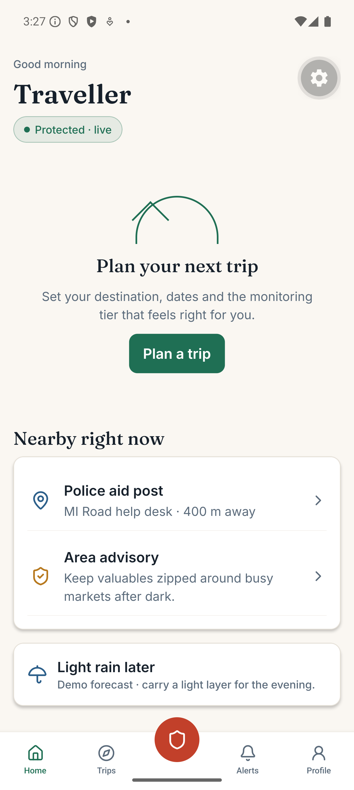
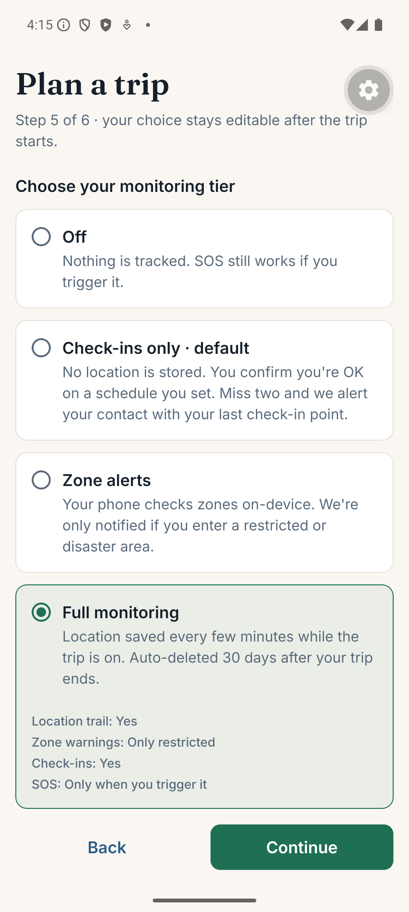
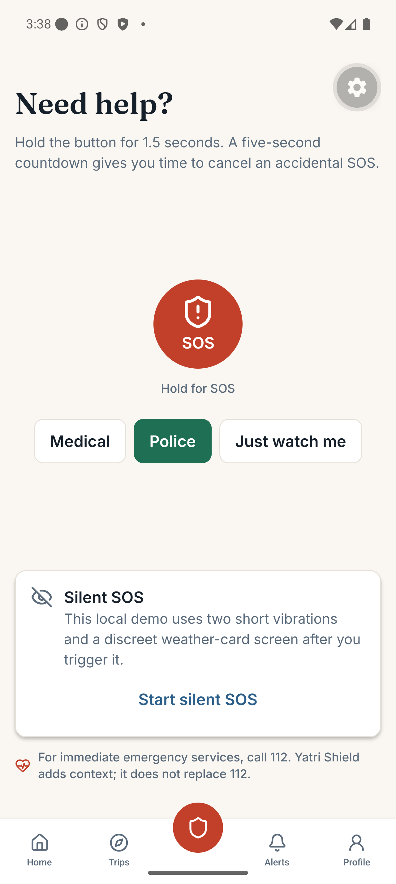
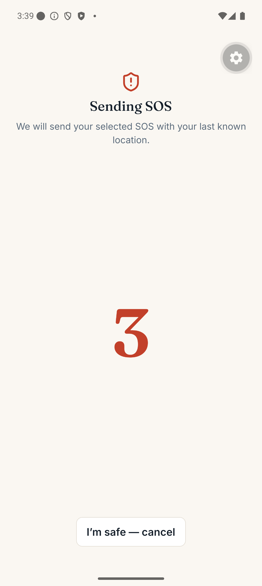
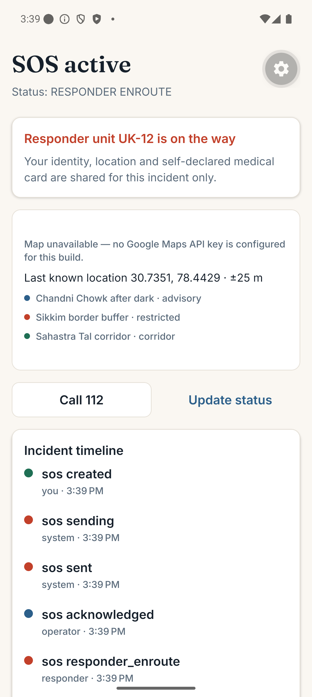
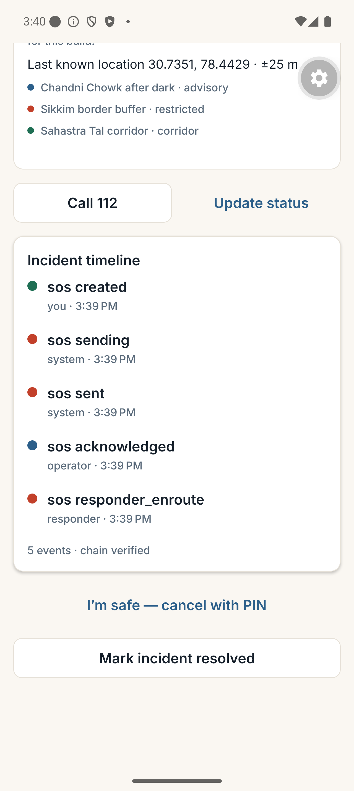
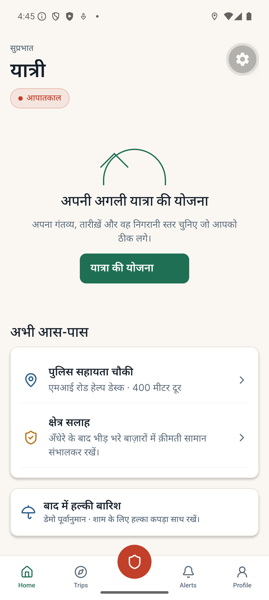
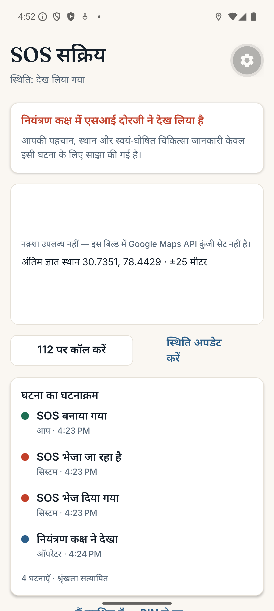

# Yatri Shield

Yatri Shield is an offline-first tourist safety demonstration for India. It supports consent-tiered trips, local zone checks, missed-check-in context, a persistent SOS state machine, and a local operator dashboard. It complements - and never replaces - emergency number **112**.

## What is included

- Expo SDK 57 / TypeScript / Expo Router custom-dev-client application.
- Zustand UI state, TanStack Query provider, MMKV preferences, SecureStore-held SQLCipher queue key, and SQLite outbox with SOS priority.
- On-device polygon evaluation with accuracy gates, consecutive-fix confirmation, and cooldowns.
- Local Fastify + Socket.IO mock service and Leaflet dashboard at `http://localhost:4000/dashboard`.
- Four deterministic demo scenarios: Jaipur advisory, Sikkim restricted boundary, Sahastra Tal off-route/offline replay, and SOS drill.
- Light/dark tokens, accessible controls, live monitoring status, and demo Digital Tourist ID/QR flows.
- English and Hindi across the demo path — onboarding, tabs, home, trip planner, consent tiers, permission primer, Shield, the SOS screen and its incident timeline. The language switch applies immediately and survives a restart. Screens outside that path (Alerts, Trips, Profile, Demo Lab, identity) still render English; their strings are not yet in the catalogue.

## Screenshots

Captured from the running app on a Pixel 9 Pro emulator. All data shown is demo data. The map area renders a zone summary because no Google Maps API key is configured in this build (see [Maps](#maps)).

| Home · empty state and monitoring pill                                                                                                                                                                     | Consent tiers · "what leaves your phone"                                                                                                                                                                |
| ---------------------------------------------------------------------------------------------------------------------------------------------------------------------------------------------------------- | ------------------------------------------------------------------------------------------------------------------------------------------------------------------------------------------------------- |
|  |  |

| Shield · hold to arm                                                                                                                                                                                 | SOS · five-second countdown                                                                                                                              |
| ---------------------------------------------------------------------------------------------------------------------------------------------------------------------------------------------------- | -------------------------------------------------------------------------------------------------------------------------------------------------------- |
|  |  |

| SOS · responder dispatched from the mock operator                                                                                                                                  | Incident timeline · hash-chain integrity                                                                                                                                                           |
| ---------------------------------------------------------------------------------------------------------------------------------------------------------------------------------- | -------------------------------------------------------------------------------------------------------------------------------------------------------------------------------------------------- |
|  |  |

| Home in Hindi                                                                                                                                                                | SOS in Hindi                                                                                                                                                                           |
| ---------------------------------------------------------------------------------------------------------------------------------------------------------------------------- | -------------------------------------------------------------------------------------------------------------------------------------------------------------------------------------- |
|  |  |

The integrity line is a real check, not a label: it recomputes the SHA-256 event chain and will read `integrity check failed` if the chain does not verify.

## Prerequisites

- Node.js 20 or later. Node 25 is installed on this development machine and has been used for validation.
- Java 17.
- Android SDK and an emulator, or a physical Android device. This machine has `Pixel_9_Pro` configured.
- A custom development client is required; Expo Go cannot load the native MMKV, SQLCipher, background-location, or map integrations.

## Setup and run

```powershell
cd 'D:\sih project'
npm install
npm run prebuild
npm run mock
```

Open a second terminal:

```powershell
cd 'D:\sih project'
npm run android
```

For an Android emulator, `EXPO_PUBLIC_API_BASE_URL` and `EXPO_PUBLIC_SOCKET_URL` default to `http://10.0.2.2:4000`. For a physical device, copy `.env.example` to `.env` and replace `10.0.2.2` with the computer's LAN IP.

Useful validation commands:

```powershell
npm run format:check
npm run lint
npm run typecheck
npm test
npm run mock
```

## 60-second demo script

1. Start the mock service, then open `/dashboard` in a browser. Confirm the red **DEMO DATA** watermark is visible.
2. Launch the app and choose **Explore demo mode**.
3. In **Profile → Privacy centre → Demo Lab**, run **Hero demo · Sahastra Tal at 8×**. The trip, route replay and offline alert are generated locally.
4. Go to **Shield**, hold SOS for 1.5 seconds, and allow the five-second countdown to complete.
5. The queue sends the SOS to the dashboard. The mock operator, SI Dorjee, acknowledges it after eight seconds; unit UK-12 changes to en route three seconds later.
6. In the app, open the incident timeline and show the hash-chain integrity line. Use **Call 112** to demonstrate the parallel real emergency path (do not place a test call).

## Monitoring tiers

| Tier            | Local behaviour                        | Upload behaviour                          |
| --------------- | -------------------------------------- | ----------------------------------------- |
| Off             | No fixes or check-ins stored           | Only a user-triggered SOS                 |
| Check-ins only  | Check-in state only                    | Check-in/escalation events                |
| Zone alerts     | Zone evaluation on-device              | Restricted/disaster entries only          |
| Full monitoring | Mode-controlled local location batches | Location batches and critical zone events |

Mode transitions are themselves telemetry, so only Full monitoring uploads them. The one exception is `EMERGENCY`, which is uploaded on every tier because a user-triggered SOS always leaves the phone.

## Monitoring modes

The location engine derives its mode and reconfigures the OS subscription on every change.

| Mode          | GPS interval | Accuracy | Entered when                                     |
| ------------- | ------------ | -------- | ------------------------------------------------ |
| `IDLE`        | —            | none     | No active trip                                   |
| `ACTIVE_TRIP` | 60 s         | balanced | Trip running                                     |
| `HIGH_RISK`   | 20 s         | high     | Inside a restricted or disaster zone             |
| `EMERGENCY`   | 3 s          | highest  | SOS raised; outranks every other mode            |
| `LOW_BATTERY` | 240 s        | low      | Battery ≤ 15% and not charging (recovers at 20%) |

Motion gating: ten stationary minutes in `ACTIVE_TRIP` stretch GPS to 5 minutes until the accelerometer sees movement again.

## Maps

`react-native-maps` uses the Google provider on Android and throws `IllegalStateException: API key not found` at `MapView.onCreate` when no key is present. Without a key the trip and SOS screens render a zone summary (last known location, accuracy, and the zone list) rather than a map. To enable the map, set `EXPO_PUBLIC_GOOGLE_MAPS_API_KEY` in `.env` and re-run `npm run prebuild` so the key reaches `AndroidManifest.xml`.

## Building for an emulator only

A default build compiles four ABIs and needs several GB of free disk. To build only what an x86_64 emulator runs:

```powershell
cd android
./gradlew assembleDebug -PreactNativeArchitectures=x86_64
```

## Known platform limitations

- Geofence entry uses an accuracy gate, two consecutive inside fixes, and a per-zone cooldown. The accuracy-buffer hysteresis described in the design (shrink the polygon on entry, expand it on exit) is not implemented -- `Zone.bufferM` is stored and never read -- and no zone-exit event is emitted.
- The outbox has no periodic flusher and the app has no connectivity detection. `online` is a manual toggle in Demo Lab, so the airplane-mode acceptance criterion must be driven by hand. An offline SOS does retry every 10 s while its screen is open.
- Trips live only in memory. Unlike the SOS record, they do not survive a relaunch.
- Battery level and charging state drive `LOW_BATTERY` through `expo-battery`. On an emulator, exercise it with `adb shell dumpsys battery unplug` and `adb shell dumpsys battery set level 10`, then `adb shell dumpsys battery reset`.
- iOS does not offer an arbitrary persistent background service. The project uses the supported location/background model and must disclose reduced fidelity when the user only grants While Using permission.
- iOS cannot send an SMS silently; the app opens a pre-filled system SMS composer for the demo shortcode `78112`.
- Android power-button five-press interception is not implemented. It is intentionally not faked. The SOS button remains one tap away and the native power-button path requires a reviewed Android module before release.
- The dashboard, KYC, responder unit, shortcode and identity credential are demo-only. They do not contact ERSS-112, police, DigiLocker, a hospital, or a real person.
- SQLCipher is configured through the Expo SQLite config plugin. Verify the exact export-grade crypto requirements for a production store and test on each release build.

## Battery measurement method

On a physical Android device: charge to 100%, disable unrelated high-drain applications, activate a Full monitoring trip, keep the screen off with normal network conditions for 60 minutes, then record the battery change from Android Battery settings. Repeat three times and use the median. The target for `ACTIVE_TRIP` is approximately 3% per hour or less; emulator results are not representative.

## Safety and privacy notes

- The default tier is **Check-ins only**. Off has equal visual weight.
- Advisory-zone hits remain local; location is not uploaded for that tier.
- A successful build is not evidence of real emergency-service integration. Production launch needs a state-agency agreement, legal review, incident procedures, DLT/SMS setup, security assessment, and hardware test matrix.
