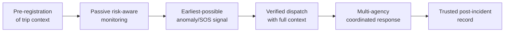
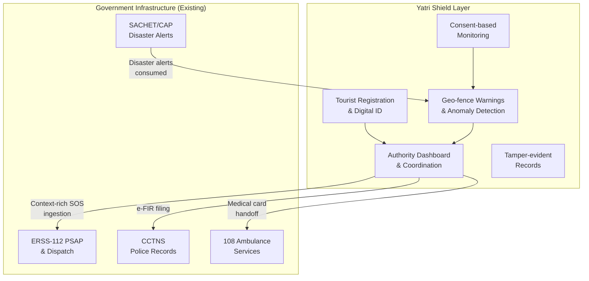

# Product Vision

> **Document**: 01-product-vision.md  
> **Version**: 1.0.0  
> **Last Updated**: July 2026  
> **Audience**: All stakeholders — product, engineering, government, legal  
> **Related**: [Business Requirements](02-business-requirements.md) · [Stakeholder Analysis](05-stakeholder-analysis.md) · [Functional Requirements](03-functional-requirements.md)

---

## 1. Problem Statement

### 1.1 One-Sentence Definition

Tourists in India remain vulnerable because no system knows who they are, where they intended to be, or that they are in trouble until it is too late — and the agencies that respond cannot coordinate on shared, trustworthy, real-time information.

### 1.2 One-Paragraph Definition

India's emergency infrastructure (ERSS-112, SDRF, tourist police units) is reactive: it activates only after a call is made, yet the highest-fatality tourist incidents — trekkers lost in weather, travellers missing in remote corridors, victims in no-network zones — are precisely those where no call ever comes. Tourists carry no machine-readable identity or itinerary that responders can use; families detect disappearance days late; agencies coordinate over phone calls and paper; and incident records are contested. Yatri Shield closes this loop with (a) an opt-in digital tourist ID carrying itinerary and emergency contacts, (b) consent-based location monitoring with geo-fence warnings and missed-check-in/anomaly detection that works degraded-offline, and (c) an authority dashboard with auditable, tamper-evident incident logs shared across police, tourism, disaster-management, and health agencies.

### 1.3 Detailed Definition

The product's real job is a six-stage chain:

Everything else — risk scores, heatmaps, wearables, blockchain — is subordinate to that chain and must be justified against it.

---

## 2. The Core Problem: Detection-and-Coordination, Not Absence-of-Services

India already operates a pan-India emergency number (ERSS-112) that receives distress signals over ten channels and dispatches police, health, and fire resources on a GIS map `[VERIFIED — MHA/C-DAC, 112.gov.in]`. What is **missing** is not emergency services — it is four interconnected gaps:

### Gap 1: Detection Gap

**Nobody knows a tourist is in trouble until someone reports it.**

In the May 2025 Meghalaya honeymoon case, a couple vanished on 23 May; the husband's body was found only on 2 June — a **10-day detection gap** in one of India's most-visited tourist corridors `[VERIFIED — Wikipedia/press timeline]`.

### Gap 2: Location Gap

**Nobody knows where the tourist is once phones are off, out of network, or the person is off-route.**

In the June 2024 Sahastra Tal trek disaster, 9 of 22 trekkers died of hypothermia after losing the route in a blizzard; rescue helicopters were deployed only days after the group missed check-ins `[VERIFIED — The Wire, Outlook, IAF statements]`.

### Gap 3: Coordination Gap

**Response is fragmented across agencies.**

Police, tourism department, SDRF/NDRF, forest department, hospitals, and district administration each maintain separate records, verification steps, and jurisdictional boundaries, which slows the "golden hour."

### Gap 4: Trust Gap

**Records are contested.**

Tourists (especially foreigners) distrust local reporting processes; authorities face fake or exaggerated reports; families dispute official timelines; there is no shared tamper-evident log of who knew what, when. The Raghuvanshi case bail controversy — where procedural timestamps were central to the legal dispute — is a direct illustration `[VERIFIED]`.

---

## 3. Why Is Tourist Safety Monitoring Hard Despite Smartphones and 112?

| Challenge                                | Explanation                                                                                                                                                                                                        | Evidence                                                               |
| ---------------------------------------- | ------------------------------------------------------------------------------------------------------------------------------------------------------------------------------------------------------------------ | ---------------------------------------------------------------------- |
| **Connectivity failure at peak risk**    | The highest-risk zones (Himalayan treks, NE hill roads, forest zones, coastal dead zones) are exactly where cellular network coverage fails. A cloud-first SOS app fails precisely when it is needed.              | `[RESEARCH-BACKED]`                                                    |
| **Tourists are transient and anonymous** | Police have no baseline: no itinerary, no expected return time, no emergency contacts, often no local SIM (foreigners). Missing-person detection depends on family noticing silence from another state or country. | `[RESEARCH-BACKED]`                                                    |
| **Reporting friction**                   | Language barriers, fear of police interaction, unfamiliarity with local numbers (many foreigners do not know 112; 911/999 habits), and jurisdiction confusion.                                                     | `[RESEARCH-BACKED]`                                                    |
| **Response variance**                    | Even within ERSS-112, ground checks show response times ranging from ~4 minutes in cities to 50+ minutes in weaker pockets.                                                                                        | `[VERIFIED — India TV field check, Mar 2026; MHA state ERSS rankings]` |
| **Privacy tension**                      | Continuous tracking of visitors by the state is legally and ethically sensitive, especially post-DPDP Act 2023 / DPDP Rules 2025.                                                                                  | `[VERIFIED — MeitY Gazette notification 13–14 Nov 2025]`               |

---

## 4. Scale of the Problem

| Metric                                      | Value                        | Source                                    |
| ------------------------------------------- | ---------------------------- | ----------------------------------------- |
| Domestic tourist visits (2023)              | ~2.19 billion                | `[RESEARCH-BACKED — Ministry of Tourism]` |
| Foreign tourist arrivals (annual)           | ~9.2–9.5 million             | `[RESEARCH-BACKED — Ministry of Tourism]` |
| Registered crimes against foreigners (2024) | 257 (up 8% from 238 in 2023) | `[VERIFIED — NCRB Crime in India 2024]`   |
| Most common offence against foreigners      | Theft                        | `[VERIFIED — NCRB 2024]`                  |
| Rapes of foreign nationals (2022)           | 25 registered                | `[VERIFIED — NCRB 2022]`                  |

**Critical statistical caveat** `[RESEARCH-BACKED]`: NCRB figures measure **registered** crimes against foreigners only. These are widely believed to understate reality due to under-reporting (tourists leave before filing FIRs, language barriers, reluctance). Product decisions must treat official crime data as a **floor**, not a measure of true incidence. Domestic-tourist incidents are not separately tracked at all in national statistics — itself a data gap this system could help close.

---

## 5. What the System Must Fundamentally Achieve

**Reduce time-to-detection and time-to-verified-response for tourist incidents, with consent, in low-connectivity conditions, across agency boundaries — while creating records all parties can trust.**

This decomposes into six fundamental capabilities:

| #   | Capability                              | Why It Matters                                                                                                               |
| --- | --------------------------------------- | ---------------------------------------------------------------------------------------------------------------------------- |
| 1   | **Pre-registration of trip context**    | Gives responders a baseline (itinerary, contacts, medical info) before anything goes wrong                                   |
| 2   | **Consent-based passive monitoring**    | Detects silence, deviation, and anomaly without requiring the tourist to actively call for help                              |
| 3   | **Earliest-possible signal generation** | Closes the detection gap from days to hours via missed-check-in/anomaly/SOS mechanisms                                       |
| 4   | **Context-rich dispatch**               | SOS reaches responders with verified identity, location, itinerary, and medical card — cutting triage time                   |
| 5   | **Multi-agency coordination**           | Single incident timeline visible to police, tourism, SDRF, hospital — eliminating phone-call coordination                    |
| 6   | **Tamper-evident record**               | Hash-chained, anchored incident logs that no single party can alter — courts, families, agencies all trust the same timeline |

---

## 6. Who Benefits

| Beneficiary                        | Value Delivered                                                                                                                                             |
| ---------------------------------- | ----------------------------------------------------------------------------------------------------------------------------------------------------------- |
| **Tourists**                       | Faster help, proactive warnings, verified identity without carrying physical documents, family visibility                                                   |
| **Families**                       | Real-time trip visibility (with tourist's consent), automatic notification on incidents, ability to mark safe in disasters                                  |
| **Police & Tourism Departments**   | Situational awareness, fewer blind searches, auditability, verified-ID SOS triage above anonymous signals                                                   |
| **SDRF/NDRF & Forest Departments** | Pre-registered trekker manifests, checkpoint-based monitoring, weather-closure enforcement, search-box reduction                                            |
| **Hospitals**                      | Identity + emergency contacts + blood group + allergies on arrival via QR scan, with access logged                                                          |
| **State Governments**              | Tourism-brand protection — demonstrated by the April 2025 Pahalgam attack causing immediate severe collapse in Kashmir tourist arrivals `[RESEARCH-BACKED]` |
| **District Magistrates**           | Disaster-zone roll-call capability (how many tourists inside a hazard polygon, who is unresponsive)                                                         |
| **Embassies/Consulates**           | Structured notification for foreign national incidents `[OPEN QUESTION — MEA protocol integration]`                                                         |

---

## 7. Real-World Incident Evidence Base

The system's design is not theoretical. Every major design decision maps to a documented incident failure mode:

### 7.1 Sahastra Tal Trek Disaster — Uttarkashi, Uttarakhand, June 2024

**What happened**: A 22-member Karnataka Mountaineering Association group began the ~35 km Sahastra Tal trek on 29 May 2024; after summiting (~4,600 m), a blizzard on descent caused the group to lose the route. Nine trekkers, including a 71-year-old woman, died of hypothermia. IAF Cheetah and Mi-17 helicopters plus SDRF evacuated 13 survivors on 5–6 June. `[VERIFIED]`

**What failed**:

- No live position telemetry
- Alerting depended on the group being overdue against an informal return date (7 June)
- Weather window not enforced
- Registration data did not translate into active monitoring

**Detection delay**: Yes — distress began ~2–3 June; large-scale rescue on 5–6 June.

**System counterfactual**: Corridor geo-fencing plus mandatory checkpoint check-ins with automatic escalation on miss is the realistic mechanism. Pure GPS-to-cloud geofencing would not have worked live in a Himalayan dead zone — requires offline buffering + satellite/mesh/SMS fallback, or checkpoint-based (not continuous) monitoring. Weather-conditional route closure (IMD feed → zone status) could have blocked the summit window.

### 7.2 Raja Raghuvanshi Murder — Sohra, Meghalaya, May–June 2025

**What happened**: A honeymooning couple from Indore checked out of a Nongriat homestay on 23 May 2025 and vanished; last phone contact ~1:43 PM, then both phones off. Family filed a missing report the same day. The husband's body was found in a gorge below Wei Sawdong Falls on 2 June — ten days later. The wife was arrested on 9 June; the case produced a procedural-lapse bail controversy now before the Supreme Court. `[VERIFIED]`

**What failed**:

- No last-known-location trail, no itinerary of planned stops, no homestay-linked check-out/check-in chain
- Searchers combed enormous terrain blind for 10 days
- Contested process records (arrest-procedure grounds central to bail dispute)

**System counterfactual**: Even a coarse, battery-light location trail with consent would have narrowed the search from 10 days of open-terrain combing. Tamper-evident incident logs (grounds-of-arrest, search/notification events) are exactly the artefact courts examined.

**Sober caveat**: This was a premeditated murder; the perpetrators would have disabled tracking. Tech's realistic value is search-space reduction and process integrity, not prevention.

### 7.3 Pahalgam Terror Attack — Baisaran, J&K, April 2025

**What happened**: Militants attacked tourists at the Baisaran meadow, killing 26 people. Response was delayed by terrain. The attack triggered a mass exodus of tourists from Kashmir. `[RESEARCH-BACKED]`

**System counterfactual**: Could not have prevented the attack. Value is post-event: zone roll-call ("N registered tourists inside fence — M confirmed safe"), family notification, casualty identification via digital ID, immediate temporary exclusion fencing for inbound tourists. This is the strongest real-world argument for the "who is inside this polygon right now" capability — and also the most privacy-sensitive one.

### 7.4 Kedarnath Flash Floods — Uttarakhand, June 2013

**What happened**: Thousands of pilgrims and tourists died or went missing when flash floods destroyed the valley. Post-disaster, authorities could not even establish how many visitors were present. `[RESEARCH-BACKED]`

**System connection**: This event directly motivated Uttarakhand's mandatory Char Dham yatra registration system. Yatri Shield generalises that proven, government-adopted visitor-manifest principle.

### 7.5 Kerala Floods — August 2018

**What happened**: State-wide flooding stranded large numbers of domestic and foreign tourists. Hotels became the de facto manifest. `[RESEARCH-BACKED]`

**System connection**: Hotels/homestays are a critical data node — check-in data is the state's best proxy for tourist location. Foreigner check-ins are already reported via Form-C to the Bureau of Immigration.

### 7.6 Crimes Against Women Travellers (Pattern)

**Baseline data** `[VERIFIED]`: NCRB 2022 reported 25 rapes of foreign nationals registered. The March 2024 Dumka (Jharkhand) assault on a Spanish travel blogger drew international attention. Failure modes: victims did not know local emergency channels; incidents in low-witness rural areas; reporting friction.

**System value**: Discreet SOS, live trusted-contact sharing, night-risk-zone advisories, multilingual reporting. Tech cannot substitute for policing and prosecution.

### 7.7 Cross-Case Synthesis

| Failure Mode                                       | Incidents                                 | System Response                                                             |
| -------------------------------------------------- | ----------------------------------------- | --------------------------------------------------------------------------- |
| Detection gap (nobody knows tourist is in trouble) | Sahastra Tal, Raghuvanshi, Kedarnath      | Missed-check-in escalation, anomaly detection, server-side silence watchdog |
| Location unknown once phones are off/no-network    | Sahastra Tal, Raghuvanshi                 | Offline breadcrumb queue, SMS fallback, checkpoint-based monitoring         |
| No visitor manifest in hazard zones                | Kedarnath, Kerala, Pahalgam               | Geo-fenced zone roll-call, registration-linked monitoring                   |
| Response fragmentation across agencies             | All cases                                 | Single incident timeline shared across police/tourism/SDRF/hospital         |
| Contested/missing records                          | Raghuvanshi (bail dispute)                | Hash-chained tamper-evident event log with blockchain anchoring             |
| Reporting friction for tourists                    | Women traveller pattern, foreign tourists | Multilingual in-app reporting, discreet SOS, e-FIR                          |
| Weather not enforced                               | Sahastra Tal                              | IMD-linked zone-closure mechanism                                           |

---

## 8. Strategic Positioning

### 8.1 What Yatri Shield Is

The **tourist-context layer on top of ERSS-112 and SACHET** — never a parallel emergency system.

### 8.2 What Yatri Shield Is NOT

| Anti-Pattern                          | Why Rejected                                                                               |
| ------------------------------------- | ------------------------------------------------------------------------------------------ |
| A parallel dispatch/control room      | Would fragment ERSS response and be rejected by MHA/state police `[RECOMMENDATION — firm]` |
| A mandatory surveillance system       | Violates DPDP Act, Puttaswamy proportionality, and would destroy adoption                  |
| A tourist safety score leaderboard    | Profiling hazard; scoring people is ethically indefensible                                 |
| A facial-recognition tracking network | Legally fraught, trust-destroying, unnecessary for the core loop                           |
| An AI auto-dispatch system            | False-positive catastrophe; human validation is non-negotiable                             |
| A fake-report detector                | Silences genuine victims                                                                   |

### 8.3 Design Principles

1. **Consent-first, privacy-by-default**: The least invasive monitoring tier is the default. Advisory-zone hits never leave the device. All location processing has a purpose gate.
2. **Offline-first correctness**: The highest-risk zones have no network. Every feature must degrade gracefully, not fail silently.
3. **Human-gated escalation**: No AI or rule can dispatch responders. It can only create a triaged incident for a human operator.
4. **Additive to 112, never parallel**: SOS reaches existing PSAPs with richer context. Building a second dispatch pipeline would fragment response.
5. **Trustworthy records, not surveillance**: Hash-chained logs serve courts and auditors. The trust comes from tamper-evidence, not from volume of data collected.
6. **Degradation is visible and honest**: When the system cannot provide full fidelity (iOS limitations, no network, no GPS), it discloses this rather than pretending to work.

---

## 9. Validated Problems (Ranked)

1. Detection gap for silent distress in remote areas `[Sahastra Tal, Raghuvanshi — VERIFIED]`
2. Absent last-known-location trails for search
3. Offline dead zones exactly where risk peaks
4. No visitor manifest inside hazard zones `[Kedarnath → Char Dham registration proves government demand]`
5. Multi-agency coordination without a shared incident record
6. Response-time variance and hoax burden at PSAPs `[VERIFIED spread: 4–53 min]`
7. Language barriers multiplying every other failure
8. Reporting friction and FIR abandonment by transient tourists `[NCRB undercount pattern]`
9. Contested incident/process records `[Raghuvanshi bail — VERIFIED]`
10. Fragmented per-state apps with zero interoperability

---

## 10. Vision Statement

> Yatri Shield will be the first system that knows — with consent — that a tourist exists in a risk zone, that they have gone silent, and who to tell. It will close the detection gap from days to hours, give responders a search box measured in metres instead of districts, and produce records that courts, families, and agencies all trust. It will do this without replacing 112, without mandatory enrolment, without scoring people, and without pretending technology alone makes anyone safe.

---

## References

- [Business Requirements](02-business-requirements.md)
- [Stakeholder Analysis](05-stakeholder-analysis.md)
- [User Personas](06-user-personas.md)
- [User Journeys](07-user-journeys.md)
- [Functional Requirements](03-functional-requirements.md)
- [Competitor Analysis](40-competitor-analysis.md)
- [Legal & Regulatory Compliance](37-legal-regulatory-compliance.md)
- [Assumptions Register](39-assumptions-register.md)
