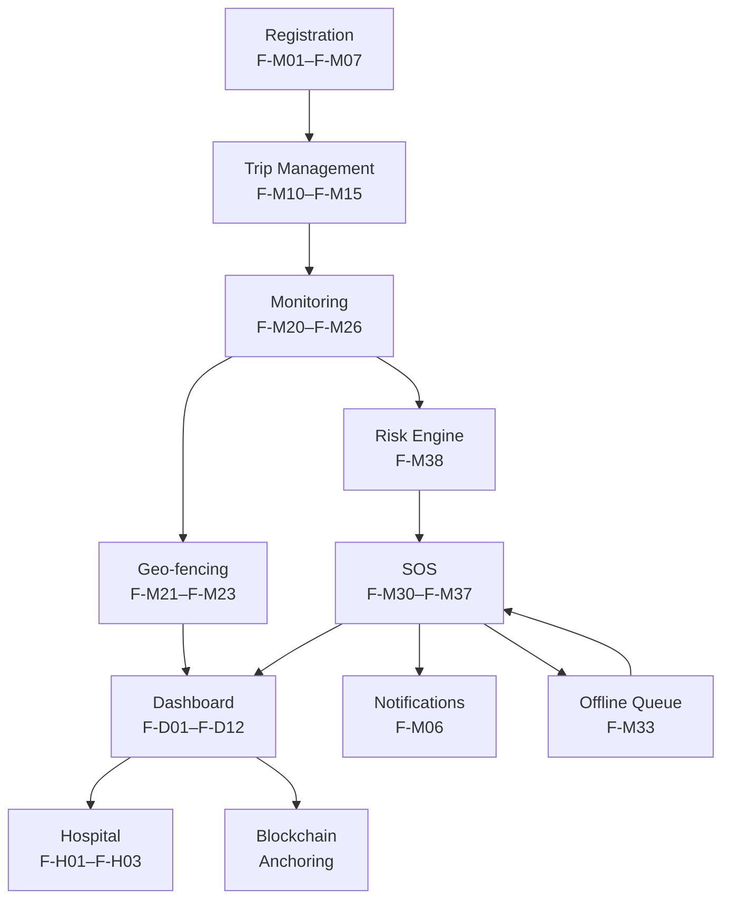

# Functional Requirements

> **Document**: 03-functional-requirements.md  
> **Version**: 1.0.0  
> **Last Updated**: July 2026  
> **Audience**: Engineers, product managers, QA  
> **Related**: [Business Requirements](02-business-requirements.md) · [User Journeys](07-user-journeys.md) · [Non-Functional Requirements](04-non-functional-requirements.md)

---

## 1. Feature Priority Legend

| Priority | Meaning                                                | Scope                                                      |
| -------- | ------------------------------------------------------ | ---------------------------------------------------------- |
| **P0**   | MVP must-have — required for hackathon/first prototype | Demonstrates the core chain end-to-end                     |
| **P1**   | MVP if time, otherwise v1.0                            | Enhances core chain reliability                            |
| **P2**   | v1.x (post-launch iteration)                           | Extends capabilities to additional scenarios               |
| **P3**   | v2+ / Future scope                                     | Advanced capabilities requiring pilot data or partnerships |

---

## 2. Tourist Mobile App Features

### 2A. Registration & Identity

| ID    | Feature                                     | Priority         | Description                                                                                                                                                                                         | Actors  | Dependencies                      | Acceptance Criteria                                                                                                                                                                                      |
| ----- | ------------------------------------------- | ---------------- | --------------------------------------------------------------------------------------------------------------------------------------------------------------------------------------------------- | ------- | --------------------------------- | -------------------------------------------------------------------------------------------------------------------------------------------------------------------------------------------------------- |
| F-M01 | **Phone-OTP Registration**                  | P0               | Tourist registers with phone number; OTP sent via SMS; verified phone becomes primary identity. Re-entry OTP on new device.                                                                         | Tourist | SMS gateway                       | Tourist can register, verify OTP, and receive JWT tokens within 60 seconds. Failed OTP shows specific error. 3 incorrect attempts lock for 5 minutes with exponential backoff.                           |
| F-M02 | **KYC — Domestic (Aadhaar via DigiLocker)** | P0 (mock in MVP) | Domestic tourist verifies identity via DigiLocker Aadhaar offline XML or QR scan. System extracts name, DOB, photo, and address. Issues a verifiable credential.                                    | Tourist | DigiLocker API                    | KYC completes in ≤30 seconds (excluding user consent step). Verification failure shows specific reason. Self-declared fields flagged distinctly from verified fields.                                    |
| F-M03 | **KYC — International (Passport+Visa)**     | P0 (mock in MVP) | Foreign tourist scans passport bio page (OCR) and visa. System extracts nationality, passport number, visa validity. Manual override for OCR errors with review flag.                               | Tourist | OCR service, passport MRZ parsing | Passport MRZ parsed with ≥95% accuracy. Visa validity checked against current date. Provisional ID issued if OCR quality is poor (human review queued).                                                  |
| F-M04 | **Digital Tourist ID**                      | P0               | Time-bound verifiable credential as QR code. Contains: name, photo (if KYC), age band, nationality, blood group (self-declared), emergency contacts ref, trip dates. Auto-expires at trip end date. | Tourist | F-M02 or F-M03                    | QR renders offline. Scanning QR returns verified fields with provenance ("Aadhaar-verified" vs "self-declared"). ID auto-expires and stops rendering after trip end + 24h grace.                         |
| F-M05 | **Emergency Medical Card**                  | P1               | Tourist self-declares: blood group, allergies, medications, pre-existing conditions, GP contact, travel insurance details. Attached to Digital ID. Every access logged.                             | Tourist | F-M04                             | Medical card data accessible via QR scan by hospital staff. Every scan produces an audit log entry (who, when, which facility, incident ref). Self-declared flag on every field.                         |
| F-M06 | **Emergency Contacts**                      | P0               | Tourist adds 1–5 emergency contacts (name, phone, relationship, notification preferences). Contacts receive trip-share invitations.                                                                 | Tourist | SMS/push gateway                  | Contacts added/removed instantly. Contact receives SMS notification when added. Contact's notification preferences respected for all automated communications.                                           |
| F-M07 | **Profile Management**                      | P1               | Edit profile details, change phone number (re-OTP), update medical card, manage emergency contacts, view consent history, download personal data, request deletion.                                 | Tourist | F-M01                             | Profile changes take effect immediately. Phone change requires OTP on new number. Data download generates a ZIP within 24 hours. Deletion request honoured per retention schedule (legal holds visible). |

### 2B. Trip Management

| ID    | Feature                         | Priority | Description                                                                                                                                                                                                 | Actors                      | Dependencies                   | Acceptance Criteria                                                                                                                                                                                     |
| ----- | ------------------------------- | -------- | ----------------------------------------------------------------------------------------------------------------------------------------------------------------------------------------------------------- | --------------------------- | ------------------------------ | ------------------------------------------------------------------------------------------------------------------------------------------------------------------------------------------------------- |
| F-M10 | **Trip Creation**               | P0       | Tourist defines trip: destination(s), start/end dates, route (optional), monitoring consent tier, family-share preferences, check-in interval.                                                              | Tourist                     | F-M01                          | Trip created in ≤2 seconds. Region hint used to pre-download zone pack. Default consent tier is Check-ins Only. Off tier has equal visual weight.                                                       |
| F-M11 | **Consent Tier Selection**      | P0       | Four tiers: Off (SOS only), Check-ins Only, Zone Alerts, Full Monitoring. Each tier displays exactly what data leaves the device, in plain language, per DPDP. Tier changeable mid-trip.                    | Tourist                     | F-M10                          | Consent receipt generated and stored for every tier change. Each tier's data-sharing table is shown before confirmation. Downgrade takes effect within 60 seconds. Upgrade requires re-confirmation.    |
| F-M12 | **Trip Start/Pause/Resume/End** | P0       | Explicit lifecycle control. Start downloads zone pack and activates monitoring. Pause stops monitoring (logged). End stops all monitoring and starts retention clock.                                       | Tourist                     | F-M10, F-M11                   | Trip start downloads zone pack (retries on failure; trip starts regardless with "advisories unavailable" flag). Pause/resume transitions logged as events. End triggers retention countdown per policy. |
| F-M13 | **Check-in Scheduling**         | P0       | Configurable interval (minimum 1 hour, maximum 24 hours). Tourist receives check-in reminder. One-tap "I'm OK" response. Missed check-in triggers escalation ladder (see [Risk Engine](21-risk-engine.md)). | Tourist                     | F-M12                          | Reminder arrives within 1 minute of scheduled time. One-tap response acknowledges successfully (with retry on failure). Missed check-in escalation begins at configured timeout + 10 min grace.         |
| F-M14 | **Trip Geo-Detection Nudge**    | P2       | If no trip is active but user appears to be travelling (location change ≥50 km), system shows opt-in nudge: "You seem to be travelling — start a trip?"                                                     | Tourist                     | Background location permission | Nudge appears max once per 24 hours. "Don't ask again" option persists. Nudge does not fire if any trip was ended within 2 hours.                                                                       |
| F-M15 | **Family Trip Sharing**         | P1       | Share trip status with emergency contacts: live location (Full tier only), last check-in status, area advisories. Auto "I'm fine" daily message if enabled.                                                 | Tourist, Emergency Contacts | F-M06, F-M12                   | Shared contacts see trip status appropriate to consent tier. Full-tier sharing shows map. Check-in-tier sharing shows last check-in time and area name. Link expires when trip ends.                    |

### 2C. Safety & Monitoring

| ID    | Feature                            | Priority | Description                                                                                                                                                                                                                                                  | Actors               | Dependencies                     | Acceptance Criteria                                                                                                                                                                                                                    |
| ----- | ---------------------------------- | -------- | ------------------------------------------------------------------------------------------------------------------------------------------------------------------------------------------------------------------------------------------------------------ | -------------------- | -------------------------------- | -------------------------------------------------------------------------------------------------------------------------------------------------------------------------------------------------------------------------------------- |
| F-M20 | **Background Location Monitoring** | P0       | Low-power location sampling during active trips. Mode-dependent interval (60s/20s/3s/240s). On-device geo-fence evaluation. Battery-aware sampling. Queue-and-forward when offline.                                                                          | Tourist              | OS permissions, F-M12            | Battery impact ≤3% per hour on ACTIVE_TRIP mode. Background service survives Doze. Process death recovery restarts monitoring for active trips. Location batch uploads use idempotency keys.                                           |
| F-M21 | **Zone Advisory Notification**     | P0       | On-device fence-entry for advisory-class zones. Calm, specific notification in tourist's language. Example: "Petty theft reported frequently here after 21:00; keep valuables secured; nearest police aid post 400 m." Advisory hits never leave the device. | Tourist              | F-M20, Zone packs                | Notification appears within 30 seconds of zone entry (2+ consecutive fixes inside, accuracy ≤75m). Advisory acknowledgement rate tracked. Max 3 advisories per day per device (alert-fatigue cap).                                     |
| F-M22 | **Restricted Zone Warning**        | P0       | Strong warning on entering restricted zones (border/military/forest core). Exit guidance + legal note. If dwell exceeds threshold, authority notified. GPS-error gates: accuracy ≤30m, ≥60s dwell, ≥2 consecutive fixes.                                     | Tourist, Authority   | F-M20, Zone packs                | Warning displayed within 30 seconds. Dwell notification to authority only after accuracy + dwell + consecutive-fix gates pass. Permit-holders (linked to ID) suppress alert. Buffer zones at boundary prevent GPS-drift false entries. |
| F-M23 | **Trek Route Deviation Alert**     | P1       | Device detects >X metres off trek corridor for >T minutes. On-device alarm with backtrack guidance. One-tap "I'm fine / intentional detour" acknowledgement. Unacknowledged → beacon mode.                                                                   | Tourist, Trek Leader | F-M20, Trek corridor polygons    | Deviation alert within 2 minutes of exceeding threshold. Backtrack guidance uses downloaded offline map. Group-lead override available. Server escalation on missed checkpoint timeout.                                                |
| F-M24 | **Checkpoint Check-in**            | P1       | QR code or BLE beacon at physical checkpoints along trek routes. Tourist scans/auto-detects → check-in event recorded. Works offline (queued).                                                                                                               | Tourist, Trek Leader | Checkpoint infrastructure, F-M12 | QR scan completes in ≤3 seconds. BLE auto-detection within 20m range. Offline check-in queued with timestamp and synced on connectivity. Missed checkpoint triggers escalation per configured SLA.                                     |
| F-M25 | **Disaster Zone Alert**            | P1       | Push + SMS when tourist is inside a declared emergency polygon. Multilingual. "Mark yourself safe" prompt. Exit routing. Cell Broadcast (SACHET) integration where available.                                                                                | Tourist              | SACHET/CAP feed, F-M20           | Alert delivered within 60 seconds of zone declaration. Mark-safe response reflected on authority dashboard within 5 seconds. Unresponsive tourists flagged for SAR within 15 minutes.                                                  |
| F-M26 | **Night Risk Zone Nudge**          | P2       | Respectfully phrased advisory when tourist enters a zone flagged for elevated night-time risk. Example: "Consider alerting a trusted contact about your route."                                                                                              | Tourist              | F-M20, Zone metadata             | Nudge respects quiet hours. Nudge never uses the word "unsafe." Option to reach a woman officer displayed for relevant zones.                                                                                                          |

### 2D. SOS & Emergency

| ID    | Feature                         | Priority | Description                                                                                                                                                                                                       | Actors  | Dependencies                            | Acceptance Criteria                                                                                                                                                                                                                           |
| ----- | ------------------------------- | -------- | ----------------------------------------------------------------------------------------------------------------------------------------------------------------------------------------------------------------- | ------- | --------------------------------------- | --------------------------------------------------------------------------------------------------------------------------------------------------------------------------------------------------------------------------------------------- |
| F-M30 | **Manual SOS**                  | P0       | One-tap SOS button (hold 1.5 seconds to arm, 5-second countdown, cancel with PIN). Transmits: ID, live location, medical card, itinerary, battery level, network type. Starts emergency tracking mode (3s GPS).   | Tourist | F-M01, API, Push                        | SOS packet transmitted within 5 seconds of countdown completion. Acknowledged-by-operator status visible on app within 60 seconds. Emergency contacts notified simultaneously via push + SMS.                                                 |
| F-M31 | **SOS Type Selection**          | P0       | Optional type selector before SOS: Police, Medical, Silent, General. Type informs triage priority and dispatch routing. Default is General if not selected within 3 seconds.                                      | Tourist | F-M30                                   | Type selection does not delay SOS by more than 3 seconds. Type visible on dashboard incident card. Medical SOS auto-attaches medical card.                                                                                                    |
| F-M32 | **Silent SOS**                  | P0       | No local sounds, no UI change, no screen flash. Confirmation via single vibration only. Dashboard receives COVERT flag. Responders instructed: no call-back to victim phone. SMS decoy option.                    | Tourist | F-M30                                   | No audible or visible indication on device. COVERT flag set on incident. Operator sees "DO NOT CALL BACK" instruction. Vibration confirmation only.                                                                                           |
| F-M33 | **Offline SOS**                 | P0       | No data network → SOS persisted to encrypted queue → SMS fallback attempted (compressed coordinates in ~110 chars) → radio scanning for connectivity → sync on reconnect.                                         | Tourist | F-M30, SMS permission                   | SOS persisted to encrypted SQLCipher queue within 1 second. SMS attempted if GSM available (Android: programmatic; iOS: pre-filled composer). Queue survives app restart. Sync on reconnect merges SMS-incident and app-incident by SOS UUID. |
| F-M34 | **SOS Cancellation**            | P0       | Cancel within 5-second countdown window freely. After dispatch: cancel with PIN + reason. Post-dispatch cancel → false_alarm with reason code. No punitive action for first N cancellations.                      | Tourist | F-M30                                   | Countdown cancel stops SOS immediately. Post-dispatch cancel requires PIN (demo: 1122; production: user-set + biometric). Cancel reason recorded. ≥3 false alarms in 30 days → human-review flag only.                                        |
| F-M35 | **SOS Status Tracking**         | P0       | Tourist sees real-time incident status: received → acknowledged → responder assigned → en route → on scene → resolved. Operator name/unit visible.                                                                | Tourist | F-M30, WebSocket                        | Status updates via WebSocket (foreground) or push (background). Each transition visible within 2 seconds. "Help is X minutes away" ETA displayed when available.                                                                              |
| F-M36 | **Call 112 Button**             | P0       | Always-visible button that dials 112 directly. Never claims the app replaces 112. Displayed on SOS screen and incident screen.                                                                                    | Tourist | Phone dialer                            | Tapping "Call 112" opens native dialer with 112 pre-filled. No confirmation dialog (emergency action).                                                                                                                                        |
| F-M37 | **Power-Button SOS**            | P3       | Five rapid power-button presses trigger SOS. Requires native Android foreground service and policy review.                                                                                                        | Tourist | Native module, Play Store review        | Deferred — requires platform-specific native module design. Not faked in current builds.                                                                                                                                                      |
| F-M38 | **Automatic Anomaly Challenge** | P1       | Prolonged inactivity vs. itinerary, phone dark mid-trip in risk zone, route deviation at night. System challenges user first: "Are you OK? Respond in 10 min." Then family. Then authorities per severity matrix. | Tourist | F-M20, [Risk Engine](21-risk-engine.md) | Challenge delivered within 2 minutes of anomaly detection. Response acknowledged within 1 second. Timeout → family notification → second timeout → incident creation. Dead battery at low-risk location does NOT trigger CRITICAL.            |

### 2E. Incident Reporting (Non-Emergency)

| ID    | Feature                        | Priority | Description                                                                                                                                                       | Actors          | Dependencies                                                       | Acceptance Criteria                                                                                                                                          |
| ----- | ------------------------------ | -------- | ----------------------------------------------------------------------------------------------------------------------------------------------------------------- | --------------- | ------------------------------------------------------------------ | ------------------------------------------------------------------------------------------------------------------------------------------------------------ |
| F-M40 | **Structured Incident Report** | P1       | Theft/harassment/other after-the-fact report. Multilingual form. Photo/video attachment. Timestamped acknowledgement.                                             | Tourist         | F-M01                                                              | Report completed in ≤10 minutes. Acknowledgement with reference number. Status trackable even after leaving the state/country.                               |
| F-M41 | **e-FIR Filing**               | P2       | Auto-generate FIR draft for missing-person/theft where state rules allow. Route to jurisdictional PS. Zero-FIR principle in workflow. Hash-anchor the submission. | Tourist, Police | CCTNS integration `[OPEN QUESTION per state]`                      | e-FIR draft pre-populated from report data. Routed to correct PS based on incident location. Tourist receives confirmation with FIR number when registered.  |
| F-M42 | **Evidence Upload**            | P1       | Photos/videos/audio attached to incidents. Client-side SHA-256 hash. Server re-verification. Blockchain anchor of evidence hash.                                  | Tourist         | S3-compatible storage, [Blockchain](22-blockchain-architecture.md) | Upload resumes on network interruption. Hash mismatch → reject + retry. Evidence hash included in next anchor batch. Verify API confirms evidence integrity. |

### 2F. General App Features

| ID    | Feature                    | Priority | Description                                                                                                                           | Actors  | Dependencies                                              | Acceptance Criteria                                                                                                                                             |
| ----- | -------------------------- | -------- | ------------------------------------------------------------------------------------------------------------------------------------- | ------- | --------------------------------------------------------- | --------------------------------------------------------------------------------------------------------------------------------------------------------------- |
| F-M50 | **Multilingual Support**   | P0       | English + Hindi for MVP. ≥4 languages for v1. All critical screens (onboarding, SOS, alerts, consent) in all supported languages.     | Tourist | Translation service                                       | Language switch applies immediately and survives restart. All SOS-path screens fully translated. Critical notifications sent in user's selected language.       |
| F-M51 | **Offline Maps**           | P1       | Downloadable offline map tiles for trip region. Used for backtrack guidance, zone visualization, SOS location display.                | Tourist | Map tile server                                           | Map region downloadable during trip start. Offline maps render without network. Storage size estimate shown before download.                                    |
| F-M52 | **Dark Mode / Light Mode** | P1       | System-following and manual override. All screens, all states.                                                                        | Tourist | —                                                         | Theme switch applies without restart. All UI elements visible in both modes. Accessibility contrast ratios met in both modes.                                   |
| F-M53 | **Accessibility**          | P1       | Screen reader support, minimum touch targets (48dp), contrast ratios (WCAG 2.1 AA), large text support, reduced motion option.        | Tourist | —                                                         | SOS button accessible via screen reader with descriptive label. All interactive elements have ≥48dp touch target. Animations respect reduced-motion preference. |
| F-M54 | **Privacy Centre**         | P1       | View all consent receipts, active data processing, retention schedules, download personal data, request deletion, consent withdrawal. | Tourist | F-M07, [Privacy Architecture](26-privacy-architecture.md) | All active consents listed with plain-language purpose. Withdrawal takes effect within 5 minutes. Deletion request status trackable.                            |

---

## 3. Police/Responder Dashboard Features

| ID    | Feature                           | Priority | Description                                                                                                                                                                                    | Actors                           | Dependencies                                               | Acceptance Criteria                                                                                                                                                                 |
| ----- | --------------------------------- | -------- | ---------------------------------------------------------------------------------------------------------------------------------------------------------------------------------------------- | -------------------------------- | ---------------------------------------------------------- | ----------------------------------------------------------------------------------------------------------------------------------------------------------------------------------- |
| F-D01 | **Incident Queue**                | P0       | Real-time list of active incidents. Priority-sorted (verified-ID SOS > anonymous, CRITICAL > HIGH). Audible alert on new SOS. Filter by type, severity, jurisdiction.                          | Operator, Dispatcher             | WebSocket, [SOS Management](23-sos-incident-management.md) | New SOS card renders on dashboard within 2 seconds. Audible alert plays. Incident card shows: tourist ID, photo, location on map, type, medical card, itinerary, battery, network.  |
| F-D02 | **Incident Acknowledgement**      | P0       | One-click acknowledge. Records operator ID, unit assignment, ETA. Ack status pushed to tourist app. SLA: ≤60 seconds. Breach → escalation to supervisor queue.                                 | Operator                         | F-D01                                                      | Ack action takes ≤1 second. Tourist app shows "acknowledged by [operator/unit]" within 2 seconds. If no ack within 60 seconds → supervisor queue + voice-call bridge `[PROD]`.      |
| F-D03 | **Incident Lifecycle Management** | P0       | State transitions: created → acknowledged → assigned → enroute → on_scene → resolved → closed (+ cancelled, false_alarm, merged). Role-gated transitions. Each transition hash-chained.        | Operator, Dispatcher, Supervisor | [SOS Management](23-sos-incident-management.md)            | Illegal state transitions rejected with specific error. Each transition appended to hash-chain. Timeline visible with actor, timestamp, notes.                                      |
| F-D04 | **Live Tourist Location**         | P0       | Map showing tourist's real-time location during active incident. Location updates via WebSocket. Accuracy radius visualized. Staleness indicator if >60 seconds old.                           | Operator                         | F-M20, WebSocket                                           | Location dot updates within 3 seconds of server receipt. Accuracy circle displayed. "Last updated X seconds ago" shown. Stale indicator (red) if >60 seconds.                       |
| F-D05 | **Tourist Context Card**          | P0       | Pre-populated incident card: verified name, photo, age, nationality, blood group, allergies, emergency contacts, itinerary, trip history, consent tier, last check-in.                         | Operator                         | F-M04, F-M05, F-M10                                        | All available context displayed without additional lookups. Verified fields marked distinctly from self-declared. "Context unavailable" for unregistered tourists.                  |
| F-D06 | **Incident Timeline**             | P0       | Chronological event log for each incident. Shows: SOS received, ack, dispatch, on-scene, resolution, evidence uploads, escalations, all with timestamps and actors. Hash-chain integrity line. | Operator, Supervisor             | [Blockchain Architecture](22-blockchain-architecture.md)   | Timeline renders complete history. Hash-chain verification runs on-demand. "Chain verified" / "integrity check failed" displayed accurately.                                        |
| F-D07 | **Duplicate Incident Handling**   | P1       | Auto-detection of duplicate incidents (same tourist active SOS, spatial-temporal cluster, SMS+app twin). Operator merge tool. Merged state preserves both timelines.                           | Operator                         | [SOS Management](23-sos-incident-management.md)            | Duplicate candidates highlighted. Merge action available. Merged incident preserves complete history from both sources.                                                             |
| F-D08 | **Escalation Controls**           | P1       | Manual escalation to supervisor, SDRF, district control. Automatic escalation on SLA breach. Multi-victim incident flag.                                                                       | Operator, Supervisor             | [SOS Management](23-sos-incident-management.md)            | Escalation button available per incident. Escalation event recorded with reason. Supervisor queue shows escalated incidents prominently.                                            |
| F-D09 | **Multi-Language Translation**    | P2       | Inline translation of tourist messages/reports. Tourist's preferred language displayed alongside English translation.                                                                          | Operator                         | AI translation service                                     | Translation appears within 5 seconds. Original language preserved alongside translation. Translation quality flag ("auto-translated") visible.                                      |
| F-D10 | **Zone Management**               | P0       | Draw polygons on map for advisory/restricted/disaster zones. Set class, buffer, schedule, expiry. Approval workflow (class-dependent). Version control.                                        | Tourism Admin, Police Admin      | [Geofencing Architecture](19-geofencing-architecture.md)   | Polygon drawing with standard map tools. Zone published only after approval. Temporary disaster zones: two-person emergency publish with auto-expiry ≤72h. Version history visible. |
| F-D11 | **Disaster Zone Roll-Call**       | P2       | Display count of registered tourists inside a declared emergency polygon. List: confirmed safe, unresponsive, with last-fix and timestamp. SAR priority ranking.                               | SDRF, Operator                   | F-M25, [Geofencing](19-geofencing-architecture.md)         | Roll-call count available within 5 minutes of zone declaration. Safe/unresponsive classification updated in real-time. Export for SAR team.                                         |
| F-D12 | **Incident Closure & Feedback**   | P1       | Close incident with disposition code and summary. Tourist receives closure summary + feedback prompt. Record hash-anchored.                                                                    | Operator                         | [Blockchain Architecture](22-blockchain-architecture.md)   | Closure requires disposition code. Tourist receives notification with summary. Feedback prompt sent 24h after closure. All closure data anchored.                                   |

---

## 4. Hospital/Emergency Dashboard Features

| ID    | Feature                            | Priority | Description                                                                                                                                                                        | Actors             | Dependencies                                            | Acceptance Criteria                                                                                                                                                |
| ----- | ---------------------------------- | -------- | ---------------------------------------------------------------------------------------------------------------------------------------------------------------------------------- | ------------------ | ------------------------------------------------------- | ------------------------------------------------------------------------------------------------------------------------------------------------------------------ |
| F-H01 | **Patient Identification via QR**  | P1       | Scan incoming patient's Digital Tourist ID QR. Displays: verified name, age, blood group, allergies, medications, emergency contacts, insurer. Access event logged.                | Nurse, Doctor      | F-M04, F-M05                                            | QR scan returns medical card within 2 seconds. Access logged with: who, when, which facility, incident reference. "Self-declared vs verified" flag on every field. |
| F-H02 | **Medical Incident Card**          | P2       | Scoped medical-access grant per incident. Hospital sees only medical-relevant data for the duration of the grant (TTL 24h default). Treatment updates append to incident timeline. | Hospital Staff     | [SOS Management](23-sos-incident-management.md)         | Grant auto-expires after TTL. Treatment updates visible on main incident timeline. Expired grant prevents further access.                                          |
| F-H03 | **Emergency Contact Notification** | P1       | Automatic notification to tourist's emergency contacts upon hospital admission. Includes hospital name, admission time, attending doctor if available.                             | System (automatic) | F-M06, [Notification System](24-notification-system.md) | Notification sent within 5 minutes of admission event. Contact's preferred channel used. Notification includes hospital contact details.                           |

---

## 5. Tourism Authority Dashboard Features

| ID    | Feature                   | Priority | Description                                                                                                                                                            | Actors           | Dependencies                                            | Acceptance Criteria                                                                                                                                         |
| ----- | ------------------------- | -------- | ---------------------------------------------------------------------------------------------------------------------------------------------------------------------- | ---------------- | ------------------------------------------------------- | ----------------------------------------------------------------------------------------------------------------------------------------------------------- |
| F-T01 | **Anonymised Analytics**  | P2       | Arrival trends, zone density, incident counts by type/region. All data anonymised (truncated coordinates, H3 cells, k≥20 suppression). No individual tourist tracking. | Tourism Admin    | [Privacy Architecture](26-privacy-architecture.md)      | Dashboard shows aggregate data only. No drill-down to individual tourist. k-anonymity suppression applied. Export available in anonymised format.           |
| F-T02 | **Advisory Broadcasting** | P1       | Author and push zone-targeted advisory alerts to tourists. DM approval workflow. Read-receipt tracking. Pre-approved templates for common scenarios.                   | Tourism Admin    | [Notification System](24-notification-system.md), F-D10 | Advisory authored with template or free text. Requires DM approval before send. Read-receipt count visible. Delivery channel: push + SMS for high-priority. |
| F-T03 | **Ministerial Dashboard** | P2       | High-level view: active tourists, incident summary, response time trends, zone activity. Designed for executive consumption.                                           | Senior Officials | F-T01                                                   | Auto-refreshing dashboard. Exportable to PDF. No PII visible at any level.                                                                                  |

---

## 6. System Admin Features

| ID    | Feature                     | Priority | Description                                                                                                                                                                            | Actors                | Dependencies                                                 | Acceptance Criteria                                                                                                                                              |
| ----- | --------------------------- | -------- | -------------------------------------------------------------------------------------------------------------------------------------------------------------------------------------- | --------------------- | ------------------------------------------------------------ | ---------------------------------------------------------------------------------------------------------------------------------------------------------------- |
| F-A01 | **Organisation Management** | P1       | Create/manage organisations (police districts, hospitals, tourism offices). Assign jurisdiction. Configure approval workflows.                                                         | System Admin          | [AuthN/AuthZ](17-authentication-authorization.md)            | Organisations created with jurisdiction polygon. Users assigned to organisations. Jurisdiction determines incident visibility.                                   |
| F-A02 | **User & Role Management**  | P0       | Provision authority users. Assign roles (operator, dispatcher, hospital, tourism_admin, sys_admin). Mandatory TOTP MFA for all authority users. No self-signup for authority accounts. | System Admin          | [AuthN/AuthZ](17-authentication-authorization.md)            | Roles assigned with org scoping. MFA enforced on all authority accounts. Role change takes effect immediately. Audit trail for all role changes.                 |
| F-A03 | **System Configuration**    | P1       | Versioned configuration: risk engine weights, check-in intervals, escalation SLAs, geo-fence parameters, notification templates. All config changes audited. Instant rollback.         | System Admin          | [Risk Engine](21-risk-engine.md)                             | Config changes versioned (increment on save). Rollback to any previous version. Config changes take effect without service restart. Audit trail for all changes. |
| F-A04 | **Audit Log Viewer**        | P1       | Search and export audit logs. Filter by user, action type, resource, date range. Auditor role access only.                                                                             | Auditor, System Admin | [Security Architecture](27-security-architecture.md)         | Logs searchable with ≤5 second response. Export to CSV/JSON. No modification capability — read-only. Audit log write failures page operations immediately.       |
| F-A05 | **Health Dashboard**        | P0       | System health: API latency, database status, queue depth, WebSocket connections, anchor queue, notification delivery rates. Liveness and readiness status.                             | System Admin          | [Monitoring & Observability](30-monitoring-observability.md) | All service health visible on single page. Red/yellow/green status indicators. Alert history visible.                                                            |

---

## 7. Feature Interaction Matrix

---

## 8. Features Explicitly Excluded

| Feature                                      | Reason for Exclusion                     | Source            |
| -------------------------------------------- | ---------------------------------------- | ----------------- |
| Public tourist safety score leaderboard      | Profiling hazard                         | Domain Report §15 |
| Facial recognition tourist tracking via CCTV | Legally fraught, trust-destroying        | Domain Report §15 |
| PII/location stored on blockchain            | DPDP erasure conflict, honeypot          | Domain Report §12 |
| Independent dispatch/control room            | Fragments ERSS response                  | Domain Report §9  |
| Automatic police dispatch on AI signal       | False-positive catastrophe               | Domain Report §11 |
| Mandatory enrolment as entry condition       | Consent collapse                         | Domain Report §15 |
| Fake-report auto-detection/flagging          | Silences genuine victims                 | Domain Report §11 |
| Continuous ambient audio/video monitoring    | Surveillance beyond purpose              | Domain Report §15 |
| Real-time ML model training                  | No training data; rules deliver v1 value | Tech Report §12   |
| Custom map tile server                       | Unnecessary complexity for v1            | Tech Report §30   |
| MQTT broker without hardware endpoints       | Premature optimisation                   | Tech Report §30   |

---

## References

- [Business Requirements](02-business-requirements.md)
- [User Journeys](07-user-journeys.md)
- [Non-Functional Requirements](04-non-functional-requirements.md)
- [UI Specification — Mobile](08-ui-specification-mobile.md)
- [UI Specification — Dashboards](09-ui-specification-dashboards.md)
- [Risk Engine](21-risk-engine.md)
- [Geofencing Architecture](19-geofencing-architecture.md)
- [SOS & Incident Management](23-sos-incident-management.md)
