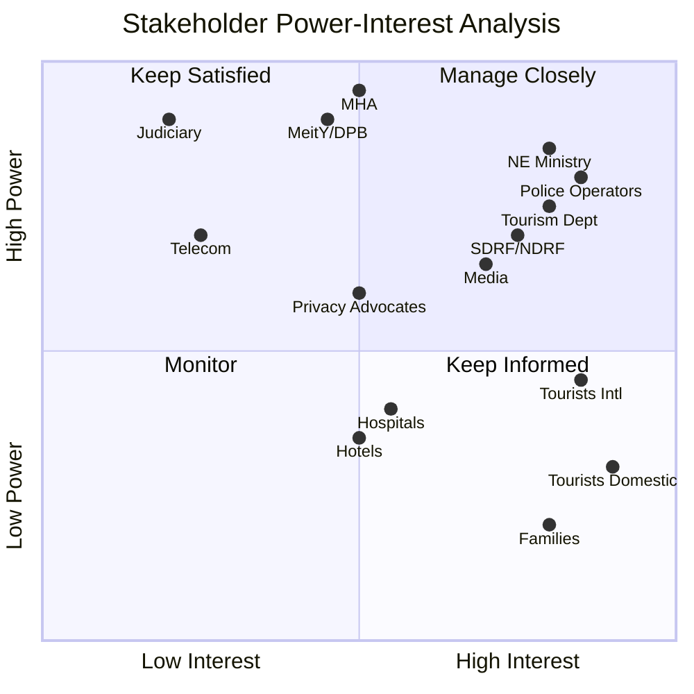

# Stakeholder Analysis

> **Document**: 05-stakeholder-analysis.md  
> **Version**: 1.0.0  
> **Last Updated**: July 2026  
> **Audience**: Product managers, government sponsors, programme governance  
> **Related**: [Product Vision](01-product-vision.md) · [User Personas](06-user-personas.md) · [Business Requirements](02-business-requirements.md)

---

## 1. Critical Governance Question

> [!IMPORTANT]
> **Which agency owns and operates the platform in a state?** `[OPEN QUESTION — critical]`
>
> - **Tourism Department**: Owns tourist relationships, no responders
> - **State Police**: Owns response capability, trust deficit with visitors
> - **SDMA**: Owns disaster response only, not routine safety
> - **Joint Cell (Tourism-Police)**: International best practice suggests this model
>
> This single governance decision shapes the entire product — data ownership, hosting, legal liability, officer mandates, funding, inter-agency access policies, and political accountability. It must be validated first with the sponsoring ministry and pilot-state leadership.

---

## 2. Stakeholder Registry

### 2.1 Primary Stakeholders (Direct System Users)

| ID    | Stakeholder                               | Role in System                                  | Interest Level | Power Level                     | Key Needs                                                                                              | Key Fears                                                                                                   |
| ----- | ----------------------------------------- | ----------------------------------------------- | -------------- | ------------------------------- | ------------------------------------------------------------------------------------------------------ | ----------------------------------------------------------------------------------------------------------- |
| SH-01 | **Tourists (Domestic)**                   | Primary user — mobile app                       | HIGH           | LOW (individual)                | Safety, privacy, family peace of mind, hassle-free reporting                                           | Surveillance, battery drain, forced disclosure, being tracked by state                                      |
| SH-02 | **Tourists (International)**              | Primary user — mobile app                       | HIGH           | MEDIUM (diplomatic sensitivity) | English-first UX, works without local SIM, embassy contact, document-free verification                 | Language barriers, police interaction, privacy (foreign state tracking citizens of another country)         |
| SH-03 | **Tourist Families / Emergency Contacts** | Notification recipients, trip-share viewers     | HIGH           | LOW                             | Know their person is safe; immediate notification if not; don't want to be spammed                     | False alarms causing panic; delayed notification on genuine emergency                                       |
| SH-04 | **Police Operators (PSAP/Station)**       | Dashboard users — triage, acknowledge, dispatch | HIGH           | HIGH                            | Clear alerts, zero missed genuine SOS, minimal paperwork, verified-ID triage                           | Hoax/pocket-dial burden; being disciplined via dashboard timestamps; foreign tourists they cannot interview |
| SH-05 | **SDRF/NDRF Response Teams**              | Field responders — dashboard + field app        | HIGH           | HIGH                            | Shrink search boxes; terrain-aware last-fix data; roll-call for hazard zones; offline field capability | Garbage GPS data sending teams to phantom coordinates; alert fatigue                                        |
| SH-06 | **Hospital Staff (Casualty)**             | Hospital dashboard — patient identification     | MEDIUM         | MEDIUM                          | Fast identification (QR → medical card), verified emergency contacts, insurer                          | Wrong medical data; legal liability for acting on unverified self-declared fields                           |
| SH-07 | **Tourism Department Officials**          | Tourism dashboard — analytics, advisories       | HIGH           | HIGH                            | Arrival growth, incident-free season, ministerial dashboards, advisory broadcasting                    | Leaked "unsafe zones" map making headlines; system generating bad press                                     |
| SH-08 | **System Administrators**                 | Admin panel — config, users, zones, health      | MEDIUM         | HIGH                            | Reliable system operation, configuration control, audit capability                                     | System failure under their watch; security breach                                                           |

### 2.2 Secondary Stakeholders (Indirect Influence)

| ID    | Stakeholder                             | Relationship                                      | Interest                               | Influence                                            |
| ----- | --------------------------------------- | ------------------------------------------------- | -------------------------------------- | ---------------------------------------------------- |
| SH-09 | **Ministry of Dev. of NE Region**       | Sponsoring ministry                               | HIGH — NE region is priority geography | HIGH — funding, mandate                              |
| SH-10 | **Ministry of Home Affairs (MHA)**      | ERSS-112 owner                                    | MEDIUM — integration partner           | VERY HIGH — controls PSAP infrastructure             |
| SH-11 | **NDMA / State SDMAs**                  | SACHET/CAP owner; disaster zone declarers         | MEDIUM                                 | HIGH — controls disaster alert infrastructure        |
| SH-12 | **Ministry of Tourism**                 | National tourism policy                           | HIGH                                   | HIGH — policy support, adoption push                 |
| SH-13 | **MeitY**                               | DPDP Act enforcer; DigiLocker owner               | MEDIUM                                 | VERY HIGH — compliance authority                     |
| SH-14 | **Data Protection Board**               | DPDP enforcement                                  | MEDIUM                                 | VERY HIGH — penalty authority (up to ₹250 crore)     |
| SH-15 | **District Magistrates**                | Incident commanders under DMA 2005                | HIGH during disasters                  | HIGH — operational authority                         |
| SH-16 | **Forest Departments**                  | Restricted-zone owners (national parks, reserves) | MEDIUM                                 | MEDIUM — zone authoring, enforcement                 |
| SH-17 | **Embassies / Consulates**              | Foreign national incident notification            | LOW routine / HIGH during incidents    | MEDIUM — diplomatic channel                          |
| SH-18 | **Hotels / Homestays / Tour Operators** | Check-in confirmation; itinerary data nodes       | MEDIUM                                 | MEDIUM — adoption multiplier                         |
| SH-19 | **Trek Operators**                      | Group manifests; checkpoint compliance            | HIGH for trek module                   | LOW-MEDIUM                                           |
| SH-20 | **Telecom Providers**                   | SMS DLT, shortcode, Cell Broadcast                | LOW                                    | HIGH — SMS infrastructure dependency                 |
| SH-21 | **Insurance Companies**                 | Incident certificates; claims data                | LOW                                    | LOW (future integration)                             |
| SH-22 | **Media**                               | Public perception; incident reporting             | HIGH (reactive)                        | HIGH — narrative control                             |
| SH-23 | **Civil Society / Privacy Advocates**   | Surveillance concerns; rights monitoring          | MEDIUM                                 | HIGH — can shape public narrative against the system |
| SH-24 | **Judiciary**                           | Evidence admissibility; warrant requirements      | LOW (routine) / HIGH (case law)        | VERY HIGH                                            |

---

## 3. Stakeholder Power/Interest Grid

### Engagement Strategy by Quadrant

| Quadrant                                       | Stakeholders                                        | Strategy                                                                             |
| ---------------------------------------------- | --------------------------------------------------- | ------------------------------------------------------------------------------------ |
| **Manage Closely** (high power, high interest) | MHA, NE Ministry, Police, Tourism Dept, SDRF, MeitY | Regular briefings, co-design workshops, MoU negotiation, pilot partnership           |
| **Keep Satisfied** (high power, low interest)  | Judiciary, Telecom, Data Protection Board           | Compliance documentation, legal counsel engagement, proactive regulatory submissions |
| **Keep Informed** (low power, high interest)   | Tourists, Families, Hotels, Trek Operators          | Clear product communication, privacy transparency, adoption campaigns                |
| **Monitor** (low power, low interest)          | Insurance, Embassies (routine)                      | Periodic updates, integration readiness documentation                                |

---

## 4. Stakeholder Needs Analysis

### 4.1 Tourists

| Need                           | Priority | Feature Mapping                                 | Constraint                   |
| ------------------------------ | -------- | ----------------------------------------------- | ---------------------------- |
| Get help fast when in danger   | CRITICAL | SOS, Offline SOS, Anomaly detection             | Must work without network    |
| Not be tracked without consent | CRITICAL | Consent tiers, default to least invasive        | DPDP Act                     |
| Family knows they're safe      | HIGH     | Trip sharing, auto-ping, emergency notification | Must not create false alarms |
| Understand what data is shared | HIGH     | Plain-language consent screens, privacy centre  | DPDP Rules 2025              |
| Report incidents easily        | MEDIUM   | Structured report, e-FIR, multilingual          | State police SOP integration |
| Not drain battery              | HIGH     | Adaptive sampling, LOW_BATTERY mode             | OEM battery killers          |
| Carry no documents             | MEDIUM   | Digital Tourist ID, QR credential               | KYC integration dependency   |

### 4.2 Police / Responders

| Need                                 | Priority | Feature Mapping                                          | Constraint                                  |
| ------------------------------------ | -------- | -------------------------------------------------------- | ------------------------------------------- |
| Verified SOS above anonymous signals | CRITICAL | Digital ID-attached SOS, triage priority                 | Cannot refuse anonymous calls               |
| Pre-populated incident context       | HIGH     | Tourist context card, medical card, itinerary            | Data only available for registered tourists |
| Reduce blind searches                | HIGH     | Last-known location, search-box reduction                | GPS accuracy degrades in terrain            |
| Minimal additional workload          | HIGH     | Auto-generated event log, one-click ack                  | Officer adoption risk                       |
| Fair treatment by the system         | CRITICAL | Dashboard timestamps not used punitively without context | `[ASSUMPTION A10]` — validate with police   |
| Foreign tourist interview support    | MEDIUM   | Translation assistance, verified-ID context              | AI translation quality                      |

### 4.3 Tourism Department

| Need                             | Priority | Feature Mapping                        | Constraint                                |
| -------------------------------- | -------- | -------------------------------------- | ----------------------------------------- |
| No "unsafe zone" publicity       | HIGH     | Neutral phrasing ("stay-alert zone")   | `[OPEN QUESTION]` — political sensitivity |
| Arrival analytics                | MEDIUM   | Anonymised density, incident counts    | k-anonymity, no individual tracking       |
| Advisory broadcasting with reach | HIGH     | Zone-targeted push, SMS, read-receipts | DM approval workflow required             |
| Ministerial reporting            | MEDIUM   | Auto-refreshing dashboard, PDF export  | No PII at any level                       |

### 4.4 SDRF / NDRF

| Need                         | Priority | Feature Mapping                         | Constraint                                     |
| ---------------------------- | -------- | --------------------------------------- | ---------------------------------------------- |
| Know who is in a hazard zone | CRITICAL | Disaster zone roll-call                 | Only works for registered tourists             |
| Terrain-aware last-fix data  | HIGH     | Accuracy radius, timestamp, altitude    | GPS quality varies; "false-precision dot" fear |
| Offline field capability     | HIGH     | Field app with opportunistic sync       | Mobile data in disaster zones unreliable       |
| Search-box reduction for SAR | CRITICAL | Last-known + corridor + checkpoint data | Checkpoint infrastructure dependency           |

### 4.5 Hospitals

| Need                           | Priority | Feature Mapping                              | Constraint                   |
| ------------------------------ | -------- | -------------------------------------------- | ---------------------------- |
| Fast patient identification    | HIGH     | QR scan → medical card                       | Only for registered tourists |
| Reliable medical data          | HIGH     | Provenance flags (verified vs self-declared) | Self-declared data liability |
| Emergency contact notification | MEDIUM   | Automatic notification on admission          | Contact data availability    |
| Access logging                 | HIGH     | Audit trail per QR scan                      | DPDP compliance              |

---

## 5. Stakeholder Conflict Analysis

| Conflict                                                | Stakeholders                                      | Resolution                                                                                                                           |
| ------------------------------------------------------- | ------------------------------------------------- | ------------------------------------------------------------------------------------------------------------------------------------ |
| **Privacy vs. safety monitoring**                       | Tourists vs. Police/SDRF                          | Consent tiers with default to least invasive; break-glass with audit for emergencies                                                 |
| **"Unsafe zone" labelling vs. tourism promotion**       | Tourism Dept vs. Police                           | Neutral phrasing; zone governance approval workflow; advisory zones are tourist-facing only                                          |
| **Dashboard timestamps vs. officer fairness**           | Police Officers vs. System Design                 | Timestamps recorded for audit but explicitly not used as sole basis for disciplinary action; context fields required                 |
| **Record immutability vs. right to erasure**            | Blockchain design vs. DPDP Act                    | PII never on-chain; only hash roots on-chain; off-chain data subject to erasure; roots alone are not personal data                   |
| **Mandatory enrolment vs. voluntary adoption**          | Government desire for coverage vs. Tourist rights | Voluntary with strong incentive design; mandatory enrolment rejected as consent-destroying `[RECOMMENDATION]`                        |
| **Foreign tourist tracking vs. diplomatic sensitivity** | Government vs. Embassies                          | Consent-only; no foreign-government data sharing without tourist's explicit authorization; embassy notification at tourist's request |
| **ML-driven auto-dispatch vs. false-positive risk**     | Efficiency advocates vs. Safety engineering       | Human-gated escalation is permanent regardless of model quality; ML refines triage, never dispatches                                 |
| **Comprehensive data collection vs. minimisation**      | Analytics desire vs. Privacy requirement          | Truncated coordinates for analytics; operational precise fixes with incident-gated access only                                       |

---

## 6. Stakeholder Communication Plan

| Stakeholder Group                 | Communication Method                                    | Frequency                    | Owner               |
| --------------------------------- | ------------------------------------------------------- | ---------------------------- | ------------------- |
| Sponsoring Ministry               | Formal progress reports, demo sessions                  | Monthly                      | Programme Lead      |
| MHA / ERSS team                   | Integration working group meetings                      | Bi-weekly during integration | Technical Lead      |
| Pilot State Police                | Training workshops, feedback sessions                   | Weekly during pilot          | Product Lead        |
| Tourism Department                | Dashboard training, analytics review                    | Monthly                      | Product Lead        |
| SDRF/NDRF                         | Joint exercise planning, system training                | Per-exercise + monthly       | Operations Lead     |
| Hospital Partners                 | QR integration training                                 | Pre-launch + quarterly       | Integration Lead    |
| Tourist Community                 | App Store communications, in-app messaging, help centre | Continuous                   | Marketing Lead      |
| Privacy Advocates / Civil Society | Transparency reports, published privacy controls        | Quarterly                    | Privacy/Legal Lead  |
| Media                             | Press releases, incident response protocol              | As needed                    | Communications Lead |

---

## 7. RACI Matrix for Key Decisions

| Decision                         | Responsible            | Accountable           | Consulted                  | Informed         |
| -------------------------------- | ---------------------- | --------------------- | -------------------------- | ---------------- |
| Platform governance model        | Programme Lead         | NE Ministry           | MHA, State Police, Tourism | All stakeholders |
| Zone authoring policy            | Tourism Admin + Police | DM / State Government | Tourist representatives    | Public           |
| Privacy tier defaults            | Privacy Lead           | DPO                   | MeitY, Legal Counsel       | Tourists         |
| ERSS integration scope           | Technical Lead         | Programme Lead        | MHA/C-DAC, State PSAP      | Police operators |
| Incident liability framework     | Legal Counsel          | Programme Lead        | MHA, State Government      | All              |
| Blockchain consortium membership | Technical Lead         | Programme Lead        | Participating agencies     | All              |
| Production hosting selection     | DevOps Lead            | Technical Lead        | MeitY (empanelment)        | All              |
| Language support priorities      | Product Lead           | Programme Lead        | NE Ministry, Tourism       | Tourists         |

---

## References

- [Product Vision](01-product-vision.md)
- [User Personas](06-user-personas.md)
- [Business Requirements](02-business-requirements.md)
- [Privacy Architecture](26-privacy-architecture.md)
- [Legal & Regulatory Compliance](37-legal-regulatory-compliance.md)
- [Assumptions Register](39-assumptions-register.md)
