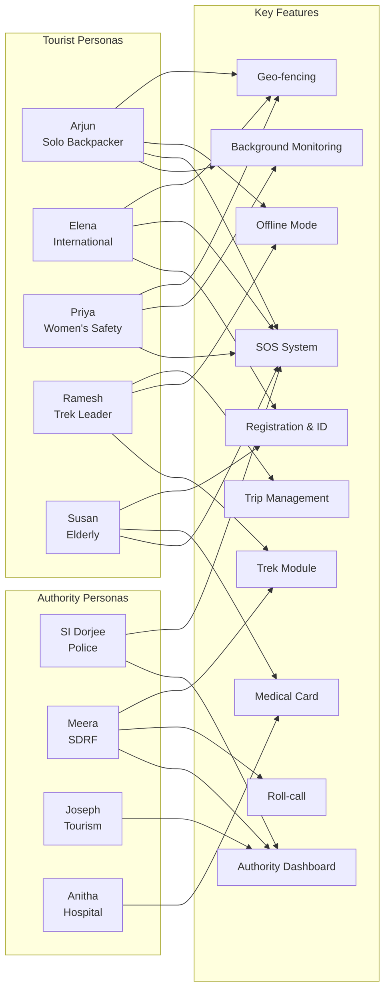

# User Personas

> **Document**: 06-user-personas.md  
> **Version**: 1.0.0  
> **Last Updated**: July 2026  
> **Audience**: Product managers, UX designers, engineers  
> **Related**: [Stakeholder Analysis](05-stakeholder-analysis.md) · [User Journeys](07-user-journeys.md) · [UI Specification — Mobile](08-ui-specification-mobile.md)

---

## 1. Persona Overview

| ID  | Name         | Role                                           | Age | Archetype                                  | Primary Platform      |
| --- | ------------ | ---------------------------------------------- | --- | ------------------------------------------ | --------------------- |
| P1  | Arjun        | Solo backpacker (domestic)                     | 27  | Tech-savvy, independence-seeking           | Android               |
| P2  | Elena        | International tourist                          | 34  | Safety-conscious, document-anxious         | iPhone                |
| P3  | Priya        | Woman travelling for work + leisure (domestic) | 29  | Discretion-seeking, night-safety-aware     | Android               |
| P4  | Ramesh       | Trek leader with group                         | 46  | Experienced outdoorsman, moderate tech     | Android               |
| P5  | Susan        | Elderly tourist on group tour (international)  | 68  | Low tech ability, health concerns          | iPhone (large text)   |
| P6  | SI Dorjee    | Police sub-inspector, tourist hill district    | 38  | Overworked frontline responder             | Dashboard (web)       |
| P7  | Meera        | SDRF response team lead                        | 41  | Search-and-rescue professional             | Dashboard + field app |
| P8  | Joseph       | State tourism department joint director        | 52  | Senior bureaucrat, politically accountable | Dashboard (web)       |
| P9  | Nurse Anitha | Hospital casualty intake nurse                 | 35  | Frontline healthcare, time-pressured       | Hospital dashboard    |

---

## 2. Detailed Personas

### P1 — Arjun, 27, Solo Backpacker

**Background**: Software engineer from Bengaluru. Travels solo on long weekends to remote destinations. Phone is his lifeline. Currently planning Spiti Valley trip via Delhi.

**Demographics**:

- Tech proficiency: HIGH
- Device: Android (OnePlus — relevant for OEM battery-killer testing)
- Language: English primary, Hindi fluent
- Network awareness: Knows about dead zones from past experience
- Travel frequency: 8–10 trips/year, mostly domestic, 3–4 to remote areas

**Goals**:

- Freedom to explore without constant worry
- Parents know he's safe without him having to text every 2 hours
- Offline capability in Spiti's dead zones (Kaza–Kibber stretch has minimal signal)
- If he goes silent for too long, someone competent checks — not a false-alarm police response

**Pain Points**:

- Long no-network stretches make parents panic
- Past experience: parents called local police when he didn't respond for 18 hours in Zanskar (dead battery + no network) — embarrassing for everyone
- Battery anxiety: background apps drain OnePlus aggressively
- Doesn't want to learn a complex app; wants set-and-forget

**Feature Expectations**:

- Set-and-forget monitoring that just works in background
- Auto "I'm fine" pings to parents when connected
- Offline maps and zone data
- SOS that works on power button (or one tap) — not buried in menus
- If he misses two check-ins, someone looks at his last-known location — without spamming police for every dead battery
- Battery-aware modes that degrade gracefully

**Emergency Expectation**: If he misses two check-ins and is in a risk zone, escalation happens — but intelligently. Dead battery in Manali (urban, low-risk) should NOT trigger the same response as 18-hour silence on Sahastra Tal route.

**Consent Tier Preference**: Zone Alerts — wants the safety net without uploading continuous location.

**Persona-Specific Design Requirements**:

- OnePlus battery-killer mitigation guidance shown during setup
- Check-in reminder that doesn't feel like a leash
- "I'm fine" auto-ping configurable (daily vs. per-check-in)
- SOS accessible from lock screen or power-button pattern (P3 priority)

---

### P2 — Elena, 34, International Tourist (Spain → Rajasthan/Himachal)

**Background**: Marketing professional from Madrid. Second visit to India. No local SIM for first 48 hours. Doesn't know about 112. Loves authentic travel but worries about safety after reading news coverage.

**Demographics**:

- Tech proficiency: MEDIUM-HIGH
- Device: iPhone 15
- Language: Spanish primary, English fluent, no Hindi
- SIM status: eSIM with international roaming (expensive data) until local SIM obtained
- Travel frequency: 2–3 international trips/year

**Goals**:

- English-first experience from airport immigration onwards
- Document security without carrying physical passport everywhere
- Embassy contact one tap away
- Verified guides/services (future scope but expected)
- App works on WiFi-only until she gets a local SIM

**Pain Points**:

- No local SIM: can't call 112 initially on data-only eSIM `[RESEARCH-BACKED — 112 over VoIP may not work on all eSIM configs]`
- Language barrier with police
- Fear from international news coverage about assaults on foreign women in India
- Permit confusion (Himachal border areas, ILP zones if she travels further NE)
- Airport arrival is overwhelming; doesn't want another app to configure

**Feature Expectations**:

- App offered/promoted at airport immigration with simple onboarding
- Digital ID from passport scan replaces need to carry physical passport
- Multilingual SOS (English operator who already knows who and where she is)
- WiFi-only mode until local SIM
- Embassy contact accessible without searching
- Works with iOS limitations acknowledged (she'll accept "iOS cannot send SMS automatically" if explained clearly)

**Emergency Expectation**: An operator who speaks English and already knows who and where she is. No call-back queue. Acknowledgement within seconds.

**Consent Tier Preference**: Full Monitoring for trek portions, Zone Alerts in cities.

**Persona-Specific Design Requirements**:

- Passport MRZ OCR must handle Spanish passport format
- Embassy selection by nationality (Spain → Spanish Embassy/Consulate in India)
- WiFi-only mode documented and tested
- iOS SMS limitation clearly disclosed during onboarding
- ILP/PAP-aware zone alerts if she travels to NE states

---

### P3 — Priya, 29, Woman Travelling for Work + Leisure

**Background**: Consultant from Delhi, frequently travels to NE India cities (Guwahati, Shillong) for work. Extends trips for leisure. Solo evening exploration in unfamiliar cities.

**Demographics**:

- Tech proficiency: HIGH
- Device: Android (Samsung)
- Language: English, Hindi
- Travel frequency: Monthly work trips with leisure extensions
- Key concern: Personal safety, especially at night

**Goals**:

- Evening freedom in unfamiliar cities without visible panic apps
- Live trip-share to sister with auto-alarm if cab deviates from route
- Night-risk-zone nudges phrased respectfully (not patronising)
- Option to reach a woman officer
- Silent SOS that doesn't alert the attacker

**Pain Points**:

- Harassment risk in unfamiliar cities at night
- Unreliable cabs — has experienced route deviation
- Visible "safety apps" can provoke aggressor
- Doesn't want app that makes her feel like a victim
- Previous safety app experience: installed one, forgot PIN, uninstalled

**Feature Expectations**:

- Silent SOS — volume-button pattern or single-tap with no UI change
- Live cab-share to sister: if cab deviates from expected route, auto-alert
- Night-risk-zone nudges: "Consider alerting a trusted contact" not "DANGER AREA"
- Quick access to woman officer option
- App looks like a normal travel app, not a panic app
- PIN/biometric for SOS cancel — not forgettable

**Emergency Expectation**: Acknowledgement within seconds. No call-back to her phone (silent mode). Responder knows her exact location in the cab. Sister gets notification simultaneously.

**Consent Tier Preference**: Full Monitoring during night travel, Zone Alerts during day.

**Persona-Specific Design Requirements**:

- Silent SOS is first-class, not an afterthought — COVERT flag on incident
- Cab-route deviation detection (compare real route to expected route from mapping API)
- Night-risk zone nudges use respectful language; never "unsafe"
- Woman officer request flag on SOS/incident
- App design must not look like a "safety for women" app — mainstream travel app aesthetics

---

### P4 — Ramesh, 46, Trek Leader with Group

**Background**: Certified trek leader with a Karnataka-based operator. Leading a 14-member group on Sahastra Tal-type routes. Moderate tech ability. Carries power banks. Knows the dead zones intimately.

**Demographics**:

- Tech proficiency: MODERATE
- Device: Android (Redmi — OEM battery-killer relevant)
- Language: Kannada, Hindi, basic English
- Connectivity awareness: Expert — knows every signal pocket on his routes
- Group responsibility: Legal and moral obligation for 14 trekkers

**Goals**:

- Bring everyone back safely
- Keep his operator licence
- Group manifest linking so authorities know who is with him
- Checkpoint QR/beacon check-ins that work offline and sync at signal pockets
- Weather-closure notices BEFORE the trailhead
- Protocol where a missed checkpoint triggers graduated escalation

**Pain Points**:

- No way to signal distress above the last village
- Registration paperwork that goes to a filing cabinet and never helps anyone
- Power management for 14 devices over a multi-day trek
- Battery-killer Redmi phone — FGS dies unpredictably
- Has seen friends lose trekkers; knows what a 2-day detection gap means

**Feature Expectations**:

- Group manifest: link all 14 trekker registrations to his trek group
- Checkpoint check-ins: QR at physical checkpoints or BLE beacon auto-detect
- Offline buffering: everything works offline; syncs at next signal pocket
- Graduated escalation: missed checkpoint → call attempts → local forest post → district control → SDRF
- Weather-conditional closure: IMD feed → zone status → "do not proceed" before trailhead
- Group-lead override: he can acknowledge a deviation for the whole group ("intentional detour")
- Trek operator dashboard: see status of his group members

**Emergency Expectation**: If his group misses a checkpoint by >2 hours and doesn't respond to challenge, rescuers get his route plan and last checkpoint automatically. SDRF doesn't have to search an entire valley.

**Consent Tier Preference**: Full Monitoring (professional obligation — his operator may require this).

**Persona-Specific Design Requirements**:

- Group creation and manifest linking workflow
- Checkpoint infrastructure integration (QR + BLE)
- Redmi/MIUI battery-killer mitigation guidance
- Trek-leader role with group-level controls
- Weather-conditional route closure display

---

### P5 — Susan, 68, Elderly Tourist on Group Tour (UK → Kerala)

**Background**: Retired teacher from Birmingham, UK. First trip to India with an organised group tour. Low tech ability. Has hypertension; takes daily medication. iPhone with large text mode enabled.

**Demographics**:

- Tech proficiency: LOW
- Device: iPhone (latest, large text mode, accessibility features on)
- Language: English only
- Health: Hypertension, regular medication; wears medical alert bracelet
- Travel style: Organised group tour with guide

**Goals**:

- One giant HELP button — no menus, no configuration
- Medical card (blood group, medications, GP contact, travel insurance) reaches the ambulance automatically
- Daughter in London notified automatically if anything happens
- Never has to explain her medical conditions twice to a new doctor

**Pain Points**:

- Cannot navigate complex apps; gives up after 2nd screen of setup
- Font size must be large; contrast must be high
- Doesn't understand "consent tiers" — just wants "keep me safe, yes or no"
- Worried about medical emergency in unfamiliar country
- Doesn't know Indian emergency numbers (not 999 here)

**Feature Expectations**:

- Enormous SOS button visible on home screen without scrolling
- Medical card pre-filled during group-tour onboarding (guide assists)
- Travel insurance details attached — ambulance/hospital can see insurer
- Daughter's contact as emergency contact — automatic notification
- 112 call button clearly labelled with explanation ("India's emergency number, like 999")
- Everything in large text; everything accessible via VoiceOver

**Emergency Expectation**: She presses one button. Help comes. Her daughter in London gets a phone call. The ambulance knows she has hypertension and is on Amlodipine. She never has to explain anything twice.

**Consent Tier Preference**: Full Monitoring (via group tour operator's assistance — she accepts what the guide recommends).

**Persona-Specific Design Requirements**:

- Simplified onboarding path for guided group setup
- Extra-large SOS button (≥120dp) always visible
- Medical card with prominent medication list
- VoiceOver/TalkBack fully functional on all SOS-path screens
- "Like 999 in UK" contextual hint for 112
- Group tour operator can assist registration on behalf (with Susan's confirmation)

---

### P6 — SI Dorjee, 38, Police Sub-Inspector

**Background**: Sub-inspector in a tourist-heavy hill district in Himachal Pradesh. Handles 112 dispatches plus local complaints. Short-staffed: two constables per shift. Covers a jurisdiction spanning 50+ km of mountain roads.

**Demographics**:

- Tech proficiency: MODERATE (uses smartphones, basic computer skills)
- Device: Desktop/laptop for dashboard; personal Android phone
- Language: Hindi, Pahari, basic English
- Shift pattern: 12-hour rotating shifts; often solo at night
- Jurisdiction: Remote hill district, 30+ minutes to many locations

**Goals**:

- Clear alerts fast — prioritised queue
- Zero missed genuine SOS
- Minimal paperwork — auto-generated logs he can attach to FIR
- Verified-ID SOS ≠ anonymous ping (triage priority)
- One-tap acknowledge/dispatch
- Last-known-location + itinerary on the incident card — no blind searches
- Auto-generated case log attachable to FIR

**Pain Points**:

- Hoax/pocket-dial calls waste limited manpower
- Foreign tourists he cannot interview (language)
- Blind missing-person searches over huge terrain
- Two constables for a 50 km stretch
- Existing paperwork for FIR/daily diary is already heavy
- "Yet another system" fatigue

**Fear**: Being disciplined because a dashboard timestamp proves he acknowledged late — the system must be fair and account for ground reality (staffing, connectivity, terrain), or officers will resist it.

**Emergency Expectation**: See a verified SOS with the tourist's face, name, location on a map, itinerary, and medical data. One-click acknowledge. Dispatch closest unit. Timeline auto-logs everything. No separate paperwork.

**Persona-Specific Design Requirements**:

- Dashboard incident card: all tourist context visible without clicks
- Acknowledgement SLA that accounts for single-officer night shifts
- Reason-code field on ack-delay (e.g., "responding to prior incident")
- Incident timeline auto-generated and exportable for FIR attachment
- Translation assistance for foreign tourist messages
- Dashboard works on modest hardware (no heavy WebGL maps)
- Audible alert distinguishes SOS (critical) from advisory (informational)
- "Link to external 112 incident" merge tool for when tourist also dials 112

---

### P7 — Meera, 41, SDRF Response Team Lead

**Background**: Leads a 6-person SDRF (State Disaster Response Force) unit in Uttarakhand. Specialises in mountain rescue. Has responded to trek disasters including situations similar to Sahastra Tal.

**Demographics**:

- Tech proficiency: MODERATE-HIGH (uses GPS devices, radio, basic mapping software)
- Device: Dashboard (base) + ruggedised Android phone (field)
- Language: Hindi, English
- Operating environment: Mountainous terrain, often above treeline, frequently no network

**Goals**:

- Shrink search boxes — from "somewhere in this valley" to "within 500m of this coordinate"
- Hazard-polygon roll-calls: "62 registered devices inside, 44 confirmed safe — focus on the 18"
- Terrain-aware last-fix data with timestamp + accuracy radius (not a false-precision dot)
- Offline field app that syncs opportunistically

**Pain Points**:

- Has spent days searching areas that GPS could have narrowed to metres
- False-precision GPS dots in gorges — teams deployed to coordinates that are 200m off
- Coordinate format confusion (DMS vs decimal degrees vs grid reference)
- Current trek registration tells her a group of 22 started — not where they are or who is who
- Helicopter rescue costs ₹50,000+/hour — wrong coordinates waste budget

**Fear**: Garbage GPS data sending teams to phantom coordinates. A system that claims 10m accuracy when the fix had 150m uncertainty in a gorge.

**Emergency Expectation**: Dashboard shows: 14 registered trekkers in group, last checkpoint passed was #3 at 14:00, group leader hasn't checked in for 6 hours, last GPS fix (accuracy: 95m) was 2.3km NE of checkpoint #3, terrain elevation 4,200m, weather: IMD orange warning. Deploy from there.

**Persona-Specific Design Requirements**:

- Accuracy radius ALWAYS displayed with GPS coordinates — never a bare lat/lon
- Coordinate format selectable (decimal degrees, DMS, UTM grid)
- "Fix staleness" indicator: how old is this data?
- Roll-call view per hazard polygon: safe / unresponsive / unknown
- Offline field app with GPS display and opportunistic sync
- Group manifest view: all members of a trek group with their statuses
- SAR priority ranking: unresponsive in worst terrain/weather first

---

### P8 — Joseph, 52, State Tourism Department Joint Director

**Background**: Senior bureaucrat in the state tourism department. Responsible for tourism promotion and management. Reports to the Tourism Secretary. Politically accountable for tourist safety incidents in the state.

**Demographics**:

- Tech proficiency: LOW-MODERATE
- Device: Desktop (dashboard), occasionally iPad
- Language: English, Hindi
- Decision-making: Consensus-driven, risk-averse, hierarchy-conscious
- Primary concern: No negative headlines about tourist safety in his state

**Goals**:

- Tourist arrival growth metrics
- Incident-free tourist season
- Ministerial dashboards with auto-refreshing numbers
- Advisory broadcast reaching tourists (not going to spam)
- No "leaked unsafe zones" map making headlines

**Pain Points**:

- Learns about tourist incidents from Twitter before official channels
- Advisories reach nobody — current system is WhatsApp-based
- No way to know how many tourists are in a given area at any time
- Media amplifies every incident; no proactive narrative

**Fear**: A leaked "unsafe zones" map makes national/international headlines. The system becomes a tool media uses to criticise the state's tourism safety.

**Persona-Specific Design Requirements**:

- Executive dashboard: high-level numbers, no drill-down to individual tourist data
- Auto-refreshing; PDF export for ministerial briefings
- Advisory broadcasting with DM approval workflow and delivery confirmation
- Zone naming: "stay-alert zone" not "unsafe zone" — neutral language enforced
- Media-ready incident summary generation (anonymised) for press briefings
- Alert when incident is created (so he hears from the system before Twitter)

---

### P9 — Nurse Anitha, 35, Hospital Casualty Intake

**Background**: Casualty intake nurse at a district hospital in Meghalaya. First responder for incoming trauma patients. Time-pressured; often handles multiple patients simultaneously.

**Demographics**:

- Tech proficiency: MODERATE (uses hospital information system daily)
- Device: Hospital computer/tablet with QR scanner
- Language: Khasi, Hindi, basic English
- Work environment: High-stress, multi-tasking, noisy casualty department

**Goals**:

- Treat fast, document properly
- Scan incoming patient's QR → get verified name, age, blood group, allergies, emergency contact, insurer
- Access event logged (compliance)
- Call family immediately

**Pain Points**:

- Unidentified patients waste critical time (name, blood group, allergies all unknown)
- Wrong medical data is worse than no data — needs confidence in what she's reading
- Foreign tourists: complete communication breakdown
- Insurance verification takes hours; treatment starts regardless
- Paper-based records get lost between departments

**Fear**: Wrong medical data leading to adverse treatment outcome. Needs provenance: "self-declared" vs "Aadhaar-verified" flag on every field.

**Emergency Expectation**: Patient arrives unconscious with a phone or QR card. Anitha scans the QR. Within 2 seconds: name (verified), age (verified), blood group (self-declared), allergies (self-declared — flagged), medications (self-declared — flagged), emergency contacts with phone numbers, insurer name and policy number. Every scan logged. Family notified automatically.

**Persona-Specific Design Requirements**:

- QR scan → instant display (no login required; incident-scoped grant)
- Every field labelled with provenance: ✓ Verified (Aadhaar/passport) or ⚠ Self-declared
- Emergency contact phone numbers one-tap callable
- Insurer details displayed (not integrated with insurance systems in v1)
- Access auto-expires after incident resolution + 24h
- Works on older hospital tablets and slow network
- Minimal UI — critical information immediately visible, no scrolling for vitals

---

## 3. Persona-to-Feature Traceability

---

## 4. Persona Validation Status

| Persona                  | Validation Method                                              | Status                                                        |
| ------------------------ | -------------------------------------------------------------- | ------------------------------------------------------------- |
| P1–P5 (Tourist personas) | `[ASSUMPTION]` — No primary interviews conducted               | Must validate with tourist interviews before PRD finalisation |
| P6 (Police)              | `[ASSUMPTION]` — Based on ERSS-112 research and press reports  | Must validate with police officer interviews                  |
| P7 (SDRF)                | `[ASSUMPTION]` — Based on Sahastra Tal post-incident reports   | Must validate with SDRF team interviews                       |
| P8 (Tourism Dept)        | `[ASSUMPTION]` — Based on government structure research        | Must validate with tourism officials                          |
| P9 (Hospital)            | `[ASSUMPTION]` — Based on emergency medicine workflow research | Must validate with hospital staff interviews                  |

> [!WARNING]
> No primary stakeholder interviews were conducted for any persona. Sections are based on published reports, incident analyses, and domain research. All persona assumptions require field validation with actual users before product decisions. See [Assumptions Register](39-assumptions-register.md).

---

## References

- [Stakeholder Analysis](05-stakeholder-analysis.md)
- [User Journeys](07-user-journeys.md)
- [UI Specification — Mobile](08-ui-specification-mobile.md)
- [UI Specification — Dashboards](09-ui-specification-dashboards.md)
- [Functional Requirements](03-functional-requirements.md)
- [Assumptions Register](39-assumptions-register.md)
