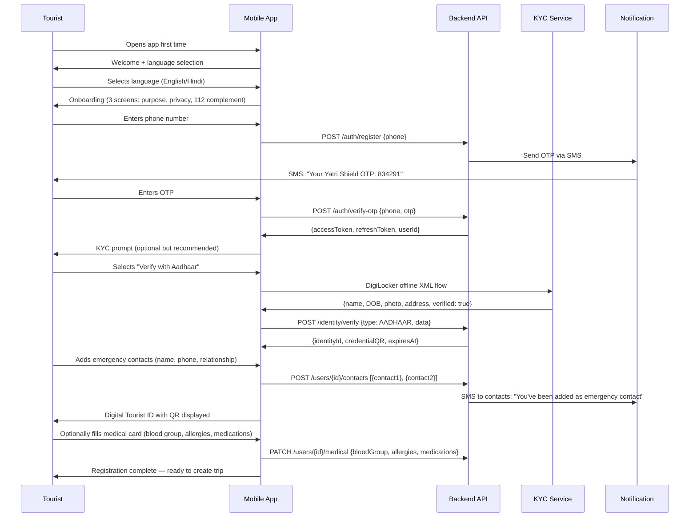
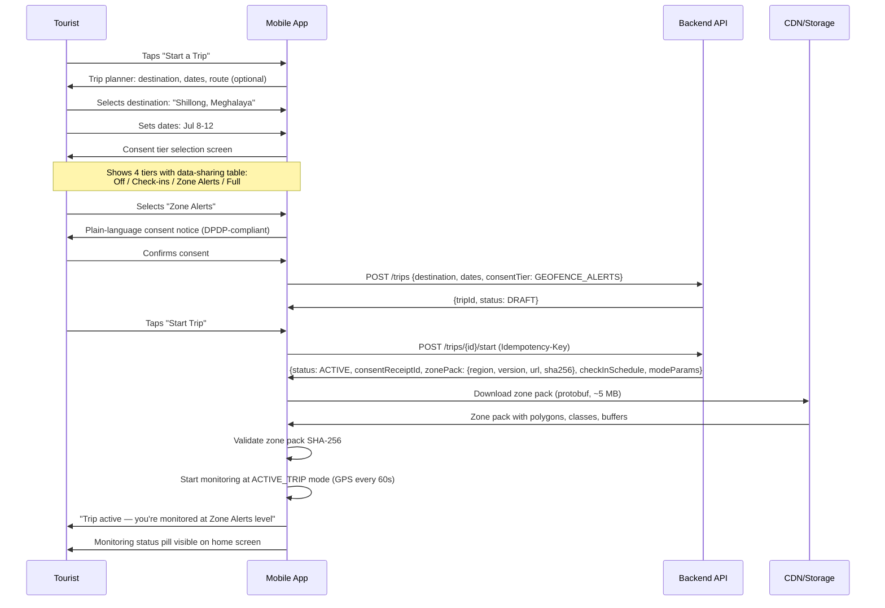
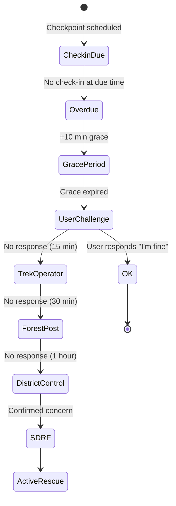
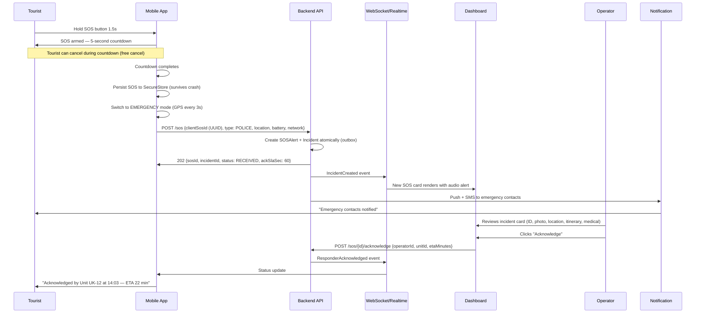
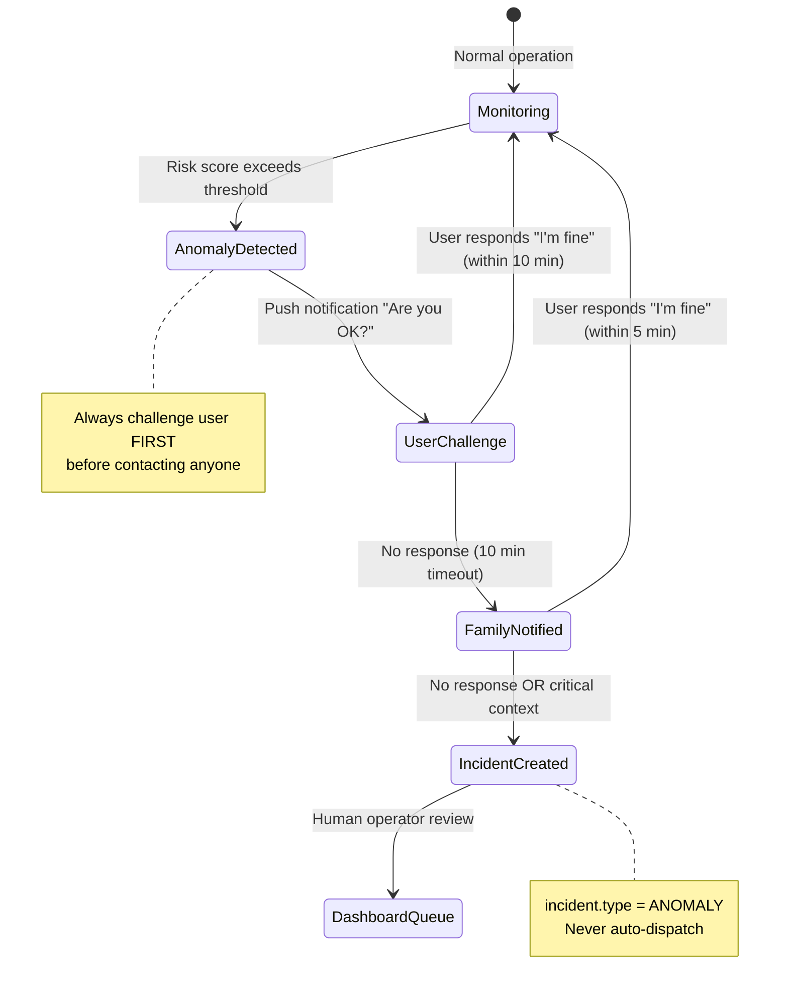
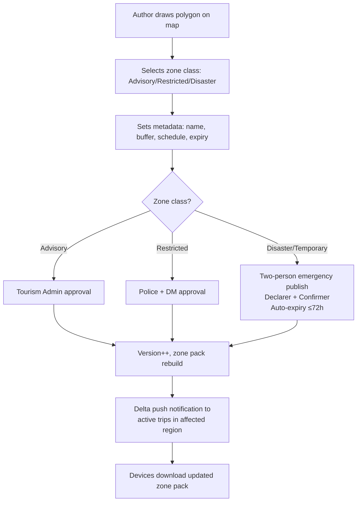

# User Journeys

> **Document**: 07-user-journeys.md  
> **Version**: 1.0.0  
> **Last Updated**: July 2026  
> **Audience**: Product managers, UX designers, engineers, QA  
> **Related**: [User Personas](06-user-personas.md) · [UI Specification — Mobile](08-ui-specification-mobile.md) · [Functional Requirements](03-functional-requirements.md)

---

## Journey Format

Each journey follows this structure:

- **Trigger**: What initiates the journey
- **Entry Point**: Where the user starts
- **Actors**: Who is involved
- **Preconditions**: What must be true before
- **Step-by-Step Workflow**: Happy path with system internals
- **Alternative Workflows**: Variations
- **Failure Workflows**: What happens when things go wrong
- **Offline Workflow**: Behaviour without network
- **Recovery Workflow**: How to recover from failures
- **Exit Conditions**: When the journey ends
- **Desired Outcome**: What success looks like
- **Personas**: Which personas this journey primarily serves

---

## J1. Tourist Registration & Digital ID Issuance

**Trigger**: Tourist arrives at airport/hotel/check-post, or self-serves in-app.  
**Entry Point**: App install → onboarding flow, or kiosk/hotel-assisted registration.  
**Actors**: Tourist, System, (optionally) hotel staff or immigration kiosk.  
**Personas**: P1, P2, P3, P4, P5.  
**Priority**: P0 (MVP).

### Preconditions

- App installed on tourist's device
- Phone number available (domestic SIM, international SIM, or WiFi-only with OTP via WhatsApp/email fallback)

### Happy Path



### Alternative Workflows

| Variation                                | Flow Change                                                                                                                                        |
| ---------------------------------------- | -------------------------------------------------------------------------------------------------------------------------------------------------- |
| **International tourist (no local SIM)** | WiFi-only mode; OTP via email or WhatsApp; passport scan instead of Aadhaar; nationality-aware embassy linking                                     |
| **Hotel/kiosk-assisted registration**    | Staff enters tourist details on kiosk → tourist confirms on their phone via QR link → OTP still sent to tourist's phone                            |
| **Group tour registration (P5 — Susan)** | Tour guide initiates group registration → each tourist gets individual QR link → simplified flow with large text → guide assists with medical card |
| **Skip KYC**                             | Tourist registers with phone only → provisional ID issued → reduced triage priority on SOS (noted on dashboard: "unverified identity")             |
| **Returning tourist**                    | Phone number recognised → re-OTP → existing profile restored → previous trip history visible                                                       |

### Failure Workflows

| Failure                       | System Behaviour                                                         | User Experience                                                                |
| ----------------------------- | ------------------------------------------------------------------------ | ------------------------------------------------------------------------------ |
| OTP gateway down              | Email fallback → both down: retry-after with queue                       | "OTP sending failed. Trying alternate method..." → retry button with countdown |
| DigiLocker API down           | Provisional ID with deferred verification; KYC retry prompt after 1 hour | "Verification temporarily unavailable. You can proceed and verify later."      |
| Passport OCR poor quality     | Manual entry with review flag; lower confidence score on ID              | "We couldn't read your passport clearly. Please enter details manually."       |
| Network loss mid-registration | Partial state saved locally; resume on reconnect                         | "Registration saved. We'll complete it when you're back online."               |
| Invalid OTP (3 attempts)      | Account locked 5 minutes; exponential backoff                            | "Too many attempts. Please try again in 5 minutes."                            |

### Offline Workflow

Registration requires at least one network contact (for OTP). If tourist has no network at all: kiosk/hotel-assisted registration where the kiosk has network, or defer registration until connectivity. The app stores a partial registration state locally.

### Exit Conditions

- Tourist has a verified or provisional Digital Tourist ID
- Emergency contacts added (at least one recommended; not required)
- Medical card optionally filled
- Consent receipt generated for KYC data processing

### Desired Outcome

A tourist exists in the system with verified identity, trip context, emergency contacts, and revocable consent. All downstream features (SOS, monitoring, hospital QR) can reference this identity.

---

## J2. Trip Creation & Starting Monitoring

**Trigger**: Tourist decides to start a trip.  
**Entry Point**: Home screen → "Start a Trip" button.  
**Actors**: Tourist, System.  
**Personas**: P1, P2, P3, P4, P5.  
**Priority**: P0.

### Happy Path



### Alternative Workflows

| Variation                     | Flow Change                                                                                                                      |
| ----------------------------- | -------------------------------------------------------------------------------------------------------------------------------- |
| **Geo-detected travel nudge** | User hasn't started a trip but location changes >50 km → "You seem to be travelling — start a trip?" (opt-in; max once per 24h)  |
| **Trek trip (P4)**            | Route selection from predefined trek corridors; group manifest linking; check-in interval aligned to checkpoint schedule         |
| **Tier change mid-trip**      | Tourist opens Privacy Centre → changes tier → consent receipt generated → pipeline adjusts within 60 seconds                     |
| **Zone pack download fails**  | Trip starts regardless; "Zone advisories unavailable" flag shown; retry in background; critical safety features (SOS) unaffected |

### Failure Workflows

| Failure                                    | System Behaviour                                                                         | User Experience                                                                                                      |
| ------------------------------------------ | ---------------------------------------------------------------------------------------- | -------------------------------------------------------------------------------------------------------------------- |
| Zone pack download fails (CDN down)        | Trip starts with stale/absent pack; background retry every 5 minutes                     | "Trip started. Zone advisories will be available when download completes."                                           |
| Background location permission not granted | App explains why permission is needed; degrades to Check-ins Only if "While In Use" only | Permission primer screen with clear benefit explanation; cannot select Full/Zone tiers without background permission |
| Battery optimisation not exempted          | OEM-specific guidance displayed                                                          | "For reliable monitoring, please disable battery optimisation for Yatri Shield" with step-by-step screenshots        |

### Offline Workflow

Trip creation requires initial API contact (to get zone pack). If tourist is offline: trip saved locally as draft; started on next connectivity; SOS always works regardless of trip status.

### Exit Conditions

- Trip is in ACTIVE state
- Zone pack downloaded (or flagged unavailable)
- Monitoring running at selected tier
- Consent receipt stored
- Check-in schedule initialised (if applicable to tier)

---

## J3. Background Monitoring (Steady State)

**Trigger**: Trip is active.  
**Entry Point**: Automatic (background service).  
**Actors**: System (background), Tourist (passive).  
**Personas**: P1, P2, P3, P4.  
**Priority**: P0.

### Behaviour by Mode

| Mode        | GPS Interval | Sync Interval           | On-Device Processing           | Upload Behaviour            |
| ----------- | ------------ | ----------------------- | ------------------------------ | --------------------------- |
| IDLE        | None         | None                    | None                           | None                        |
| ACTIVE_TRIP | 60 s         | 7 min (~7 points/batch) | Zone evaluation, motion gating | Per consent tier            |
| HIGH_RISK   | 20 s         | 3 min                   | Zone evaluation                | Per consent tier            |
| EMERGENCY   | 3 s          | 30 s                    | Continuous                     | Always uploaded (all tiers) |
| LOW_BATTERY | 240 s        | 15 min                  | Reduced zone evaluation        | Per consent tier            |

### Steady-State Operation

1. **Location acquisition**: Foreground Service (Android) / allowsBackgroundLocationUpdates (iOS) samples GPS at mode-configured interval
2. **On-device zone evaluation**: Each fix evaluated against cached zone polygons (bbox prefilter → ray-casting point-in-polygon)
3. **Motion gating**: 10 stationary minutes in ACTIVE_TRIP stretches GPS to 5-minute interval until accelerometer detects movement
4. **Batch assembly**: Points accumulated locally; synced every T seconds per mode
5. **Queue-and-forward**: If offline, batches queued in encrypted SQLCipher with idempotency keys; synced oldest-first on reconnect
6. **Daily auto "OK"**: If enabled by tourist, system sends "I'm fine" message to emergency contacts once per day (requires connectivity)

### Failure Scenarios

| Failure                                                   | Detection                                                                   | Response                                                                                                                                                                   |
| --------------------------------------------------------- | --------------------------------------------------------------------------- | -------------------------------------------------------------------------------------------------------------------------------------------------------------------------- |
| **OS kills background app** (Android OEM battery manager) | Server detects missed sync (no location batch for 2× expected interval)     | Server-side: trip enters "device-silent" state → if in risk zone, begins user-challenge flow. Device-side: BOOT_COMPLETED receiver restarts; WorkManager 15-min re-checker |
| **Battery drops below 15%**                               | expo-battery event                                                          | Mode transitions to LOW_BATTERY (240s GPS); recovers at 20% (hysteresis prevents flapping)                                                                                 |
| **GPS drift in gorge/canyon**                             | Fix accuracy >100m, speed sanity >250 km/h (implied)                        | Drop teleport fixes; require accuracy threshold per zone class before fence events                                                                                         |
| **User force-stops app**                                  | OS guarantee: total stop until next manual open                             | Server watchdog covers it; disclosed in UX ("Background monitoring requires the app to run")                                                                               |
| **iOS suspends app**                                      | SLC (Significant-Change Location Service) wakes on ~500m cell-level changes | Reduced fidelity disclosed; server-side check-in challenges compensate                                                                                                     |

### Desired Outcome

Invisible, boring, battery-cheap background monitoring. Tourist forgets the app is running. System accumulates location breadcrumbs for search-box reduction if ever needed.

---

## J4. Entering an Advisory Zone

**Trigger**: On-device fence-entry event (advisory-class zone).  
**Entry Point**: Automatic (background evaluation).  
**Actors**: Tourist (passive recipient), System.  
**Personas**: P1, P2, P3.  
**Priority**: P0.

### Happy Path

1. Device GPS fix places tourist inside advisory zone polygon
2. On-device engine applies gates: accuracy ≤75m, 2+ consecutive fixes inside, 30s dwell timer
3. Gates satisfied → local notification in tourist's language
4. Notification content: specific, calm, actionable. Example: "Petty theft reported frequently here after 21:00; keep valuables secured; nearest police aid post 400 m"
5. Tourist reads or dismisses notification
6. Event logged **locally only** — advisory hits never leave the device `[RECOMMENDATION — privacy]`
7. No authority notification for advisory zones

### Failure Scenarios

| Failure                             | Response                                                                                  |
| ----------------------------------- | ----------------------------------------------------------------------------------------- |
| **Alert fatigue from over-fencing** | Strict zone-quality governance; cap at 3 advisories per day per device; zone review cycle |
| **GPS error at boundary**           | Hysteresis buffer prevents rapid enter/exit cycling; 5-minute per-zone cooldown           |
| **Stale zone pack**                 | Server pushes zone-pack-update notification; app downloads delta                          |

### Ignored Advisory

System does nothing further except log locally. Tourist autonomy is respected.

### Desired Outcome

Tourist is informed, not policed. Advisory improves situational awareness without creating surveillance.

---

## J5. Entering a Restricted Zone

**Trigger**: Fence entry, restricted-class zone (border/military/forest core).  
**Entry Point**: Automatic (background evaluation).  
**Actors**: Tourist, System, Authority (forest dept / police / military).  
**Personas**: P1, P2, P4.  
**Priority**: P0.

### Happy Path (Unpermitted Entry)

1. Device GPS fix places tourist inside restricted zone polygon
2. On-device engine applies stricter gates: accuracy ≤30m, 2+ consecutive fixes, 60s dwell timer
3. Gates satisfied → **strong warning notification** + guidance to exit + legal notice
4. If dwell exceeds threshold (configurable per zone, default 5 minutes), event uploaded to server
5. Server re-validates against authoritative PostGIS polygon (protects against tampered packs)
6. Server confirms → authority notified with tourist ID + location per disclosed policy
7. Authority contacts/intercepts per SOP

### Alternative: Permit-Holder

1. Tourist has a linked permit (ILP, forest permit, PAP)
2. Permit ID attached to Digital Tourist ID
3. On zone entry, system checks permit validity: zone ID + date range
4. Valid permit → alert suppressed; event logged as "permitted entry"
5. Invalid/expired permit → treated as unpermitted entry

### Failure Scenarios

| Failure                                 | Response                                                                                                                                                 |
| --------------------------------------- | -------------------------------------------------------------------------------------------------------------------------------------------------------- |
| **GPS-drift false entry near boundary** | Buffer zones (polygon shrunk by accuracy radius on entry); dwell-time and accuracy gates before escalation; uncertain-state events not sent to authority |
| **Wrongful stop of foreign tourist**    | Diplomatic incident risk — gates must be conservative; permit-check suppression must work; "uncertain" state yields advisory, not authority notification |
| **Tampered zone pack**                  | Server-side PostGIS re-validation catches tampered geometries                                                                                            |

### Desired Outcome

Prevention first, enforcement second. Tourist warned and guided out before authority involvement. False positives minimised through conservative gating.

---

## J6. Trek Route Deviation & Missed Checkpoint

**Trigger**: Device >X metres off corridor for >T minutes, or checkpoint missed by >T.  
**Actors**: Tourist (trekker), Trek Leader, System, Forest Post, District Control, SDRF.  
**Personas**: P4 (Ramesh), P7 (Meera).  
**Priority**: P1.

### Route Deviation Path

1. Device detects trekker >200m off defined trek corridor for >10 minutes
2. On-device alarm: "You appear off-route" + backtrack guidance using offline map
3. One-tap response options: "I'm fine" / "Intentional detour" / "Need help"
4. "I'm fine" → event logged; monitoring continues with elevated risk score
5. "Intentional detour" → acknowledged; group-lead can override for entire group
6. No response + offline → phone enters beacon mode: periodic SMS attempts with compressed coordinates; louder local alarm
7. "Need help" → SOS flow triggered (J9)

### Missed Checkpoint Path



1. Checkpoint check-in due (per schedule)
2. No check-in within scheduled time + 10 min grace
3. System sends push challenge: "Are you OK? Respond in 15 min"
4. No response → SMS challenge (if GSM available)
5. Still no response → notify trek operator (if registered)
6. Still no response (30 min total) → notify local forest post
7. Still no response (1 hour total) → district control notified
8. Confirmed concern → SDRF notified with: route plan, last checkpoint, last GPS fix + accuracy, group manifest

### Failure Scenarios

| Failure                                 | Response                                                                                                             |
| --------------------------------------- | -------------------------------------------------------------------------------------------------------------------- |
| **Everyone is offline** (dead zone)     | Server-side detection depends on absence of expected sync; escalation triggers on missed checkpoint, not live data   |
| **False alarm from planned detour**     | Group-lead override; "intentional detour" acknowledgement                                                            |
| **GPS fix with 150m accuracy in gorge** | Last-fix displayed WITH accuracy radius; SDRF persona (P7) trained to interpret accuracy, not treat as precise point |

### Desired Outcome

Sahastra Tal-type events detected in hours, not days. SDRF gets a search box measured in hundreds of metres, not an entire valley.

---

## J7. Manual SOS (Online)

**Trigger**: Tourist taps SOS button or hold-to-arm trigger.  
**Entry Point**: Shield tab → SOS button.  
**Actors**: Tourist, System, Operator (police), Emergency Contacts.  
**Personas**: All tourist personas; P6 (SI Dorjee).  
**Priority**: P0.

### Happy Path



### SOS Packet Contents

| Field            | Source                                         | Purpose                                                |
| ---------------- | ---------------------------------------------- | ------------------------------------------------------ |
| clientSosId      | Client-generated UUID                          | Idempotency key; dedup across retries and SMS/app twin |
| type             | User selection (POLICE/MEDICAL/SILENT/GENERAL) | Triage routing                                         |
| location.lat/lon | GPS fix                                        | Dispatch                                               |
| location.accM    | GPS accuracy metres                            | Operator sees confidence radius                        |
| location.ts      | Fix timestamp                                  | Staleness assessment                                   |
| battery          | Device battery level                           | Urgency context (5% = time-critical)                   |
| network          | Network type (4G/3G/EDGE/WIFI/NONE)            | Operator knows follow-up channel reliability           |
| note             | Optional free text                             | "Chest pain near checkpoint 3"                         |
| identityRef      | Digital Tourist ID reference                   | Verified identity for triage priority                  |
| medicalCardRef   | Medical card reference                         | Auto-attached for MEDICAL type                         |
| tripId           | Active trip reference                          | Itinerary context                                      |

### Failure Scenarios

| Failure                                | Response                                                                                               |
| -------------------------------------- | ------------------------------------------------------------------------------------------------------ |
| **Pocket trigger**                     | 5-second countdown with PIN cancel; hold-to-arm prevents accidental activation                         |
| **No operator acknowledgement in 60s** | Auto-escalation: supervisor queue + voice-call bridge attempt `[PROD]`                                 |
| **Tourist also dials 112**             | Operator uses "link external incident" merge tool; dedup by tourist ID                                 |
| **App crashes during SOS**             | SOS persisted to SecureStore at countdown start; root-level restorer returns to SOS screen on relaunch |
| **API unreachable**                    | Offline SOS path (J8)                                                                                  |

---

## J8. Offline SOS (Critical Path)

**Trigger**: Tourist activates SOS with no data network.  
**Actors**: Tourist, System (local), SMS Gateway (if GSM available), Server (on reconnect).  
**Personas**: P1 (Arjun in Spiti), P4 (Ramesh on trek).  
**Priority**: P0.

### Path

```mermaid
flowchart TD
    A[Tourist presses SOS] --> B[App persists SOS to encrypted queue]
    B --> C{Data network?}
    C -->|Yes| D[Normal SOS path J7]
    C -->|No| E{GSM signal?}
    E -->|Yes Android| F[Programmatic SMS to shortcode<br/>SOS|v1|UUID|lat|lon|acc|ts|idRef<br/>~110 chars, fits one SMS]
    E -->|Yes iOS| G[Pre-filled SMS composer<br/>User taps Send]
    E -->|No| H[Device enters beacon mode<br/>Periodic radio scan<br/>Local alarm/strobe]
    F --> I[SMS Gateway receives]
    G --> I
    I --> J[Server creates incident<br/>source=sms, lower-verification flag]
    H --> K[Device keeps scanning for any connectivity]
    K --> L{Connectivity restored?}
    L -->|Yes| M[Sync queue: SOS first priority]
    M --> N[Server merges SMS-incident and<br/>app-incident by sosUUID]
    L -->|No| O[Queue persists across reboot<br/>Server detects missed sync<br/>as independent signal]
```

### iOS Limitation (Disclosed Honestly)

iOS cannot send SMS programmatically. The app opens a pre-filled MFMessageComposeViewController — the tourist must tap "Send" once. This is an irreducible OS constraint. The app pre-fills:

- Recipient: demo shortcode `78112` (production: registered DLT shortcode)
- Body: `SOS|v1|<sosUUID>|<lat>|<lon>|<acc>|<ts>|<idRef>`

### Failure: No GSM Either

Device continues local alarm/strobe. Queue persists across reboot. Trek checkpoint logic provides server-side detection fallback via missed expected sync. This is the hardest case — and it is documented honestly: in a true communication blackout, detection depends on absence (missed sync/checkpoint), not presence (SOS delivery).

---

## J9. Silent SOS

**Trigger**: Tourist activates SOS with "silent" type (P3 — Priya scenario: harassment/threat where audible alert would endanger her).  
**Actors**: Tourist, System, Operator.  
**Personas**: P3 (Priya).  
**Priority**: P0.

### Behaviour Differences from Standard SOS

| Aspect                 | Standard SOS                       | Silent SOS                                |
| ---------------------- | ---------------------------------- | ----------------------------------------- |
| Local sounds           | Countdown beeps, confirmation tone | None                                      |
| Screen change          | SOS active screen with red theme   | Minimal UI change; can navigate away      |
| Vibration              | Standard haptic                    | Single subtle vibration only              |
| Dashboard flag         | Standard incident                  | **COVERT** flag                           |
| Responder instructions | Normal dispatch                    | "DO NOT CALL BACK to victim's phone"      |
| SMS to contacts        | Standard alert text                | Discreet text (no "EMERGENCY" in preview) |

### Operator Protocol for COVERT Incidents

1. Do not attempt voice call to tourist's phone
2. Use in-app messaging only (if tourist has data)
3. SMS decoy option: send a benign-looking message ("Your Yatri Shield trip update is ready") that contains a hidden check-in response link
4. Dispatch units briefed on covert approach
5. Tourist's screen shows no visible SOS indicators that an aggressor could see

---

## J10. Automatic Risk Detection & Challenge

**Trigger**: Prolonged inactivity vs. itinerary, phone dark mid-trip in a risk zone, route deviation at night, possible-crash signature.  
**Actors**: Risk Engine, Tourist, Emergency Contacts, Authority.  
**Personas**: P1, P2, P3.  
**Priority**: P1.

### Challenge-First State Machine



### Key Rule

**Dead battery ≠ emergency.** The severity matrix must weigh:

- Zone risk classification (restricted zone + silence = HIGH; urban area + silence = LOW)
- Itinerary context (expected to be in a dead zone vs. expected to be in city)
- Time of day (night silence weighted higher)
- Weather conditions (IMD warning active = higher weight)
- Last known battery level (5% battery + silence = likely dead battery, not emergency)
- Fix quality (stale data caps severity; never CRITICAL on stale data alone)

---

## J11. Disaster Zone Activation & Roll-Call

**Trigger**: SDMA/police declare a temporary emergency polygon (flood/landslide/security).  
**Actors**: Authority (DM/SDMA), System, Tourists in zone, SDRF.  
**Personas**: P5, P7, P8.  
**Priority**: P1.

### Workflow

1. Authority declares emergency polygon via dashboard (two-person emergency publish: declarer + confirmer)
2. System creates temporary disaster zone with auto-expiry ≤72 hours
3. Push + SMS + Cell Broadcast (SACHET integration where available) sent to devices in/near polygon
4. Multilingual alert with pre-approved template
5. "Mark yourself safe" prompt displayed to tourists in zone
6. Exit routing displayed (if safe routes known)
7. Dashboard shows roll-call: inside count, safe-marked count, unresponsive list with last GPS fix
8. Unresponsive tourists prioritised for SAR based on: terrain, weather, fix staleness, fix accuracy

### Failure: Network Destroyed by Disaster

Cell Broadcast (SACHET/CAP) is the resilient channel — works without internet, without app. App notification is secondary. If Cell Broadcast unavailable: SMS is next fallback. Badly-worded alerts cause panic — pre-approved templates mandatory.

---

## J12. Incident Reporting (Non-Emergency) & e-FIR

**Trigger**: Tourist wants to report theft/harassment after the fact.  
**Actors**: Tourist, System, Police (jurisdictional PS).  
**Personas**: P1, P2, P3.  
**Priority**: P1.

### Workflow

1. Tourist opens "Report Incident" from app menu
2. Selects incident type (theft, harassment, lost document, other)
3. Fills structured form in their language: what, where, when, description
4. Attaches photos/videos (hashed client-side)
5. Submits report
6. System generates timestamped, hash-anchored acknowledgement with reference number
7. Report routed to jurisdictional PS based on incident location (Zero FIR principle — any PS can receive)
8. Police verify, register, update status
9. Tourist tracks status even after leaving the state/country
10. e-FIR draft auto-generated where state rules permit (BNSS 2023 provisions)

### Desired Outcome

Reporting a theft takes 10 minutes, not a day. Tourist gets a stamped reference. Status is trackable remotely.

---

## J13. Police Response → Hospital Handoff → Family Notification → Resolution

**Trigger**: SOS acknowledged, responder dispatched.  
**Actors**: Police Operator, Responder Unit, Ambulance, Hospital, Tourist, Family.  
**Personas**: P6, P9, all tourist personas.  
**Priority**: P0 (SOS to ack), P1 (full chain).

### Unified Incident Timeline

```
14:02 — SOS received (app, type: MEDICAL, battery: 18%)
14:03 — Acknowledged by Operator SI Dorjee (ack latency: 41s)
14:06 — Unit UK-12 assigned, dispatched (ETA: 22 min)
14:19 — Unit UK-12 on-scene
14:23 — Ambulance 108 requested
14:31 — Ambulance handoff (medical card transferred via QR)
14:35 — Emergency contacts notified (push + SMS to 2 contacts)
14:58 — Hospital admit (District Hospital Uttarkashi, access logged)
15:15 — Hospital treatment update: "Patient stable, IV administered"
16:00 — Tourist status: RESOLVED (stable, under observation)
17:30 — Incident closed with disposition code: MEDICAL_RESOLVED
17:30 — Closure summary sent to tourist
Next day — Feedback prompt sent to tourist
All events — Hash-chained; Merkle root anchored to blockchain
```

### Seam Failures

| Seam                              | Failure                      | Mitigation                                                  |
| --------------------------------- | ---------------------------- | ----------------------------------------------------------- |
| SOS → Operator                    | No ack in 60s                | Escalation to supervisor queue + voice bridge               |
| Operator → Dispatch               | Unit unavailable             | Alternative unit assignment; escalation                     |
| Dispatch → On-scene               | Unit can't reach location    | Status update "blocked" + request additional resources      |
| On-scene → Ambulance              | 108 unavailable              | SOS remains active; hospital contacted directly             |
| Ambulance → Hospital              | Hospital at capacity         | Alternative hospital routing                                |
| Duplicate: tourist also calls 112 | Two incidents for same event | Dedup logic: merge by tourist ID + spatial-temporal cluster |

---

## J14. Post-Incident Follow-Up

**Trigger**: Incident closed.  
**Actors**: Tourist, System, Embassy (for foreigners).  
**Personas**: P2, all tourist personas.  
**Priority**: P2.

### Workflow

1. Tourist receives closure summary (push + in-app)
2. Feedback survey sent after 24 hours
3. Consular notification workflow for foreigners `[OPEN QUESTION — MEA/embassy protocol]`
4. Insurance incident certificate available on tourist request
5. Data deletion per retention schedule kicks in after trip end
6. Tourist can download their incident data before deletion

---

## J15. Consent Management & Data Deletion

**Trigger**: Tourist changes consent tier, withdraws consent, or requests deletion.  
**Actors**: Tourist, System.  
**Personas**: All tourist personas.  
**Priority**: P1.

### Consent Withdrawal

1. Tourist opens Privacy Centre → selects "Stop all monitoring"
2. Confirmation screen explains consequences: "Active trip monitoring will stop. SOS will still work."
3. Tourist confirms
4. System: immediately stops all location processing pipeline
5. Consent withdrawal receipt generated (timestamp, old tier, new tier)
6. Retention clock starts for existing data (per policy schedule)
7. If active incident exists: legal hold disclosed, monitoring continues for incident scope only

### Data Deletion Request

1. Tourist requests data deletion via Privacy Centre
2. System checks for legal holds (open incidents, regulatory retention)
3. If no holds: deletion scheduled per policy (location data: 30 days; incident data: per legal retention; account data: 90 days)
4. If holds exist: tourist informed of hold reason and expected release date
5. Deletion certificates logged when completed
6. Blockchain-anchored hashes remain (they contain no PII; roots alone are not personal data)

---

## J16. Zone Governance & Publishing

**Trigger**: Authority creates or modifies a geo-fence zone.  
**Entry Point**: Dashboard → Zone Management.  
**Actors**: Tourism Admin, Police Admin, DM (approver), System.  
**Personas**: P8 (Joseph), P6 (SI Dorjee).  
**Priority**: P0.

### Workflow



### Zone Quality Governance

| Rule                                   | Rationale                                                        |
| -------------------------------------- | ---------------------------------------------------------------- |
| Mandatory expiry for temporary zones   | Stale disaster zones mislead tourists                            |
| Area caps per zone class               | Over-broad zones generate noise                                  |
| Advisory zones limited to 3 per region | Alert fatigue prevention                                         |
| Neutral phrasing enforced              | "Stay-alert zone" not "unsafe area" — tourism economy protection |
| Audit trail on all zone changes        | Who created, who approved, when, what changed                    |
| Immutable versions                     | Every published version preserved for forensic reference         |

### Desired Outcome

Bad zones (stale, political, over-broad) will destroy user trust faster than any technical failure. Zone governance is the hidden product.

---

## References

- [User Personas](06-user-personas.md)
- [Functional Requirements](03-functional-requirements.md)
- [UI Specification — Mobile](08-ui-specification-mobile.md)
- [UI Specification — Dashboards](09-ui-specification-dashboards.md)
- [SOS & Incident Management](23-sos-incident-management.md)
- [Risk Engine](21-risk-engine.md)
- [Geofencing Architecture](19-geofencing-architecture.md)
- [Offline Synchronization](25-offline-synchronization.md)
- [Privacy Architecture](26-privacy-architecture.md)
