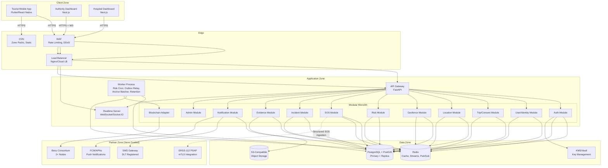
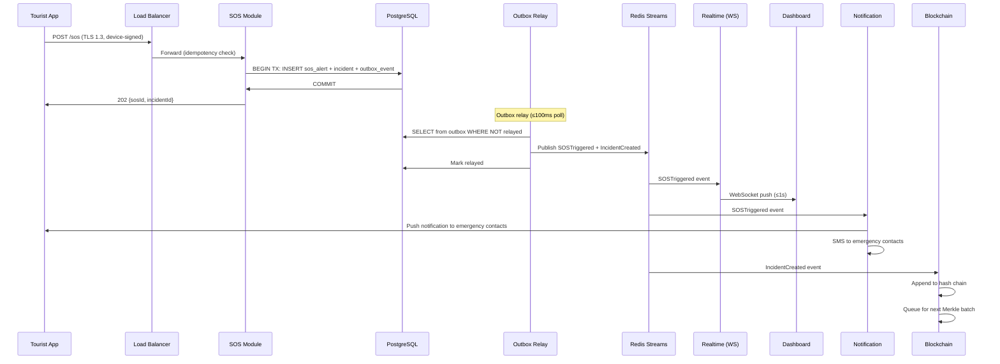
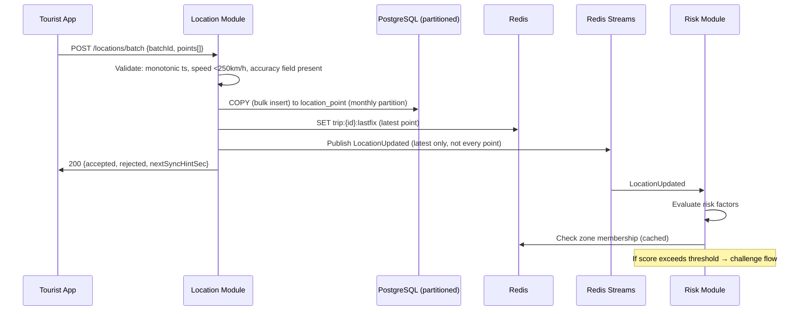
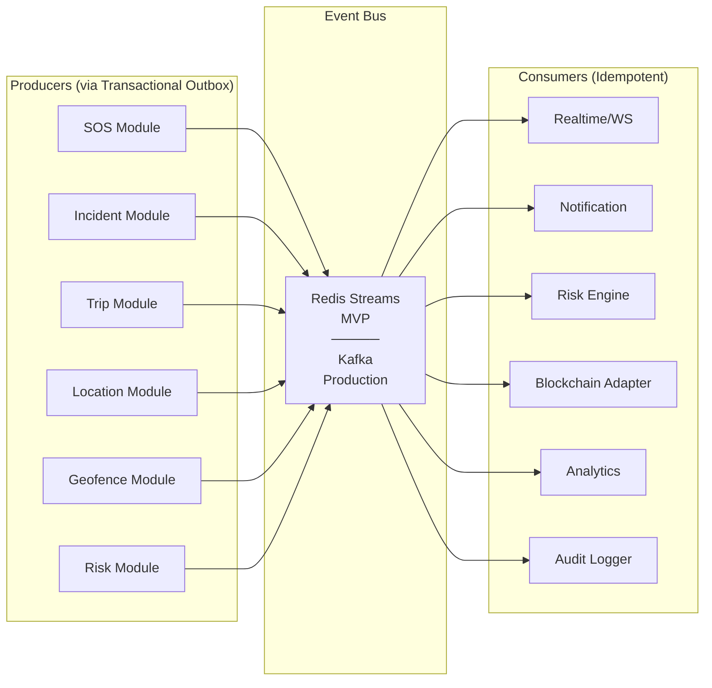
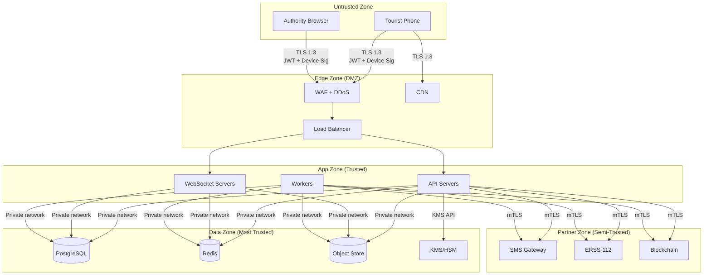
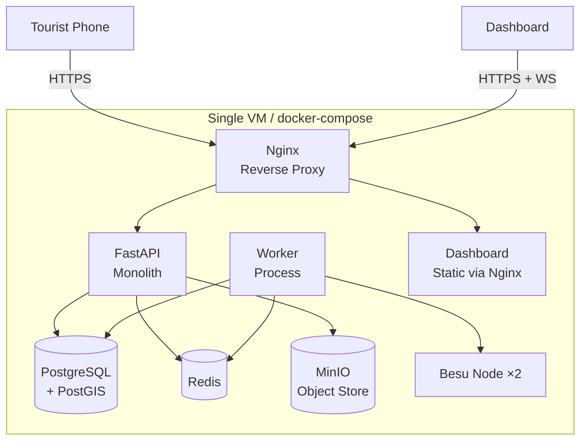
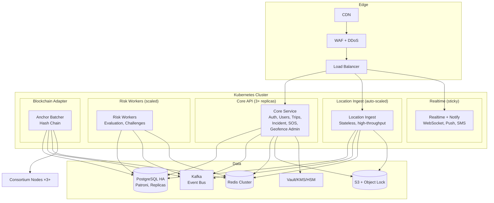

# System Architecture

> **Document**: 11-system-architecture.md  
> **Version**: 1.0.0  
> **Last Updated**: July 2026  
> **Audience**: System architects, senior engineers, DevOps  
> **Related**: [Backend Architecture](13-backend-architecture.md) · [Mobile Architecture](12-mobile-architecture.md) · [Database Architecture](14-database-architecture.md) · [Architecture Decision Records](36-architecture-decision-records.md)

---

## 1. Architecture Overview

### 1.1 Architectural Style

**Decision** `[REC]` (ADR-01): **Modular monolith** with strict module boundaries + transactional outbox + event-driven internals.

Rationale: consistency-critical incident core benefits from local transactions; team too small for distributed operations overhead; extraction path preserved. Full microservices from day one is rejected.

### 1.2 Component Diagram



### 1.3 Component Responsibilities

| Component                | Responsibility                                                                               | Data Owned                            | Dependencies                     |
| ------------------------ | -------------------------------------------------------------------------------------------- | ------------------------------------- | -------------------------------- |
| **Auth Module**          | Registration, OTP, JWT issuance/refresh, device binding, MFA                                 | Sessions, devices, tokens             | KMS, SMS gateway, Redis          |
| **User/Identity Module** | Profile, KYC, Digital ID, medical card, emergency contacts                                   | Users, identity, medical              | DigiLocker API, KMS              |
| **Trip/Consent Module**  | Trip lifecycle, consent tiers, consent receipts, check-in scheduling                         | Trips, consent receipts               | User module                      |
| **Location Module**      | Batch ingestion, validation, storage, last-fix cache                                         | Location points                       | Redis (cache), PostGIS           |
| **Geofence Module**      | Zone CRUD, zone packs, server-side validation, pack distribution                             | Zones, geofence events                | PostGIS, CDN                     |
| **Risk Module**          | Rules evaluation, scoring, challenge orchestration, anomaly detection                        | Risk assessments                      | Location, Trip, Geofence modules |
| **SOS Module**           | SOS receipt, validation, incident creation, SMS ingestion                                    | SOS alerts                            | Incident module, Notification    |
| **Incident Module**      | Lifecycle state machine, dispatch, escalation, merge, evidence linking                       | Incidents, incident events            | All modules                      |
| **Evidence Module**      | Upload presigning, hash verification, storage                                                | Evidence metadata                     | S3, Blockchain adapter           |
| **Notification Module**  | Multi-channel dispatch, templates, delivery tracking                                         | Notifications, delivery status        | FCM, APNs, SMS gateway           |
| **Blockchain Adapter**   | Hash-chain, Merkle tree, batch anchoring, verification                                       | Blockchain anchors, chain data        | Besu/transparency log            |
| **Admin Module**         | Org management, config versioning, audit log, health                                         | Config versions, audit log            | All modules                      |
| **Realtime Server**      | WebSocket management, pub/sub relay, dashboard updates                                       | (stateless — relies on Redis pub/sub) | Redis pub/sub                    |
| **Worker Process**       | Background jobs: risk cron, outbox relay, anchor batcher, retention drops, liveness watchdog | (operates on other modules' data)     | PG, Redis, Blockchain            |

---

## 2. Data Flow Architecture

### 2.1 SOS Flow (Critical Path)



**Isolation guarantee**: The SOS path has its own connection pool, priority queue lane, and can function with only: LB → SOS module → PostgreSQL. All other dependencies (Redis, notifications, blockchain) are asynchronous and non-blocking.

### 2.2 Location Ingestion Flow



### 2.3 Event-Driven Internal Architecture



**Event envelope**: `{eventId (UUIDv7), type, version, occurredAt, correlationId, causationId, producer, payload}`

**Consumer idempotency**: Each consumer maintains a processed-events table (or Redis SETNX with 7-day TTL). Duplicate eventId → skip.

---

## 3. Trust Boundaries



**Trust rules**:

1. Nothing in App Zone holds long-term keys (KMS manages)
2. Partner Zone is mutually-authenticated (mTLS) and semi-trusted — validate all inbound data
3. SMS-origin SOS gets `source=sms, unverified-channel` flag (lower verification than app-origin)
4. Data Zone reachable only from App Zone via security groups
5. CDN serves only signed, read-only zone packs (no write path)

---

## 4. Module Boundary Rules

| Rule                                                                                                      | Enforcement                       |
| --------------------------------------------------------------------------------------------------------- | --------------------------------- |
| Modules communicate via defined interfaces (service layer), never direct DB queries across module schemas | Code review + linting             |
| Cross-module data access uses events, not direct function calls                                           | Transactional outbox pattern      |
| Each module owns its database tables (separate schemas within same PostgreSQL instance)                   | Schema-per-module convention      |
| No circular dependencies between modules                                                                  | Dependency graph validation in CI |
| Shared types (event envelopes, error types, pagination) live in a common package                          | Shared kernel package             |

---

## 5. Scaling Architecture

### 5.1 MVP Architecture (Single VM)



### 5.2 Production Architecture



### 5.3 Extraction Path (Modular Monolith → Services)

| Step | Trigger Metric                                                  | Extract                                                                  | Reason                                                                                                  |
| ---- | --------------------------------------------------------------- | ------------------------------------------------------------------------ | ------------------------------------------------------------------------------------------------------- |
| 1    | Location writes > 1000/s sustained                              | **Location-Ingest** → separate service (Go candidate for raw throughput) | Write amplification; independent scaling; can use COPY-optimised path                                   |
| 2    | Dashboard WS connections > 500 or notification volume > 10k/min | **Realtime + Notification** → separate service                           | Connection-count scaling; independent failure domain                                                    |
| 3    | Risk evaluation latency > 500ms p95                             | **Risk Workers** → separate service                                      | CPU-bound; independent scaling                                                                          |
| 4    | Consortium node governance settled                              | **Blockchain Adapter** → separate service                                | Isolation from core; different deployment cadence                                                       |
| 5    | Never extract early                                             | **Incident/SOS Core**                                                    | Consistency heart; local transactions are the value; extraction adds distributed transaction complexity |

---

## 6. Cross-Cutting Architecture Patterns

### 6.1 Transactional Outbox

Every state-changing operation that produces an event writes both the state change AND the event row in the same database transaction:

```
BEGIN;
  INSERT INTO incidents (...) VALUES (...);
  INSERT INTO outbox_events (id, type, payload, created_at, relayed) VALUES (..., false);
COMMIT;
```

The outbox relay process polls `outbox_events WHERE relayed = false`, publishes to Redis Streams/Kafka, and marks `relayed = true`. This guarantees at-least-once delivery without distributed transactions.

### 6.2 Idempotency

Every mutating endpoint accepts an `Idempotency-Key` header. Server stores `(key, requestHash, response)` for 48 hours. Duplicate request with same key → return stored response. Mismatched body on same key → 422 IDEMPOTENCY_CONFLICT.

### 6.3 Correlation & Causation

Every request generates a `correlationId` (or inherits from `X-Correlation-Id` header). Events carry both `correlationId` and `causationId` (the eventId that triggered this event). All logs include `correlationId` for end-to-end tracing.

### 6.4 Graceful Degradation Ladder

Ordered from least to most severe:

1. **Lose analytics** → system fully operational for safety functions
2. **Lose blockchain anchoring** → incidents work, verification reports "pending"
3. **Lose advisory push notifications** → on-device fencing still works
4. **Lose family notifications** → SOS still reaches operators
5. **Never lose SOS intake** → isolated pool, minimal dependencies: LB → SOS module → PostgreSQL (or fallback log file)

---

## References

- [Backend Architecture](13-backend-architecture.md)
- [Mobile Architecture](12-mobile-architecture.md)
- [Database Architecture](14-database-architecture.md)
- [API Specification](15-api-specification.md)
- [Architecture Decision Records](36-architecture-decision-records.md)
- [Deployment Architecture](29-deployment-architecture.md)
- [Scalability (NFR)](04-non-functional-requirements.md#3-scalability-requirements)
