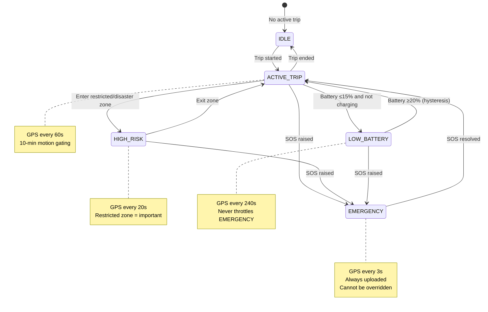
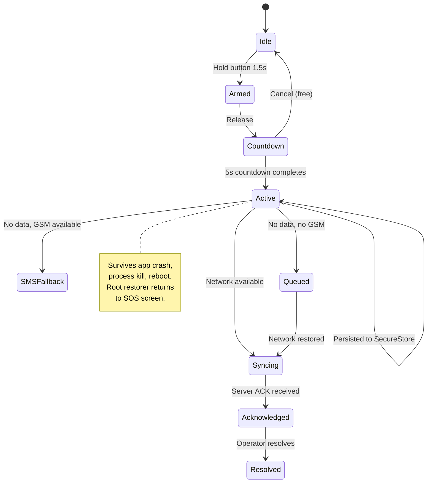

# Mobile Architecture

> **Document**: 12-mobile-architecture.md  
> **Version**: 1.0.0  
> **Last Updated**: July 2026  
> **Audience**: Mobile engineers, QA  
> **Related**: [System Architecture](11-system-architecture.md) · [UI Specification — Mobile](08-ui-specification-mobile.md) · [Offline Synchronization](25-offline-synchronization.md)

---

## 1. Platform Reality

### 1.1 Android Background Service Architecture

**Permissions ladder** `[stable platform behaviour; re-verify current API level]`:

| Permission                                          | User Action                           | Impact                                                  |
| --------------------------------------------------- | ------------------------------------- | ------------------------------------------------------- |
| `ACCESS_FINE_LOCATION` (while-in-use)               | Single prompt                         | GPS when app is visible                                 |
| `ACCESS_BACKGROUND_LOCATION` ("Allow all the time") | Separate prompt via settings redirect | GPS in background — **required for monitoring**         |
| `ACCESS_COARSE_LOCATION` only (Android 12+ option)  | User may grant coarse-only            | App must detect and degrade to approximate monitoring   |
| `SEND_SMS`                                          | Standard permission prompt            | Required for offline SOS SMS fallback                   |
| `POST_NOTIFICATIONS` (Android 13+)                  | Standard permission prompt            | Required for alerts and foreground service notification |

**Foreground Service (FGS)** with `foregroundServiceType="location"`:

- Persistent notification during active trips ("Yatri Shield — Protected · Active trip")
- Android 14+: FGS types must be declared in manifest AND runtime justification provided
- Starting FGS from background is restricted — must start while app is visible or from allowed triggers: high-priority FCM, exact alarm, boot receiver
- Play Store policy: background-location use requires in-app disclosure; safety apps qualify but expect review friction `[ASSUMPTION — verify current policy]`

**Doze / App Standby**:

- Deep Doze defers network and jobs
- FGS with location type is largely exempt from location throttling BUT network windows still batch
- `setExactAndAllowWhileIdle` alarms for check-in timers
- High-priority FCM pierces Doze for user-challenge flow

**OEM Battery Killers** (Xiaomi MIUI, Oppo ColorOS, Vivo FuntouchOS, OnePlus OxygenOS):

- These **kill even Foreground Services** aggressively
- Mitigations:
  1. Battery-optimisation exemption prompt (`ACTION_REQUEST_IGNORE_BATTERY_OPTIMIZATIONS` — Play-policy-acceptable for safety category `[ASSUMPTION]`)
  2. OEM-specific guidance screens (dontkillmyapp.com-style instructions per manufacturer)
  3. Server-side liveness watchdog: if a monitored trip's device misses 2× expected sync interval, that itself is a detection signal — **this converts OS unreliability into a detection feature**

**Process Death Recovery**:

- `BOOT_COMPLETED` BroadcastReceiver restarts monitoring for active trips
- `START_STICKY` service flag
- `WorkManager` periodic job (≥15 min) as belt-and-braces re-checker
- User force-stop = total stop until next app open (OS guarantee) — must be disclosed in UX; server watchdog covers it

### 1.2 iOS Background Service Architecture

**No arbitrary background services exist.** Available mechanisms:

| Mechanism                                                          | Behaviour                                                                            | Survives Termination                      | Battery  | Fidelity    |
| ------------------------------------------------------------------ | ------------------------------------------------------------------------------------ | ----------------------------------------- | -------- | ----------- |
| Standard location updates (`allowsBackgroundLocationUpdates=true`) | Continuous GPS; blue indicator bar                                                   | No (app must be running)                  | HIGH     | HIGH        |
| Significant-Change Location Service (SLC)                          | Wakes app on ~500m cell-level changes                                                | **Yes** (survives termination and reboot) | LOW      | LOW (~500m) |
| Region monitoring                                                  | Hardware-assisted geofence; max **20 regions** per app; circular only; ≥~100m radius | **Yes**                                   | VERY LOW | MEDIUM      |
| Visit monitoring                                                   | Coarse place-based                                                                   | Yes                                       | VERY LOW | VERY LOW    |
| Background App Refresh                                             | OS-scheduled; throttled; not guaranteed                                              | No                                        | LOW      | N/A         |

**"Always" location**: Requires provisional flow (WhenInUse first, then upgrade prompt) and App Store justification. Users can silently downgrade to WhenInUse — app must detect via `authorizationStatus` and warn.

**Push (APNs)**: High-priority alerts wake UI but cannot reliably run arbitrary code in background (`content-available` background pushes are best-effort, throttled).

**SMS**: Cannot be sent programmatically. Offline SOS on iOS = pre-filled `MFMessageComposeViewController` (tourist taps "Send" once). This is an irreducible OS constraint.

### 1.3 "Should the app run as a background service?" — Explicit Answer

**Android: YES** — a location-type Foreground Service with persistent notification during active trips only, plus Play-services geofence wake-ups, boot/app-update receivers, WorkManager re-checker, and battery-optimisation exemption for the safety use case.

**iOS: NO** — not as a persistent service, because the platform forbids it. Instead compose:

1. Continuous location updates (`allowsBackgroundLocationUpdates`) only during active trips
2. SLC as the resurrection mechanism after OS suspension
3. The 20-region budget spent dynamically on the nearest/highest-priority fences (re-seeded on each SLC wake)
4. Check-in timers implemented server-side (push-challenge) rather than as local background timers

**Accept and disclose**: iOS fidelity < Android fidelity. The server watchdog + user-challenge design keeps the safety property (detection of silence) intact even when the app is suspended.

---

## 2. Monitoring Mode Engine

### 2.1 Mode Derivation

Callers set facts — trip active, SOS raised, inside a critical zone, battery low — and the engine derives the mode. Mode is **never directly asserted**; it is computed from state.

**Precedence**: `EMERGENCY > HIGH_RISK > LOW_BATTERY > ACTIVE_TRIP > IDLE`



### 2.2 Mode Parameters

| Mode        | GPS Interval | Accuracy | Sync Interval | Motion Gating                 | Consent Override                                 |
| ----------- | ------------ | -------- | ------------- | ----------------------------- | ------------------------------------------------ |
| IDLE        | —            | —        | —             | —                             | N/A                                              |
| ACTIVE_TRIP | 60 s         | Balanced | 7 min         | 10 stationary min → 5 min GPS | Per tier                                         |
| HIGH_RISK   | 20 s         | High     | 3 min         | None                          | Per tier (but restricted events always reported) |
| EMERGENCY   | 3 s          | Highest  | 30 s          | None                          | Always uploaded (all tiers)                      |
| LOW_BATTERY | 240 s        | Low      | 15 min        | None                          | Per tier                                         |

**Parameters are server-versioned config** — thresholds can be tuned without app releases.

### 2.3 Battery Hysteresis

LOW_BATTERY triggers at battery ≤15% (not charging). Recovery at battery ≥20%. This 5% gap prevents mode flapping when battery hovers around a threshold.

---

## 3. On-Device Geo-Fence Engine

### 3.1 Architecture

```mermaid
flowchart TD
    GPS[GPS Fix] --> BBOX[BBox Prefilter<br/>Quick rejection of<br/>non-candidate zones]
    BBOX --> PIP[Ray-Casting<br/>Point-in-Polygon]
    PIP --> GATE[Quality Gates]
    GATE --> |Pass| EVENT[Generate Event]
    GATE --> |Fail| DROP[Drop - uncertain]
    EVENT --> |Advisory| LOCAL[Local notification only<br/>Never uploaded]
    EVENT --> |Restricted/Disaster| QUEUE[Queue for upload]

    subgraph "Quality Gates"
        G1[Accuracy ≤ class threshold]
        G2[Dwell timer ≥ class minimum]
        G3[≥2 consecutive inside fixes]
        G4[Speed sanity < 250 km/h]
        G5[Per-zone cooldown (5 min)]
    end
```

### 3.2 Zone Pack Format

Zone packs are signed protobuf files containing:

- Zone ID, class, version
- Geometry simplified to ≤200 vertices (ST_SimplifyPreserveTopology)
- Buffer distance
- Schedule (active hours)
- Advisory text (localised)
- Pack signature (for tamper detection)

Zone packs are region-specific, downloaded at trip start, cached, and delta-updated when server pushes a version-change notification.

### 3.3 Quality Gate Thresholds

| Zone Class | Accuracy Gate | Dwell Timer | Consecutive Fixes | Cooldown |
| ---------- | ------------- | ----------- | ----------------- | -------- |
| Advisory   | ≤75m          | ≥30s        | ≥2                | 5 min    |
| Restricted | ≤30m          | ≥60s        | ≥2                | 5 min    |
| Disaster   | ≤75m          | ≥30s        | ≥2                | 5 min    |

---

## 4. Offline Queue Architecture

### 4.1 Queue Design

```
┌─────────────────────────────────────────────┐
│  SQLCipher Encrypted Database               │
│  ┌────────────────────────────────────────┐  │
│  │ outbox_events                          │  │
│  │ ─────────────────────────────────────  │  │
│  │ id (UUID)                              │  │
│  │ type (SOS|FENCE_CRITICAL|CHECKIN|       │  │
│  │       LOCATION_BATCH|MEDIA)            │  │
│  │ priority (0=highest)                   │  │
│  │ payload (encrypted JSON)               │  │
│  │ created_at                             │  │
│  │ synced (boolean)                       │  │
│  │ retry_count                            │  │
│  │ next_retry_at                          │  │
│  └────────────────────────────────────────┘  │
│  Queue key: SecureStore → SQLCipher key      │
└─────────────────────────────────────────────┘
```

### 4.2 Priority Lanes

| Priority    | Type                                    | Sync Order                           |
| ----------- | --------------------------------------- | ------------------------------------ |
| 0 (highest) | SOS                                     | First, always                        |
| 1           | GEOFENCE_CRITICAL (restricted/disaster) | Second                               |
| 2           | CHECKIN                                 | Third                                |
| 3           | LOCATION_BATCH                          | Fourth                               |
| 4           | MEDIA (evidence)                        | Last (never starves higher priority) |

### 4.3 Sync Behaviour

On connectivity restoration:

1. Drain queue by priority order (SOS first)
2. Within same priority: oldest first
3. Each item uses its `id` as `Idempotency-Key` on the API
4. Server deduplicates via idempotency store
5. Successful sync → mark `synced = true`
6. Failed sync → increment `retry_count`, set `next_retry_at` with exponential backoff
7. Media lane has a separate throughput cap to prevent starving critical events

---

## 5. SOS Persistence & Recovery

### 5.1 SOS Lifecycle on Device



### 5.2 Recovery After Process Death

1. On app start: check SecureStore for active SOS record
2. If found: root-level navigator redirects to SOS Active screen
3. SOS record contains: sosUUID, type, creation timestamp, last known state
4. If SOS was not yet synced: immediately retry sync
5. If SOS was synced: reconnect WebSocket for status updates

### 5.3 SOS Before Authentication

SOS must work even when JWT access token has expired. A dedicated **SOS device token** is generated at registration:

- Long-lived (does not expire with access token)
- Narrowly scoped (can only hit `/sos` endpoint)
- Stored in SecureStore alongside SOS record
- Revoked only on explicit device deregistration

---

## 6. App Architecture Layers

```
┌─────────────────────────────────────────┐
│  Presentation Layer                      │
│  Expo Router · React Components · Zustand│
│  TanStack Query · i18n                   │
├─────────────────────────────────────────┤
│  Domain Layer                            │
│  Trip Manager · SOS State Machine ·      │
│  Location Engine · Geofence Engine ·     │
│  Check-in Scheduler · Risk Evaluator     │
├─────────────────────────────────────────┤
│  Infrastructure Layer                    │
│  API Client · WebSocket Client ·         │
│  SQLCipher Queue · SecureStore ·         │
│  MMKV Preferences · Native Modules      │
├─────────────────────────────────────────┤
│  Native Platform Layer                   │
│  Android FGS · iOS CLLocationManager ·   │
│  SMS · Battery · Sensors · Maps          │
└─────────────────────────────────────────┘
```

---

## References

- [System Architecture](11-system-architecture.md)
- [Offline Synchronization](25-offline-synchronization.md)
- [Geofencing Architecture](19-geofencing-architecture.md)
- [SOS & Incident Management](23-sos-incident-management.md)
- [Trip Management](18-trip-management.md)
- [UI Specification — Mobile](08-ui-specification-mobile.md)
