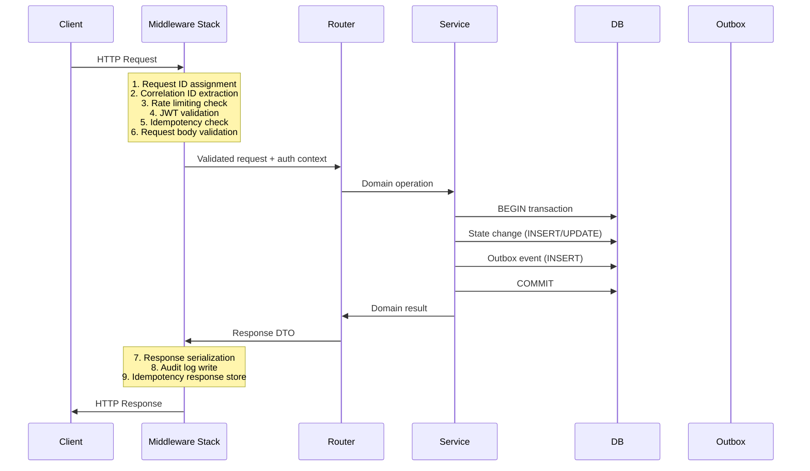

# Backend Architecture

> **Document**: 13-backend-architecture.md  
> **Version**: 1.0.0  
> **Last Updated**: July 2026  
> **Audience**: Backend engineers, architects  
> **Related**: [System Architecture](11-system-architecture.md) · [API Specification](15-api-specification.md) · [Database Architecture](14-database-architecture.md)

---

## 1. Technology Stack

| Layer           | Technology                                        | Rationale                                                               |
| --------------- | ------------------------------------------------- | ----------------------------------------------------------------------- |
| **Framework**   | FastAPI (Python 3.12+)                            | Async, OpenAPI auto-generation, rapid development, type hints `[REC]`   |
| **ORM**         | SQLAlchemy 2.0 + GeoAlchemy2                      | PostGIS support, async support, migration via Alembic                   |
| **Cache**       | Redis (via aioredis)                              | Last-fix cache, sessions, rate limits, Streams (MVP event bus), pub/sub |
| **Event Bus**   | Redis Streams (MVP) → Kafka (production)          | See ADR-06                                                              |
| **Real-Time**   | Socket.IO (python-socketio)                       | WebSocket with fallback, room-based pub/sub                             |
| **Task Queue**  | Background workers (custom) on Redis Streams      | Outbox relay, risk cron, anchor batcher                                 |
| **HTTP Client** | httpx (async)                                     | External API calls (KYC, SMS, translation)                              |
| **Validation**  | Pydantic v2                                       | Request/response validation, serialization                              |
| **Auth**        | PyJWT + custom OIDC (MVP) → Keycloak (production) | See ADR-01                                                              |
| **Testing**     | pytest + pytest-asyncio + httpx.AsyncClient       | Async test support                                                      |

---

## 2. Module Structure

```
backend/
├── app/
│   ├── main.py                    # FastAPI app factory
│   ├── config.py                  # Settings (pydantic-settings)
│   ├── dependencies.py            # Shared DI (DB session, current user, etc.)
│   │
│   ├── common/                    # Shared kernel
│   │   ├── events.py              # Event envelope, EventBus interface
│   │   ├── errors.py              # Error types, error envelope
│   │   ├── pagination.py          # Cursor-based pagination
│   │   ├── idempotency.py         # Idempotency-Key middleware
│   │   ├── auth.py                # JWT validation, RBAC/ABAC policy
│   │   ├── audit.py               # Audit log decorator
│   │   └── crypto.py              # Envelope encryption helpers
│   │
│   ├── auth/                      # Auth module
│   │   ├── router.py              # /auth/* routes
│   │   ├── service.py             # Business logic
│   │   ├── models.py              # SQLAlchemy models (users, devices, sessions)
│   │   ├── schemas.py             # Pydantic request/response
│   │   └── events.py              # UserRegistered, DeviceRegistered
│   │
│   ├── identity/                  # User & Identity module
│   │   ├── router.py              # /users/*, /identity/*
│   │   ├── service.py
│   │   ├── models.py              # Identity, MedicalCard, EmergencyContact
│   │   ├── schemas.py
│   │   └── kyc_adapters.py        # DigiLocker, Passport OCR adapters
│   │
│   ├── trips/                     # Trip & Consent module
│   │   ├── router.py              # /trips/*
│   │   ├── service.py
│   │   ├── models.py              # Trip, ConsentReceipt, CheckInSchedule
│   │   ├── schemas.py
│   │   └── events.py              # TripStarted, TripEnded, ConsentChanged
│   │
│   ├── location/                  # Location module
│   │   ├── router.py              # /locations/*
│   │   ├── service.py
│   │   ├── models.py              # LocationPoint (partitioned)
│   │   ├── schemas.py
│   │   └── events.py              # LocationUpdated
│   │
│   ├── geofence/                  # Geofence module
│   │   ├── router.py              # /geofences/*
│   │   ├── service.py
│   │   ├── models.py              # Zone, GeoFenceEvent, ZonePack
│   │   ├── schemas.py
│   │   ├── events.py              # GeoFenceEntered, GeoFenceExited
│   │   └── pack_builder.py        # Zone pack protobuf generation
│   │
│   ├── risk/                      # Risk module
│   │   ├── router.py              # /risk/*
│   │   ├── service.py             # Scoring engine
│   │   ├── models.py              # RiskAssessment
│   │   ├── schemas.py
│   │   ├── events.py              # RiskLevelChanged
│   │   └── factors.py             # Factor definitions + weights
│   │
│   ├── sos/                       # SOS module
│   │   ├── router.py              # /sos/*
│   │   ├── service.py
│   │   ├── models.py              # SOSAlert
│   │   ├── schemas.py
│   │   ├── events.py              # SOSTriggered, ResponderAcknowledged
│   │   └── sms_ingester.py        # SMS SOS parsing
│   │
│   ├── incident/                  # Incident module
│   │   ├── router.py              # /incidents/*
│   │   ├── service.py
│   │   ├── models.py              # Incident, IncidentEvent, IncidentGrant
│   │   ├── schemas.py
│   │   ├── events.py              # IncidentCreated, IncidentStatusChanged
│   │   ├── state_machine.py       # Transition matrix
│   │   └── dedup.py               # Duplicate detection + merge
│   │
│   ├── evidence/                  # Evidence module
│   │   ├── router.py              # /evidence/*
│   │   ├── service.py
│   │   ├── models.py              # Evidence
│   │   ├── schemas.py
│   │   └── events.py              # EvidenceUploaded
│   │
│   ├── notification/              # Notification module
│   │   ├── router.py              # /notifications/*, /devices/*
│   │   ├── service.py
│   │   ├── models.py              # Notification, DeviceToken
│   │   ├── schemas.py
│   │   ├── channels/              # Per-channel adapters
│   │   │   ├── fcm.py
│   │   │   ├── apns.py
│   │   │   ├── sms.py
│   │   │   └── email.py
│   │   └── templates.py           # Pre-translated template registry
│   │
│   ├── blockchain/                # Blockchain adapter module
│   │   ├── router.py              # /blockchain/*
│   │   ├── service.py
│   │   ├── models.py              # BlockchainAnchor, EventChain
│   │   ├── schemas.py
│   │   ├── chain.py               # Hash-chain logic
│   │   ├── merkle.py              # Merkle tree builder
│   │   └── besu_adapter.py        # Hyperledger Besu client
│   │
│   ├── admin/                     # Admin module
│   │   ├── router.py              # /admin/*
│   │   ├── service.py
│   │   ├── models.py              # Config, AuditLog
│   │   └── schemas.py
│   │
│   └── workers/                   # Background workers
│       ├── outbox_relay.py        # Polls outbox → publishes events
│       ├── risk_cron.py           # Periodic risk evaluation + missed check-in scan
│       ├── anchor_batcher.py      # Builds Merkle trees + submits to chain
│       ├── retention_worker.py    # Partition drops + deletion jobs
│       ├── liveness_watchdog.py   # Detects device silence
│       └── notification_worker.py # Processes notification queue
│
├── migrations/                    # Alembic migrations
├── tests/                         # pytest test suite
├── Dockerfile
├── docker-compose.yml
└── pyproject.toml
```

---

## 3. Request Processing Pipeline



---

## 4. Error Handling Strategy

### 4.1 Error Envelope

All errors returned as:

```json
{
  "error": {
    "code": "VALIDATION_FAILED",
    "message": "Human-readable description",
    "details": [{ "field": "points[1].accM", "issue": "non_positive" }],
    "requestId": "9f1c...",
    "retryable": false
  }
}
```

### 4.2 Error Code Registry

| Code                       | HTTP Status | Retryable | Description                                             |
| -------------------------- | ----------- | --------- | ------------------------------------------------------- |
| `VALIDATION_FAILED`        | 400         | No        | Request body failed validation                          |
| `AUTHENTICATION_REQUIRED`  | 401         | No        | Missing or expired token                                |
| `INSUFFICIENT_PERMISSIONS` | 403         | No        | Valid token but role/ABAC check failed                  |
| `RESOURCE_NOT_FOUND`       | 404         | No        | Entity does not exist                                   |
| `IDEMPOTENCY_CONFLICT`     | 422         | No        | Same key but different request body                     |
| `ILLEGAL_TRANSITION`       | 409         | No        | Invalid state machine transition                        |
| `DUPLICATE_RESOURCE`       | 409         | No        | Unique constraint violation                             |
| `RATE_LIMITED`             | 429         | Yes       | Rate limit exceeded; includes retryAfterSec             |
| `BACKPRESSURE`             | 429         | Yes       | Location ingestion overloaded; includes nextSyncHintSec |
| `INTERNAL_ERROR`           | 500         | Yes       | Unexpected server error                                 |
| `SERVICE_UNAVAILABLE`      | 503         | Yes       | Dependency down (circuit breaker open)                  |

### 4.3 Exception Hierarchy

```python
class AppError(Exception):
    code: str
    status: int
    retryable: bool
    details: list

class ValidationError(AppError): ...      # 400
class AuthError(AppError): ...            # 401
class ForbiddenError(AppError): ...       # 403
class NotFoundError(AppError): ...        # 404
class ConflictError(AppError): ...        # 409
class RateLimitError(AppError): ...       # 429
class InternalError(AppError): ...        # 500
```

Global exception handler catches all `AppError` subclasses and serializes to the standard envelope. Unexpected exceptions produce `INTERNAL_ERROR` with no details leaked.

---

## 5. Authorization Architecture

### 5.1 Policy Layer

```python
# Simplified policy example
@policy_check
async def read_location_history(
    user: AuthContext,
    trip_id: str,
    purpose: PurposeEnum
) -> PolicyResult:
    """
    Tourist can read their own trip's location.
    Operator can read only if:
    - Active incident exists for this trip
    - Incident jurisdiction matches operator's org
    - Incident is in an open state
    - Purpose is declared
    """
    if user.role == Role.TOURIST:
        return allow() if trip.user_id == user.id else deny()

    if user.role in (Role.OPERATOR, Role.DISPATCHER):
        incident = find_incident_for_trip(trip_id)
        if not incident:
            return deny("No active incident for this trip")
        if incident.jurisdiction != user.org_id:
            return deny("Jurisdiction mismatch")
        if incident.state not in OPEN_STATES:
            return deny("Incident is closed")
        if not purpose:
            return deny("Purpose required")

        log_access(user, trip_id, purpose)  # Audit every access
        return allow()

    return deny()
```

### 5.2 Role-Permission Matrix

| Action                   | tourist | operator | dispatcher | supervisor | hospital | tourism_admin | sys_admin | auditor |
| ------------------------ | ------- | -------- | ---------- | ---------- | -------- | ------------- | --------- | ------- |
| Create SOS               | ✅      | —        | —          | —          | —        | —             | —         | —       |
| View own trip            | ✅      | —        | —          | —          | —        | —             | —         | —       |
| Acknowledge incident     | —       | ✅       | ✅         | ✅         | —        | —             | —         | —       |
| Dispatch unit            | —       | —        | ✅         | ✅         | —        | —             | —         | —       |
| View location (incident) | —       | ✅¹      | ✅¹        | ✅¹        | —        | —             | —         | —       |
| Scan medical QR          | —       | —        | —          | —          | ✅²      | —             | —         | —       |
| Manage zones             | —       | —        | —          | —          | —        | ✅            | ✅        | —       |
| Manage users             | —       | —        | —          | —          | —        | —             | ✅        | —       |
| View audit logs          | —       | —        | —          | —          | —        | —             | ✅        | ✅      |
| Break-glass access       | —       | —        | —          | ✅³        | —        | —             | ✅³       | —       |

¹ Only with active incident in their jurisdiction + declared purpose  
² Only with scoped medical-access grant per incident (TTL 24h)  
³ Requires reason + second-person approval (or post-hoc review within 24h)

---

## 6. Background Worker Architecture

### 6.1 Outbox Relay

```python
# Pseudocode
while True:
    events = db.query(
        "SELECT * FROM outbox_events WHERE relayed = false ORDER BY created_at LIMIT 100"
    )
    for event in events:
        try:
            event_bus.publish(event.type, event.payload)
            db.update(event, relayed=True)
        except PublishError:
            log.error("Outbox relay failed", event_id=event.id)
            # Will retry on next poll

    sleep(100ms)  # Poll interval
```

### 6.2 Worker Process Composition

The worker process runs multiple async tasks:

| Task                       | Interval                | Purpose                                                |
| -------------------------- | ----------------------- | ------------------------------------------------------ |
| Outbox relay               | 100ms poll              | Publishes events from outbox to stream                 |
| Missed check-in scanner    | 60s                     | Scans `check_in_due < now()` → triggers challenge flow |
| Liveness watchdog          | 5 min                   | Detects devices silent for >2× expected sync → signal  |
| Risk evaluation (periodic) | Per-event + 5 min sweep | Evaluates risk factors for active trips                |
| Anchor batcher             | 10 min or 500 events    | Builds Merkle tree → submits to blockchain             |
| Retention worker           | Daily (off-peak)        | Drops expired partitions, processes deletion queue     |
| Notification worker        | Event-driven            | Processes notification dispatch queue                  |

---

## References

- [System Architecture](11-system-architecture.md)
- [API Specification](15-api-specification.md)
- [Database Architecture](14-database-architecture.md)
- [Authentication & Authorization](17-authentication-authorization.md)
- [Architecture Decision Records](36-architecture-decision-records.md)
