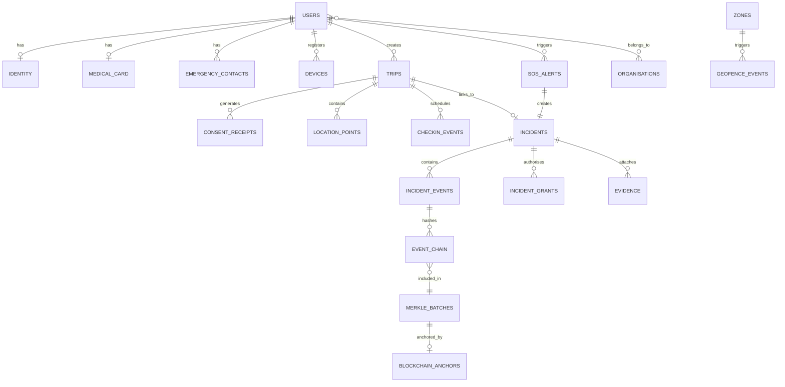

# Database Architecture

> **Document**: 14-database-architecture.md  
> **Version**: 1.0.0  
> **Last Updated**: July 2026  
> **Audience**: Backend engineers, DBAs, architects  
> **Related**: [Backend Architecture](13-backend-architecture.md) · [API Specification](15-api-specification.md) · [Privacy Architecture](26-privacy-architecture.md)

---

## 1. Database Technology

| Decision          | Choice                                          | Rationale                                                                                                                                                |
| ----------------- | ----------------------------------------------- | -------------------------------------------------------------------------------------------------------------------------------------------------------- |
| Primary database  | PostgreSQL 16+ with PostGIS 3.4+                | Relational integrity for incidents; PostGIS for spatial queries; JSONB for flexible metadata; partitioning for time-series; mature, government-adoptable |
| Spatial extension | PostGIS + H3 (pg_h3)                            | PostGIS for polygon operations; H3 for privacy-preserving density analytics                                                                              |
| Cache layer       | Redis 7+                                        | Last-fix cache, session store, rate limits, event streams                                                                                                |
| Object storage    | S3-compatible (MinIO MVP / cloud S3 production) | Evidence files, zone pack blobs                                                                                                                          |

---

## 2. Schema Overview

Each module owns a dedicated PostgreSQL schema. Cross-schema references use foreign keys only at the `id` level — no cross-schema JOINs in application code (modules communicate via events or service interfaces).

| Schema         | Tables                                                             | Module Owner  |
| -------------- | ------------------------------------------------------------------ | ------------- |
| `auth`         | `users`, `devices`, `sessions`, `otp_attempts`                     | Auth          |
| `identity`     | `identities`, `medical_cards`, `emergency_contacts`                | Identity      |
| `trips`        | `trips`, `consent_receipts`, `checkin_schedules`, `checkin_events` | Trip/Consent  |
| `location`     | `location_points` (partitioned), `location_batches`                | Location      |
| `geofence`     | `zones`, `zone_versions`, `geofence_events`, `zone_packs`          | Geofence      |
| `risk`         | `risk_assessments`, `risk_challenges`                              | Risk          |
| `sos`          | `sos_alerts`                                                       | SOS           |
| `incident`     | `incidents`, `incident_events`, `incident_grants`                  | Incident      |
| `evidence`     | `evidence`                                                         | Evidence      |
| `notification` | `notifications`, `device_tokens`, `sms_dlq`                        | Notification  |
| `blockchain`   | `event_chain`, `merkle_batches`, `blockchain_anchors`              | Blockchain    |
| `admin`        | `config_versions`, `audit_log`, `organisations`, `org_memberships` | Admin         |
| `system`       | `outbox_events`, `idempotency_store`                               | Common/System |

---

## 3. Table Definitions

### 3.1 auth.users

```sql
CREATE TABLE auth.users (
    id              UUID PRIMARY KEY DEFAULT gen_random_uuid(),
    phone_hash      TEXT NOT NULL UNIQUE,   -- SHA-256(phone) for lookup
    phone_enc       BYTEA NOT NULL,         -- AES-256-GCM encrypted phone (KMS DEK)
    role            TEXT NOT NULL DEFAULT 'tourist' CHECK (role IN ('tourist','operator','dispatcher','supervisor','hospital','tourism_admin','sys_admin','auditor')),
    language        TEXT NOT NULL DEFAULT 'en',
    status          TEXT NOT NULL DEFAULT 'active' CHECK (status IN ('active','suspended','deleted')),
    created_at      TIMESTAMPTZ NOT NULL DEFAULT now(),
    updated_at      TIMESTAMPTZ NOT NULL DEFAULT now(),
    deleted_at      TIMESTAMPTZ
);
CREATE INDEX idx_users_phone ON auth.users (phone_hash);
CREATE INDEX idx_users_role ON auth.users (role) WHERE status = 'active';
```

### 3.2 auth.devices

```sql
CREATE TABLE auth.devices (
    id              UUID PRIMARY KEY DEFAULT gen_random_uuid(),
    user_id         UUID NOT NULL REFERENCES auth.users(id),
    device_fingerprint TEXT NOT NULL,
    platform        TEXT NOT NULL CHECK (platform IN ('android','ios','web')),
    sos_token       TEXT NOT NULL UNIQUE,   -- Long-lived, narrowly-scoped SOS device token
    push_token      TEXT,                   -- FCM/APNs token
    attestation     JSONB,                  -- Play Integrity / App Attest result
    created_at      TIMESTAMPTZ NOT NULL DEFAULT now(),
    last_seen_at    TIMESTAMPTZ NOT NULL DEFAULT now(),
    UNIQUE(user_id, device_fingerprint)
);
```

### 3.3 identity.identities

```sql
CREATE TABLE identity.identities (
    id              UUID PRIMARY KEY DEFAULT gen_random_uuid(),
    user_id         UUID NOT NULL REFERENCES auth.users(id) UNIQUE,
    id_type         TEXT NOT NULL CHECK (id_type IN ('aadhaar','passport','provisional')),
    name_enc        BYTEA NOT NULL,         -- Encrypted name
    name_verified   BOOLEAN NOT NULL DEFAULT false,
    dob_enc         BYTEA,                  -- Encrypted DOB
    nationality     TEXT,
    photo_url       TEXT,                   -- S3 URL (encrypted at rest)
    passport_number_enc BYTEA,              -- Encrypted passport number
    credential_data JSONB NOT NULL,         -- Verifiable credential payload
    confidence      TEXT NOT NULL CHECK (confidence IN ('high','medium','low')),
    expires_at      TIMESTAMPTZ NOT NULL,   -- Auto-expire at trip end + 24h
    created_at      TIMESTAMPTZ NOT NULL DEFAULT now(),
    updated_at      TIMESTAMPTZ NOT NULL DEFAULT now()
);
```

### 3.4 identity.medical_cards

```sql
CREATE TABLE identity.medical_cards (
    id              UUID PRIMARY KEY DEFAULT gen_random_uuid(),
    user_id         UUID NOT NULL REFERENCES auth.users(id) UNIQUE,
    blood_group     TEXT CHECK (blood_group IN ('A+','A-','B+','B-','AB+','AB-','O+','O-')),
    allergies_enc   BYTEA,                  -- Encrypted JSON array
    medications_enc BYTEA,                  -- Encrypted JSON array
    conditions_enc  BYTEA,                  -- Encrypted JSON array
    gp_contact_enc  BYTEA,                  -- Encrypted
    insurer_enc     BYTEA,                  -- Encrypted
    all_self_declared BOOLEAN NOT NULL DEFAULT true,
    created_at      TIMESTAMPTZ NOT NULL DEFAULT now(),
    updated_at      TIMESTAMPTZ NOT NULL DEFAULT now()
);
```

### 3.5 identity.emergency_contacts

```sql
CREATE TABLE identity.emergency_contacts (
    id              UUID PRIMARY KEY DEFAULT gen_random_uuid(),
    user_id         UUID NOT NULL REFERENCES auth.users(id),
    name_enc        BYTEA NOT NULL,
    phone_enc       BYTEA NOT NULL,
    relationship    TEXT NOT NULL,
    notify_trip     BOOLEAN NOT NULL DEFAULT true,
    notify_sos      BOOLEAN NOT NULL DEFAULT true,  -- Locked true in application logic
    notify_daily_ok BOOLEAN NOT NULL DEFAULT false,
    ordinal         SMALLINT NOT NULL DEFAULT 0,
    created_at      TIMESTAMPTZ NOT NULL DEFAULT now(),
    CONSTRAINT max_contacts CHECK (ordinal < 5)
);
CREATE INDEX idx_contacts_user ON identity.emergency_contacts (user_id);
```

### 3.6 trips.trips

```sql
CREATE TABLE trips.trips (
    id              UUID PRIMARY KEY DEFAULT gen_random_uuid(),
    user_id         UUID NOT NULL REFERENCES auth.users(id),
    destination     TEXT NOT NULL,
    destination_point GEOMETRY(Point, 4326),
    start_date      DATE NOT NULL,
    end_date        DATE NOT NULL,
    consent_tier    TEXT NOT NULL CHECK (consent_tier IN ('OFF','CHECK_IN_ONLY','GEOFENCE_ALERTS','FULL')),
    status          TEXT NOT NULL DEFAULT 'draft' CHECK (status IN ('draft','active','paused','ended','cancelled')),
    checkin_interval_minutes INT,
    zone_pack_version INT,
    monitoring_mode TEXT DEFAULT 'IDLE' CHECK (monitoring_mode IN ('IDLE','ACTIVE_TRIP','HIGH_RISK','EMERGENCY','LOW_BATTERY')),
    started_at      TIMESTAMPTZ,
    ended_at        TIMESTAMPTZ,
    created_at      TIMESTAMPTZ NOT NULL DEFAULT now(),
    updated_at      TIMESTAMPTZ NOT NULL DEFAULT now()
);
CREATE INDEX idx_trips_user ON trips.trips (user_id);
CREATE INDEX idx_trips_status ON trips.trips (status) WHERE status = 'active';
CREATE INDEX idx_trips_active ON trips.trips (user_id, status) WHERE status = 'active';
```

### 3.7 trips.consent_receipts

```sql
CREATE TABLE trips.consent_receipts (
    id              UUID PRIMARY KEY DEFAULT gen_random_uuid(),
    user_id         UUID NOT NULL REFERENCES auth.users(id),
    trip_id         UUID REFERENCES trips.trips(id),
    consent_tier    TEXT NOT NULL,
    previous_tier   TEXT,
    purpose_text    TEXT NOT NULL,           -- Plain-language purpose notice text
    granted_at      TIMESTAMPTZ NOT NULL DEFAULT now(),
    withdrawn_at    TIMESTAMPTZ,
    receipt_hash    TEXT NOT NULL            -- SHA-256 of consent payload
);
CREATE INDEX idx_consent_user ON trips.consent_receipts (user_id);
```

### 3.8 location.location_points (Partitioned)

```sql
CREATE TABLE location.location_points (
    id              UUID NOT NULL DEFAULT gen_random_uuid(),
    trip_id         UUID NOT NULL,
    user_id         UUID NOT NULL,
    point           GEOMETRY(Point, 4326) NOT NULL,
    accuracy_m      REAL NOT NULL,
    altitude_m      REAL,
    speed_mps       REAL,
    heading         REAL,
    battery_pct     SMALLINT,
    network_type    TEXT,
    source          TEXT NOT NULL DEFAULT 'gps' CHECK (source IN ('gps','network','fused','sls','manual')),
    sampled_at      TIMESTAMPTZ NOT NULL,
    received_at     TIMESTAMPTZ NOT NULL DEFAULT now(),
    batch_id        UUID NOT NULL,
    PRIMARY KEY (id, sampled_at)
) PARTITION BY RANGE (sampled_at);

-- Monthly partitions (auto-created by retention worker)
CREATE TABLE location.location_points_2026_07 PARTITION OF location.location_points
    FOR VALUES FROM ('2026-07-01') TO ('2026-08-01');

-- BRIN index on time (efficient for time-range queries on partitioned data)
CREATE INDEX idx_loc_sampled_brin ON location.location_points USING BRIN (sampled_at);
-- B-tree index for trip lookups
CREATE INDEX idx_loc_trip ON location.location_points (trip_id, sampled_at DESC);
-- Spatial index for geo queries
CREATE INDEX idx_loc_point ON location.location_points USING GIST (point);
```

**Partition management**: Retention worker auto-creates future partitions (3 months ahead) and drops expired partitions per retention policy. Partition drop is O(1) — no row-by-row DELETE.

### 3.9 geofence.zones

```sql
CREATE TABLE geofence.zones (
    id              UUID PRIMARY KEY DEFAULT gen_random_uuid(),
    name            TEXT NOT NULL,
    class           TEXT NOT NULL CHECK (class IN ('advisory','restricted','disaster')),
    geometry        GEOMETRY(Polygon, 4326) NOT NULL,
    buffer_m        INT NOT NULL DEFAULT 100,
    schedule        JSONB,                  -- {startHour, endHour, timezone} or null for 24/7
    description     TEXT NOT NULL,
    status          TEXT NOT NULL DEFAULT 'draft' CHECK (status IN ('draft','pending_approval','active','expired','archived')),
    version         INT NOT NULL DEFAULT 1,
    approved_by     UUID,
    approved_at     TIMESTAMPTZ,
    expires_at      TIMESTAMPTZ,            -- Required for disaster class
    created_by      UUID NOT NULL REFERENCES auth.users(id),
    created_at      TIMESTAMPTZ NOT NULL DEFAULT now(),
    updated_at      TIMESTAMPTZ NOT NULL DEFAULT now()
);
CREATE INDEX idx_zones_status ON geofence.zones (status) WHERE status = 'active';
CREATE INDEX idx_zones_geo ON geofence.zones USING GIST (geometry);
```

### 3.10 sos.sos_alerts

```sql
CREATE TABLE sos.sos_alerts (
    id              UUID PRIMARY KEY DEFAULT gen_random_uuid(),
    client_sos_id   UUID NOT NULL UNIQUE,   -- Client-generated UUID for idempotency/dedup
    user_id         UUID NOT NULL REFERENCES auth.users(id),
    trip_id         UUID REFERENCES trips.trips(id),
    incident_id     UUID,                   -- Set after incident creation
    type            TEXT NOT NULL DEFAULT 'general' CHECK (type IN ('police','medical','silent','general','anomaly')),
    location        GEOMETRY(Point, 4326),
    accuracy_m      REAL,
    location_ts     TIMESTAMPTZ,
    battery_pct     SMALLINT,
    network_type    TEXT,
    note            TEXT,
    source          TEXT NOT NULL DEFAULT 'app' CHECK (source IN ('app','sms','auto')),
    covert          BOOLEAN NOT NULL DEFAULT false,
    status          TEXT NOT NULL DEFAULT 'received' CHECK (status IN ('received','acknowledged','dispatched','resolved','cancelled','false_alarm')),
    created_at      TIMESTAMPTZ NOT NULL DEFAULT now()
);
CREATE INDEX idx_sos_user ON sos.sos_alerts (user_id);
CREATE INDEX idx_sos_status ON sos.sos_alerts (status) WHERE status IN ('received','acknowledged','dispatched');
```

### 3.11 incident.incidents

```sql
CREATE TABLE incident.incidents (
    id              UUID PRIMARY KEY DEFAULT gen_random_uuid(),
    sos_alert_id    UUID REFERENCES sos.sos_alerts(id),
    user_id         UUID REFERENCES auth.users(id),
    trip_id         UUID REFERENCES trips.trips(id),
    type            TEXT NOT NULL,
    severity        TEXT NOT NULL CHECK (severity IN ('LOW','MODERATE','HIGH','CRITICAL')),
    status          TEXT NOT NULL DEFAULT 'created' CHECK (status IN ('created','acknowledged','assigned','enroute','on_scene','resolved','closed','cancelled','false_alarm','merged')),
    jurisdiction    UUID,                   -- Organisation ID
    assigned_to     UUID,                   -- Operator user ID
    location        GEOMETRY(Point, 4326),
    disposition_code TEXT,
    summary         TEXT,
    merged_into     UUID REFERENCES incident.incidents(id),
    chain_head      TEXT,                   -- Latest hash in the event chain for this incident
    created_at      TIMESTAMPTZ NOT NULL DEFAULT now(),
    updated_at      TIMESTAMPTZ NOT NULL DEFAULT now(),
    resolved_at     TIMESTAMPTZ,
    closed_at       TIMESTAMPTZ
);
CREATE INDEX idx_incidents_status ON incident.incidents (status) WHERE status NOT IN ('closed','cancelled','false_alarm','merged');
CREATE INDEX idx_incidents_user ON incident.incidents (user_id);
CREATE INDEX idx_incidents_jurisdiction ON incident.incidents (jurisdiction, status);
```

### 3.12 incident.incident_events

```sql
CREATE TABLE incident.incident_events (
    id              UUID PRIMARY KEY DEFAULT gen_random_uuid(),
    incident_id     UUID NOT NULL REFERENCES incident.incidents(id),
    event_type      TEXT NOT NULL,          -- 'created','acknowledged','assigned','note','evidence_added','escalated','status_changed','closed'
    actor_id        UUID,                   -- User who performed the action
    actor_role      TEXT,
    data            JSONB NOT NULL,         -- Event-specific payload
    prev_hash       TEXT,                   -- Hash of previous event in this incident's chain
    event_hash      TEXT NOT NULL,          -- SHA-256(prev_hash + event_type + data + timestamp)
    created_at      TIMESTAMPTZ NOT NULL DEFAULT now()
);
CREATE INDEX idx_ie_incident ON incident.incident_events (incident_id, created_at);
```

### 3.13 blockchain.event_chain & blockchain.blockchain_anchors

```sql
CREATE TABLE blockchain.event_chain (
    id              UUID PRIMARY KEY DEFAULT gen_random_uuid(),
    incident_id     UUID NOT NULL,
    event_id        UUID NOT NULL REFERENCES incident.incident_events(id),
    prev_hash       TEXT,
    event_hash      TEXT NOT NULL,
    batch_id        UUID,                   -- Set when included in a Merkle batch
    created_at      TIMESTAMPTZ NOT NULL DEFAULT now()
);
CREATE INDEX idx_chain_incident ON blockchain.event_chain (incident_id, created_at);
CREATE INDEX idx_chain_unbatched ON blockchain.event_chain (batch_id) WHERE batch_id IS NULL;

CREATE TABLE blockchain.merkle_batches (
    id              UUID PRIMARY KEY DEFAULT gen_random_uuid(),
    root_hash       TEXT NOT NULL,
    event_count     INT NOT NULL,
    tree_data       JSONB NOT NULL,         -- Full Merkle tree for proof generation
    anchor_id       UUID,                   -- Set after on-chain anchor
    created_at      TIMESTAMPTZ NOT NULL DEFAULT now()
);

CREATE TABLE blockchain.blockchain_anchors (
    id              UUID PRIMARY KEY DEFAULT gen_random_uuid(),
    batch_id        UUID NOT NULL REFERENCES blockchain.merkle_batches(id),
    chain_type      TEXT NOT NULL DEFAULT 'besu' CHECK (chain_type IN ('besu','transparency_log')),
    tx_hash         TEXT,                   -- On-chain transaction hash
    block_number    BIGINT,
    contract_address TEXT,
    status          TEXT NOT NULL DEFAULT 'pending' CHECK (status IN ('pending','submitted','confirmed','failed')),
    submitted_at    TIMESTAMPTZ,
    confirmed_at    TIMESTAMPTZ,
    created_at      TIMESTAMPTZ NOT NULL DEFAULT now()
);
```

### 3.14 system.outbox_events

```sql
CREATE TABLE system.outbox_events (
    id              UUID PRIMARY KEY DEFAULT gen_random_uuid(),
    event_type      TEXT NOT NULL,
    payload         JSONB NOT NULL,
    correlation_id  TEXT,
    causation_id    TEXT,
    relayed         BOOLEAN NOT NULL DEFAULT false,
    created_at      TIMESTAMPTZ NOT NULL DEFAULT now()
);
CREATE INDEX idx_outbox_unrelayed ON system.outbox_events (created_at) WHERE relayed = false;
```

### 3.15 admin.audit_log

```sql
CREATE TABLE admin.audit_log (
    id              UUID PRIMARY KEY DEFAULT gen_random_uuid(),
    actor_id        UUID,
    actor_role      TEXT,
    action          TEXT NOT NULL,          -- 'login','data_access','config_change','role_change','break_glass','zone_publish','sos_ack'
    resource_type   TEXT NOT NULL,
    resource_id     UUID,
    details         JSONB NOT NULL,
    ip_address      TEXT,
    correlation_id  TEXT,
    created_at      TIMESTAMPTZ NOT NULL DEFAULT now()
);
CREATE INDEX idx_audit_actor ON admin.audit_log (actor_id, created_at DESC);
CREATE INDEX idx_audit_resource ON admin.audit_log (resource_type, resource_id, created_at DESC);
CREATE INDEX idx_audit_action ON admin.audit_log (action, created_at DESC);

-- Audit log is append-only. No UPDATE or DELETE grants to any application role.
```

---

## 4. Entity-Relationship Diagram



---

## 5. Encryption Strategy

### 5.1 Encryption Tiers

| Tier                                   | What                                                            | How                                              | Key Management                                                                   |
| -------------------------------------- | --------------------------------------------------------------- | ------------------------------------------------ | -------------------------------------------------------------------------------- |
| **Disk encryption**                    | Entire database volume                                          | LUKS / cloud provider volume encryption          | Platform-managed                                                                 |
| **TLS in transit**                     | All DB connections                                              | `sslmode=verify-full`                            | Certificate rotation                                                             |
| **Column-level** (envelope encryption) | PII fields (phone, name, DOB, passport, medical data, contacts) | AES-256-GCM per row, DEK encrypted by KEK in KMS | KMS-managed KEK; DEK stored alongside ciphertext; rotation via re-encryption job |

### 5.2 Encrypted Column Pattern

Each `_enc` column stores: `{ciphertext, nonce, dek_ciphertext, kek_version}` serialized as BYTEA. Application-layer encrypt/decrypt — database never sees plaintext PII.

### 5.3 Key Rotation

- KEK rotation: new KEK version created in KMS; existing rows re-encrypted lazily on read (updated on next write) or eagerly via background job
- DEK rotation: generate new DEK per write; old ciphertexts readable until row is updated

---

## 6. Partitioning Strategy

### 6.1 Time-Based Partitioning

| Table             | Partition Key | Interval | Retention                                      | Drop Method                          |
| ----------------- | ------------- | -------- | ---------------------------------------------- | ------------------------------------ |
| `location_points` | `sampled_at`  | Monthly  | 90 days (active trips) / 30 days (ended trips) | `DROP TABLE partition_name` (O(1))   |
| `audit_log`       | `created_at`  | Monthly  | 7 years                                        | Archive to cold storage after 1 year |
| `outbox_events`   | `created_at`  | Weekly   | 7 days (after relay)                           | `DROP TABLE`                         |

### 6.2 Partition Lifecycle

```
Future partitions (auto-created 3 months ahead):
  location_points_2026_10 (empty, ready)
  location_points_2026_09 (empty, ready)

Current partition:
  location_points_2026_07 (active writes)

Retention-expired:
  location_points_2026_04 → DROP TABLE (instant, no vacuum needed)
```

---

## 7. Indexing Strategy

| Index Type          | Usage                                                  | Tables                                             |
| ------------------- | ------------------------------------------------------ | -------------------------------------------------- |
| **B-tree**          | Primary keys, foreign keys, status lookups, phone_hash | Most tables                                        |
| **BRIN**            | Time-range scans on partitioned tables                 | `location_points`, `audit_log`                     |
| **GiST**            | Spatial queries (point-in-polygon, nearest)            | `location_points`, `zones`                         |
| **Partial indexes** | Filter to active/relevant rows only                    | `WHERE status = 'active'`, `WHERE relayed = false` |
| **UNIQUE**          | Idempotency keys, phone_hash, client_sos_id            | Dedup columns                                      |

---

## 8. Migration Strategy

- Tool: **Alembic** (SQLAlchemy migration framework)
- Pattern: **Expand-Contract** — no breaking changes in a single deploy
  1. Expand: add new column/table (nullable or with default)
  2. Migrate: backfill data, update application to write to new + old
  3. Contract: remove old column/table (separate deploy)
- All migrations are idempotent and reversible
- No `ALTER TABLE ... ALTER COLUMN TYPE` on large tables in production (use expand-contract)

---

## References

- [Backend Architecture](13-backend-architecture.md)
- [API Specification](15-api-specification.md)
- [Privacy Architecture](26-privacy-architecture.md)
- [Security Architecture](27-security-architecture.md)
- [Blockchain Architecture](22-blockchain-architecture.md)
