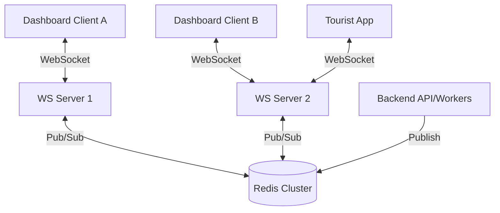

# Real-Time Communication

> **Document**: 16-realtime-communication.md  
> **Version**: 1.0.0  
> **Last Updated**: July 2026  
> **Audience**: Backend engineers, frontend engineers  
> **Related**: [System Architecture](11-system-architecture.md) · [UI Specification — Dashboards](09-ui-specification-dashboards.md)

---

## 1. Real-Time Architecture

The system requires real-time capabilities primarily for the Authority Dashboards (Police, Responder, Tourism) and secondarily for the Tourist App (SOS status updates).

### 1.1 Technology Choice

**Decision**: WebSocket via Socket.IO (`python-socketio` on server, `socket.io-client` on clients).

**Rationale**:

- Native WebSocket with HTTP long-polling fallback for constrained networks (e.g., hospital networks or legacy proxies).
- Built-in connection management, ping/pong heartbeats, and room semantics.
- Standardised across React Native (tourist app) and Next.js (dashboards).

### 1.2 Pub/Sub Backplane

Because the backend scales horizontally (multiple API/WebSocket servers), a pub/sub backplane is required to route messages to the specific server holding the client's WebSocket connection.

**Backplane**: Redis Pub/Sub (via Socket.IO Redis emitter).



---

## 2. Connection Management

### 2.1 Authentication

WebSocket connections must be authenticated before joining any rooms.

1. Client connects to `/socket.io/` namespace.
2. Server accepts connection temporarily.
3. Client emits `authenticate` event with JWT payload: `{"token": "Bearer <jwt>"}`.
4. Server validates JWT.
   - If invalid: emits `unauthorized` and drops connection.
   - If valid: joins user to their role-appropriate rooms and emits `authenticated`.

_Note for SOS Device Tokens_: Tourist apps in SOS mode can authenticate via their SOS device token if the JWT has expired.

### 2.2 Heartbeat & Reconnection

- **Ping Interval**: 25 seconds (Socket.IO default).
- **Ping Timeout**: 20 seconds.
- **Client Reconnection**: Automatic, with jittered exponential backoff (1s → 5s max).
- **Missed Events**: Real-time events are considered _transient hints_. On any reconnection, the client MUST fetch the current state via standard REST API (e.g., `GET /incidents/active`) to ensure no events were missed during the disconnect.

---

## 3. Room Topology

Rooms provide scoped broadcast domains.

| Room Name Pattern        | Subscribers                                   | Purpose                                                                   |
| ------------------------ | --------------------------------------------- | ------------------------------------------------------------------------- |
| `org:<org_id>`           | All operators in that organisation            | Broadcast new SOS alerts and incident state changes within jurisdiction   |
| `incident:<incident_id>` | Operators viewing that incident + the tourist | Live location updates and granular status changes for a specific incident |
| `user:<user_id>`         | The specific user's active sessions           | Targeted notifications (e.g., "Your session expired")                     |
| `role:tourism_admin`     | Tourism department admins                     | System-wide aggregates, dashboard updates                                 |
| `role:sys_admin`         | System administrators                         | System health alerts, config updates                                      |

---

## 4. Event Schema

All WebSocket events use the following envelope pattern:

```json
{
  "event": "EventName",
  "data": { ... },
  "timestamp": "ISO8601",
  "eventId": "UUID"
}
```

### 4.1 Dashboard Events (Server → Dashboard)

| Event Name         | Room                     | Data Payload                                 | Trigger                             |
| ------------------ | ------------------------ | -------------------------------------------- | ----------------------------------- |
| `incident.created` | `org:<org_id>`           | `{ incidentId, priority, touristName, ... }` | New SOS received                    |
| `incident.updated` | `org:<org_id>`           | `{ incidentId, status, assignedTo, ... }`    | Incident state change               |
| `location.updated` | `incident:<incident_id>` | `{ lat, lon, accM, ts }`                     | Tourist device sends location batch |
| `evidence.added`   | `incident:<incident_id>` | `{ evidenceId, type, url }`                  | Tourist uploads evidence            |

### 4.2 Tourist App Events (Server → App)

| Event Name                | Room                     | Data Payload                   | Trigger                         |
| ------------------------- | ------------------------ | ------------------------------ | ------------------------------- |
| `sos.acknowledged`        | `incident:<incident_id>` | `{ operatorName, etaMinutes }` | Operator clicks Acknowledge     |
| `sos.status_changed`      | `incident:<incident_id>` | `{ status: "en_route", msg }`  | Operator updates status         |
| `zone.advisory_published` | Global (via push)        | N/A (Handled via APNs/FCM)     | Not sent via WS to save battery |

---

## 5. Security Considerations

1. **Authorization**: Joining a room requires explicit authorization logic on the server. A client cannot arbitrary join `incident:<id>` without the server verifying they have an active grant (operator) or own the incident (tourist).
2. **Denial of Service**: Max connection limits per IP; max payload size enforced by Socket.IO; rate limiting on client-emitted events.
3. **Data Minimization**: Location updates emitted via WS do _not_ contain PII (name, phone) — only coordinate data and the incident ID. PII is fetched once via API.

---

## References

- [System Architecture](11-system-architecture.md)
- [UI Specification — Dashboards](09-ui-specification-dashboards.md)
