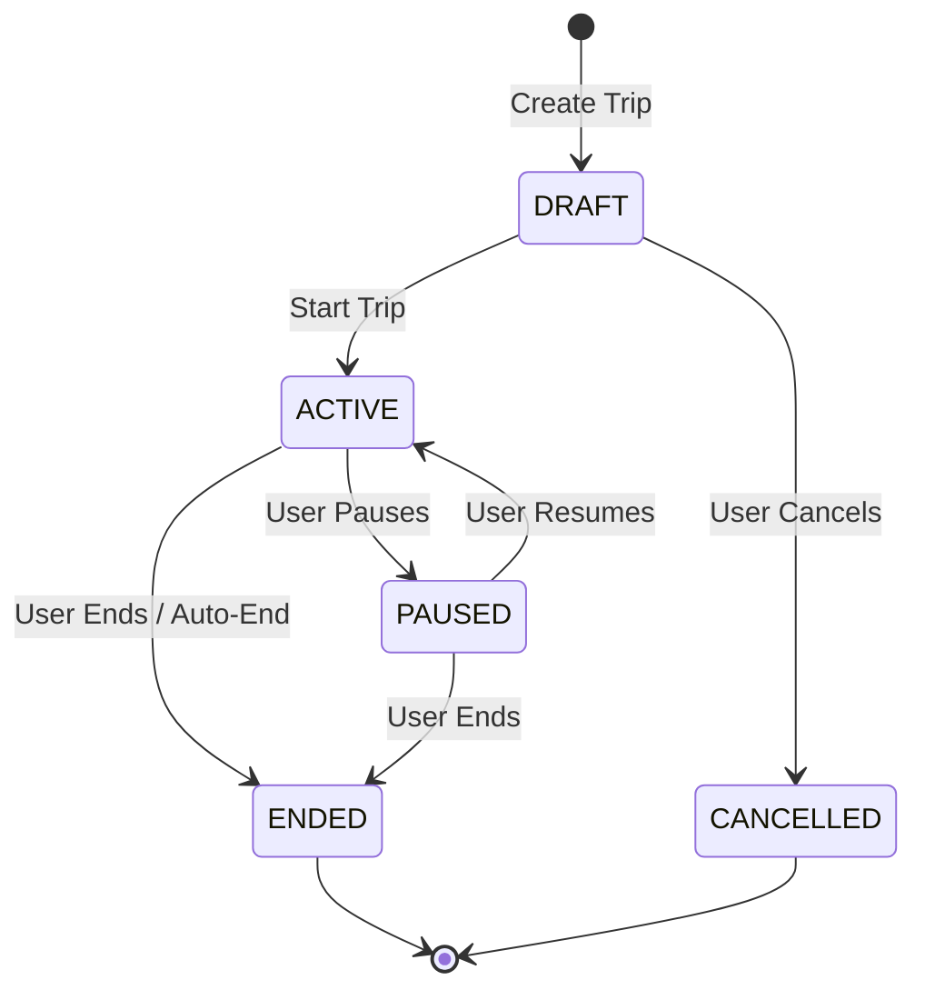

# Trip Management

> **Document**: 18-trip-management.md  
> **Version**: 1.0.0  
> **Last Updated**: July 2026  
> **Audience**: Backend engineers, Mobile engineers  
> **Related**: [Mobile Architecture](12-mobile-architecture.md) · [Backend Architecture](13-backend-architecture.md) · [Database Architecture](14-database-architecture.md)

---

## 1. Concept

A **Trip** is the central organisational unit for a tourist's safety context. It defines _when_ they are being monitored, _where_ they intend to go, and _what level_ of data they have consented to share.

Yatri Shield does not monitor tourists perpetually; monitoring is strictly bounded by the Trip lifecycle.

## 2. Trip Lifecycle

### 2.1 States

- **DRAFT**: Created, parameters set, but monitoring is off.
- **ACTIVE**: Monitoring is engaged according to the selected Consent Tier. Background services run on the device.
- **PAUSED**: Monitoring temporarily suspended (e.g., resting at a hotel where safety is assumed, saving battery).
- **ENDED**: Trip concluded. Monitoring stops. Data retention timers begin.
- **CANCELLED**: Draft trip abandoned before starting.

## 3. Consent Tiers (DPDP Act Compliance)

Every trip requires a mutually exclusive consent tier. This tier dictates the behavior of the mobile client and the backend.

| Tier | Name                | Client Action                                            | Backend Action                                      | Data Shared                                                    |
| ---- | ------------------- | -------------------------------------------------------- | --------------------------------------------------- | -------------------------------------------------------------- |
| 0    | **OFF**             | No background GPS. Manual SOS only.                      | No tracking.                                        | Only user-initiated SOS signals.                               |
| 1    | **CHECK-IN ONLY**   | No background GPS. Local timers prompt user.             | Waits for check-ins. Alerts if missed.              | Check-in status (OK/Not OK). No location unless SOS triggered. |
| 2    | **ZONE ALERTS**     | Background GPS active. Compares against local Zone Pack. | Distributes Zone Packs. Receives zone entry alerts. | Enters/exits from Restricted/Disaster zones. No breadcrumbs.   |
| 3    | **FULL MONITORING** | Background GPS active. Batches and sends breadcrumbs.    | Ingests breadcrumbs. Evaluates risk continuously.   | Full location history for the duration of the trip.            |

_Note: In the event of an SOS (Emergency Mode), the app overrides all tiers and transmits high-frequency GPS until the incident is resolved._

### 3.1 Consent Receipts

Whenever a trip starts or a tier is changed, the backend generates a `ConsentReceipt`. This is a hash-anchored record of exactly what the user agreed to, including the plain-language text they were shown. This is vital for DPDP Act auditability.

## 4. Check-in Scheduling (The "Dead Man's Switch")

For tiers 1, 2, and 3, check-ins ensure the tourist is safe even if their device is destroyed or loses signal.

1. **Configuration**: Tourist selects interval (e.g., 4 hours).
2. **Server Timer**: Backend schedules the next check-in at `now + interval`.
3. **Client Prompt**: Client app prompts the user locally based on the same schedule.
4. **Fulfillment**: Tourist taps "I'm OK". Client sends `/trips/{id}/checkin` to server. Server advances the timer.
5. **Missed Check-in (Anomaly)**:
   - If server timer expires without a check-in, the Risk Engine takes over.
   - Triggers the Challenge-Response flow (sends high-priority FCM push).
   - If Challenge fails/times out, raises Anomaly SOS.

## 5. Offline Capabilities

- Trips can be created in DRAFT mode while offline.
- A DRAFT trip can transition to ACTIVE while offline, provided the app has a reasonably fresh Zone Pack cached.
- Check-ins are queued locally if offline and sync priority is handled by the Offline Queue architecture.
- The server _will_ raise an alarm for a missed check-in if the device goes offline and misses its window. This is the intended safety mechanism for loss of connectivity in dangerous areas.

---

## References

- [Mobile Architecture](12-mobile-architecture.md)
- [Form Specifications](10-form-specifications.md)
- [Privacy Architecture](26-privacy-architecture.md)
