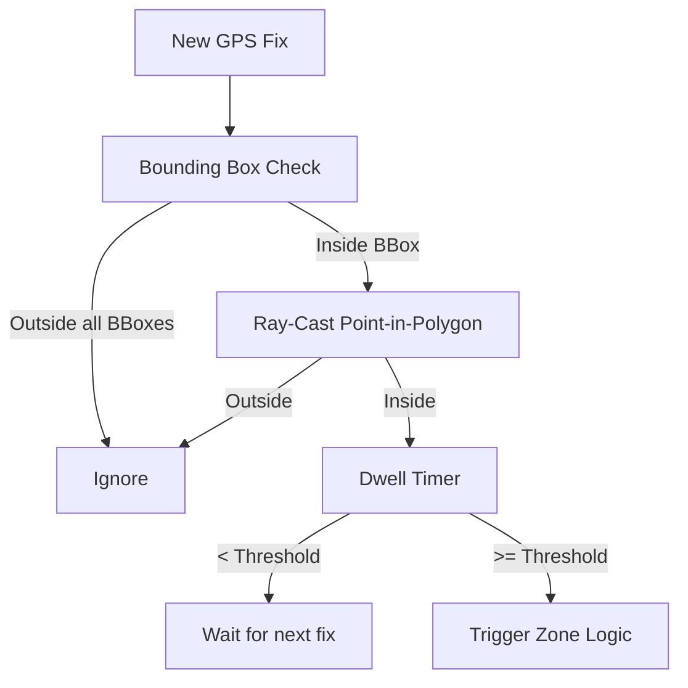

# Geofencing Architecture

> **Document**: 19-geofencing-architecture.md  
> **Version**: 1.0.0  
> **Last Updated**: July 2026  
> **Audience**: Backend engineers, Mobile engineers, GIS specialists  
> **Related**: [Mobile Architecture](12-mobile-architecture.md), [Database Architecture](14-database-architecture.md)

---

## 1. Overview

Yatri Shield relies on a hybrid geofencing architecture. To preserve privacy and save battery, geofence evaluation happens **on the client device**, not purely on the server. The server acts as the source of truth for zone definitions and distributes these definitions to clients via "Zone Packs".

## 2. Zone Classes

Zones represent geographic areas with safety implications.

| Class          | Definition                                                | Behavior                                                                                                                  |
| -------------- | --------------------------------------------------------- | ------------------------------------------------------------------------------------------------------------------------- |
| **Advisory**   | Weather warnings, minor civil unrest, elephant corridors. | Generates local push notification. Does _not_ alert backend.                                                              |
| **Restricted** | Military areas, sensitive borders, deep forest reserves.  | Generates local alert + sends `GeoFenceEvent` to backend immediately.                                                     |
| **Disaster**   | Floods, earthquakes, active terror incidents. Temporary.  | Generates critical local alert + sends `GeoFenceEvent` to backend immediately. Triggers immediate Risk Engine evaluation. |

## 3. Zone Packs

To evaluate zones offline, the mobile app downloads Zone Packs.

### 3.1 Pack Generation

1. Authority draws a polygon in the Dashboard.
2. Server validates polygon (no self-intersections, area within class limits).
3. Server simplifies polygon using PostGIS (`ST_SimplifyPreserveTopology`) to max 200 vertices for mobile CPU efficiency.
4. Server generates a Protobuf file grouping all active zones for a state/region.
5. Pack is signed with the server's private key and uploaded to the CDN.

### 3.2 Pack Distribution

- When a Trip is created or enters a new state, the app fetches the latest relevant Zone Pack from the CDN.
- If a new Disaster Zone is published, the backend sends a silent FCM push (`content-available: 1`) to all active devices in the region, instructing them to re-fetch the Zone Pack immediately.

## 4. On-Device Evaluation Engine

Running ray-casting point-in-polygon checks on every GPS fix drains the battery. The client uses a tiered evaluation approach.

### 4.1 Quality Gates (False Positive Reduction)

Before a zone entry is considered "real":

1. **Accuracy Threshold**: The GPS fix accuracy radius must be smaller than the zone's buffer size. (e.g., Don't trigger a 50m zone entry if GPS accuracy is 200m).
2. **Dwell Time**: The user must be inside the zone for $N$ consecutive seconds (e.g., 60s for Restricted, 30s for Disaster) to filter out GPS bounce.
3. **Consecutive Fixes**: Require at least 2 consecutive fixes inside the polygon.

## 5. Server-Side Fallback

For tourists on `FULL MONITORING` tier, the server receives their location batches. The Risk Engine runs a secondary, authoritative PostGIS check (`ST_Contains`) on these points.

This ensures that if a tourist's app is force-killed or the battery dies _just_ as they enter a Disaster Zone, the server's last known fix evaluation will still catch it and flag the risk.

---

## References

- [Mobile Architecture](12-mobile-architecture.md)
- [System Architecture](11-system-architecture.md)
