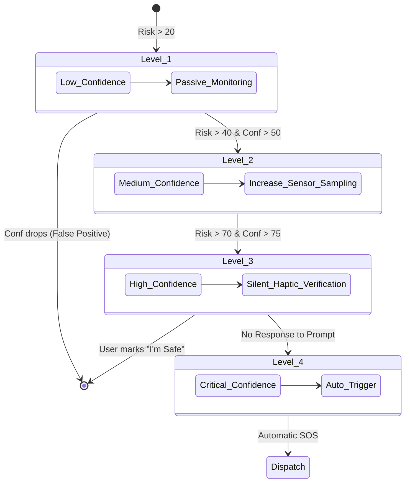

# AI Incident Detection & Risk Assessment Engine

> **System**: Smart Tourist Safety Monitoring & Incident Response System (Yatri Shield)
> **Component**: AI Incident Detection Engine
> **Version**: 2.0.0 (Production-Grade AI Architecture)
> **Audience**: ML Engineers, Mobile Systems Engineers, Safety Architects

---

## 1. System Overview

The AI Incident Detection & Risk Assessment Engine is a highly modular, multi-signal intelligence layer designed to passively protect tourists. Unlike legacy rule-based triggers, this engine utilizes contextual machine learning models to detect potential emergencies (e.g., road accidents, falls, kidnappings, or getting lost) *before* a user manually interacts with their device. 

The core philosophy is **Contextual Certainty**: never relying on a single sensor, but combining Device Motion, Location Behavior, User Interaction, and Environmental Context to generate a holistic **Risk Score** and **Confidence Score**. The engine scales its response from silent passive monitoring up to automated SOS dispatch based on mathematical confidence.

---

## 2. Event-Driven Architecture

The architecture relies on a hybrid edge-cloud execution model that is strictly **event-driven**. There is **no continuous backend polling**. The AI Engine completely sleeps until a Trip lifecycle event wakes it up.

### Trip Lifecycle Constraints
The engine ONLY runs during an active trip. Trips emit lifecycle events:
- `trip.started` -> Wakes the Edge AI.
- `trip.paused` -> Suspends sensor monitoring.
- `trip.resumed` -> Restores sensor monitoring.
- `trip.ended` -> Completely powers down the AI engine and clears memory.

To ensure extreme privacy and battery efficiency, the vast majority of high-frequency sensor fusion happens **on-device (Edge AI)**. Only high-risk incidents or periodic heartbeat events are transmitted to the backend.

### Data Flow Diagram

```mermaid
flowchart TD
    subgraph Edge[Mobile Device (Edge AI)]
        S1[IMU Sensors] --> NE[Normalization]
        S2[GPS/Location] --> NE
        S3[OS Context] --> NE
        NE --> FE[Feature Extractor]
        FE --> LM[Local TFLite Risk Model]
        LM -- Low/Med Confidence --> LocalStore[(Local Offline Queue)]
    end

    subgraph Cloud[Backend Cloud Engine]
        LM -- High Confidence Vector --> API[Ingestion API]
        API --> GE[Global Context Aggregator]
        API --> RE[Risk Verification Model]
        GE -- Weather/Crime/Geo Data --> RE
        RE --> EW[Escalation Workflow Engine]
        EW -- Trigger --> Dispatch[Emergency Dispatch (SOS)]
    end
```

---

## 3. Signal Catalogue & Risk Factors

The AI engine continuously consumes normalized streams from four primary signal categories.

### 3.1 Device Motion (IMU)
- **Sudden Deceleration/Impact**: Crash detection (vehicle or bike).
- **Free Fall + Impact**: Cliff falls or trekking accidents.
- **Abnormal Vibration/Rotation**: Being dragged or severe physical struggle.
- **Repeated Impacts**: Physical assault.

### 3.2 Location Behaviour
- **Sudden Route Deviation**: Diverging drastically from a declared itinerary.
- **Geofence Anomalies**: Entering restricted borders, disaster zones, or known high-crime areas.
- **Abnormal Dwell Time**: Remaining stationary in a remote forest/mountain for hours.

### 3.3 User Behaviour & Device Health
- **Total Inactivity Post-Impact**: No screen unlocks after a severe G-force event.
- **Repeated Fumbled Unlocks**: Panic state or physical distress.
- **Sudden Network/SIM Loss**: Device tampering or moving into a dead zone.

### 3.4 Environmental Context (Cloud Enriched)
- **Weather Extremes**: Heatwaves, flash floods, or snowstorms at the user's location.
- **Time of Day**: Unplanned midnight movement in sparse areas carries inherently higher risk.

---

## 4. AI Pipeline

1. **Sensor Ingestion**: IMU (50Hz), GPS (1Hz dynamic), OS states (event-driven).
2. **Time-Series Windowing**: Data is batched into 2.5-second overlapping sliding windows.
3. **Feature Extraction**: FFT (Fast Fourier Transform) on accelerometer data, velocity deltas, heading changes.
4. **Inference (Edge Model)**: A lightweight CNN/LSTM (e.g., MobileNetV2 architecture adapted for 1D time-series) outputs a probability distribution of states: `[Normal, Fall, Vehicle_Crash, Struggle, Inactive_Anomaly]`.
5. **Contextual Fusion (Cloud)**: The backend combines the Edge prediction with current weather, crime zones, and itinerary metadata using an XGBoost classifier.

---

## 5. Risk Scoring & Confidence Model

For every window, the engine outputs two primary metrics:
- **Risk Score (0–100)**: The severity of the detected anomaly.
- **Confidence Score (0–100)**: The statistical certainty that the anomaly is a genuine incident, derived from multi-signal corroboration.

### Risk Score Matrix (Indicative Weights)

| Signal / Anomaly | Base Risk Weight | Confidence Multiplier | Requires Corroboration? |
| :--- | :---: | :---: | :--- |
| **High-G Impact (>8G) + Sudden Stop** | +60 | x1.5 | Yes (Screen Inactivity) |
| **Free-fall > 1.5s + Impact** | +70 | x1.6 | Yes (Location = Mountain) |
| **Drastic Route Deviation** | +30 | x1.1 | No |
| **Movement in Restricted Zone** | +40 | x1.2 | No |
| **Midnight Travel + Sparse Area** | +20 | x1.0 | No |
| **SIM Removed / Airplane Mode** | +30 | x0.8 | Yes (Was in active transit) |
| **User unlocks phone post-event** | -50 (Decay) | x0.1 (Drop) | N/A |

*Example Scenario*: A sudden impact (+60 Risk) followed immediately by the user unlocking the phone (-50 Risk) drops the confidence to near-zero, classifying it as a dropped phone (False Alarm).

---

## 6. Escalation Workflow

The engine acts on a strictly defined escalation matrix based on the calculated Confidence Score.



- **Level 1 (Low)**: Passive logging.
- **Level 2 (Medium)**: Increases GPS sampling rate. Readies BLE Mesh broadcaster.
- **Level 3 (High)**: **Silent Verification**. The device vibrates intensely and asks "Are you safe?" with a 15-second countdown.
- **Level 4 (Critical)**: **Automated SOS Trigger**. The system autonomously dispatches police/medical services, bypassing user interaction.

---

## 7. False Positive Mitigation

Minimizing false alarms is critical to prevent dispatch fatigue.
1. **Multi-Signal Validation**: A fast deceleration is ignored if the travel mode is `Railway_Journey` (train braking).
2. **Context Awareness**: A "fall" detected on a ski slope is treated differently than a fall on a city sidewalk.
3. **Sensor Confidence Checks**: If GPS accuracy degrades >100m, route deviation signals are suppressed.
4. **Device Orientation Check**: An impact while the screen is on and the phone is held vertically is likely a rage-slam or dropped phone, not a car crash.

---

## 8. Offline Behaviour & Battery Optimization

### Offline Queue
If an incident hits Level 4 but the device has no internet:
1. The Edge AI engine generates the SOS payload locally.
2. The payload is written to the encrypted SQLCipher `OutboxQueue`.
3. The device immediately falls back to **Encrypted SMS** (Phase 8).
4. If SMS fails, it activates **BLE Mesh Broadcasting** (Phase 5.2) to hop the SOS to nearby tourists.

### Battery Adaptive Sampling
- **Safe Mode**: IMU sampled at 10Hz, GPS every 5 mins. Uses < 2% battery per hour.
- **Level 2 (Elevated)**: IMU bumped to 50Hz, GPS continuous.
- **Stationary Sleep**: If the accelerometer detects no movement for 10 minutes, GPS is turned off entirely until motion resumes.

---

## 9. Privacy & Security Considerations
- **Privacy by Design**: Sensor data (accelerometer arrays, gyro matrices) **never** leave the device. The backend only receives semantic risk vectors (e.g., `crash_probability_0.89`).
- **Transient Memory**: High-frequency IMU buffers are stored in volatile RAM and overwritten every 10 seconds unless a Level 3 anomaly occurs.

---

## 10. Edge Cases & Failure Scenarios

| Scenario | System Reaction | Mitigation Strategy |
| :--- | :--- | :--- |
| **Rollercoaster / Amusement Park** | Will trigger high-G impact algorithms. | Geofence exclusion zones for known theme parks completely disable crash detection. |
| **Phone thrown out of window** | High-G crash detected, but no BLE/Wearable heartbeat. | Correlate with wearable disconnect event. If phone is alone, delay dispatch for manual verification. |
| **Battery dies exactly on impact** | Offline queue fails to execute. | "Last Known Good" heartbeat on the backend will trigger a Level 4 SLA breach alert after 3 missed pings. |

---

## 11. Testing Strategy

Testing an AI Safety Engine requires synthetic and real-world datasets:
1. **Kaggle Crash Datasets**: Train the base IMU crash models.
2. **Hardware Simulation**: Use robotic drop-test rigs to record high-fidelity G-forces for "dropped phone" vs "human fall".
3. **Shadow Mode**: Deploy the engine in production silently. It calculates scores and flags events in the backend logs, but *does not trigger SOS*. Data scientists review flagged events to tune weights before turning it active.

## 12. Future Enhancements
- **Federated Learning**: Devices securely share crash pattern model weights without sharing location data, improving the global AI model.
- **Wearable Integration**: Direct API hooks into Garmin/Apple Watch to read sudden heart-rate spikes or blood oxygen drops as a primary corroborating signal.
