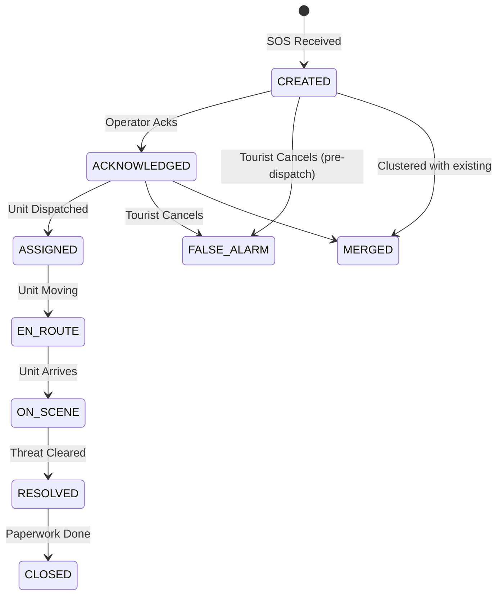

# SOS & Incident Management

> **Document**: 23-sos-incident-management.md  
> **Version**: 1.0.0  
> **Last Updated**: July 2026  
> **Audience**: Backend engineers, Mobile engineers, Product managers  
> **Related**: [API Specification](15-api-specification.md), [Real-Time Communication](16-realtime-communication.md)

---

## 1. Overview

An SOS is a signal from a tourist. An Incident is the operational response to that signal. Multiple SOS signals (e.g., from a group of friends in the same location) can be merged into a single Incident.

## 2. SOS Signal Ingestion

SOS signals can originate from multiple sources:

1. **App Button**: Tourist holds the in-app SOS button (TLS connection).
2. **Offline Queue**: Tourist pressed SOS while offline; app delivers it when connection restores.
3. **SMS Fallback**: App generates an encrypted SMS string and sends it to the central gateway if no data is available.
4. **Risk Engine (Anomaly)**: System generates an automatic SOS due to a failed Challenge (see Risk Engine).

### 2.1 Idempotency is Critical

Because network conditions during emergencies are terrible, the app will retry sending the SOS aggressively. The backend _must_ use the client-generated `clientSosId` UUID to deduplicate requests. An SOS is processed exactly once.

## 3. Incident State Machine

Once an SOS is received and validated, an Incident is created. It follows a strict state machine.

### 3.1 State Transitions and SLAs

- **CREATED → ACKNOWLEDGED**: The most critical transition. SLA is < 60 seconds. If missed, visual and auditory alarms escalate in the Operator Dashboard.
- **Tourist Cancellation**: Tourists can cancel an SOS via PIN. If the status is `CREATED` or `ACKNOWLEDGED`, it goes to `FALSE_ALARM` immediately. If the status is `ASSIGNED` or beyond, the operator must manually approve the cancellation (to prevent coercion).

## 4. The "Silent" SOS (Covert Mode)

If a tourist selects "Just watch me" or "Silent SOS":

1. The app provides minimal visual feedback and a single haptic pulse.
2. The payload is marked `covert: true`.
3. The Operator Dashboard visually flags the incident with 🤫 **DO NOT CALL BACK**.
4. Operators are restricted from initiating a voice call to the tourist's phone, which could compromise their safety if hiding.

## 5. Escalation and Handoff

Incidents belong to a specific Jurisdiction (Organisation).

- If an incident occurs near a border or requires special forces (SDRF), the operator can `ESCALATE`.
- Escalation adds the secondary organisation to the incident's ACL (Access Control List), granting their operators visibility in their dashboards.

---

## References

- [Risk Engine](20-risk-engine.md)
- [API Specification](15-api-specification.md)
