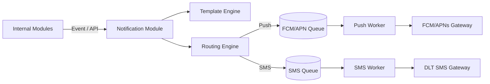

# Notification Service

> **Document**: 24-notification-service.md  
> **Version**: 1.0.0  
> **Last Updated**: July 2026  
> **Audience**: Backend engineers  
> **Related**: [Backend Architecture](13-backend-architecture.md), [Trip Management](18-trip-management.md)

---

## 1. Overview

The Notification Service acts as a unified abstraction layer for delivering messages across multiple channels. It handles templating, localization, retry logic, and delivery tracking.

## 2. Channels

| Channel               | Priority | Delivery Guarantee | Cost     | Primary Use Case                                                 |
| --------------------- | -------- | ------------------ | -------- | ---------------------------------------------------------------- |
| **FCM / APNs (Push)** | High/Low | Best Effort        | Free     | General app alerts, Challenge-Response triggers (High priority). |
| **SMS**               | High     | High               | Paid     | Emergency contacts, Offline SOS fallback, OTPs.                  |
| **Email**             | Low      | High               | Free/Low | System reports, Admin alerts, Account recovery.                  |
| **WhatsApp**          | Medium   | Medium             | Paid     | Secondary OTP fallback (optional).                               |

## 3. Architecture

## 4. Templating & Localization

- All templates are pre-registered and approved via the DLT (Distributed Ledger Technology) system for Indian telecom compliance.
- The Notification module accepts a `TemplateID` and dynamic variables.
- It looks up the user's preferred language (e.g., `en`, `hi`) and resolves the correct localized string before dispatch.

## 5. Critical Workflows

### 5.1 The Risk Challenge Push

When the Risk Engine triggers a challenge, it sends a High-Priority FCM push (`priority="high"` on Android, `apns-priority=10` on iOS). This is designed to wake the device from Doze/idle states to ensure the user sees the prompt.

### 5.2 Emergency Contact SOS Notification

When an SOS is raised, emergency contacts receive an immediate SMS containing:

- The tourist's name.
- The time of the SOS.
- A secure, short-lived web link displaying the live status of the incident (so contacts don't need the app installed).

---

## References

- [Risk Engine](20-risk-engine.md)
- [API Specification](15-api-specification.md)
