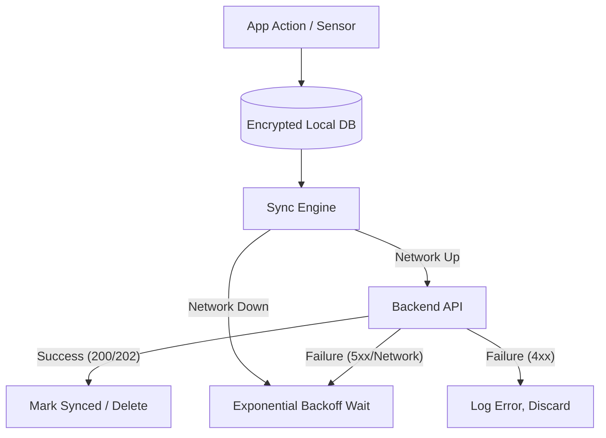

# Offline Synchronization

> **Document**: 25-offline-synchronization.md  
> **Version**: 1.0.0  
> **Last Updated**: July 2026  
> **Audience**: Mobile engineers, Backend engineers  
> **Related**: [Mobile Architecture](12-mobile-architecture.md), [Geofencing Architecture](19-geofencing-architecture.md)

---

## 1. Overview

Yatri Shield must function reliably in remote areas with zero network connectivity. The Offline Synchronization subsystem ensures data integrity and eventual consistency when connectivity is restored.

## 2. Local Storage (The Offline Queue)

All outgoing state changes (SOS triggers, check-ins, location batches) are written to a local SQLite database (encrypted via SQLCipher) _before_ attempting network transmission.

## 3. Priority Lanes

Not all data is equal. When a weak 2G signal momentarily appears, the sync engine prioritizes critical data.

1. **SOS Events (Highest Priority)**: Pushed immediately. Halts all other sync activity until acknowledged by the server.
2. **Restricted/Disaster GeoFence Events**: Pushed next.
3. **Check-ins**: Pushed third.
4. **Location Batches (Breadcrumbs)**: Pushed last. Large batches are chunked into smaller payloads to succeed on weak connections.

## 4. Conflict Resolution

- **Trips / Profile Data**: Server state always wins. (If the user edited their profile on another device).
- **Drafts**: Client state wins.
- **Idempotency**: Every queued item has a UUID generated at creation time. The backend uses this `Idempotency-Key` to safely ignore duplicates if the client retries a sync that the server actually received just before the connection dropped.

## 5. SMS Fallback (The Last Resort)

If the queue contains an SOS event and the device detects mobile network registration (GSM) but _no_ packet data (no internet), it falls back to SMS.

- **Payload**: `SOS|v1|<clientSosId>|<lat>|<lon>|<acc>|<ts>`
- **Encryption**: Payload is encrypted with the server's public key (to prevent interception) and base64 encoded.
- **Routing**: Sent to a designated shortcode/longcode handled by the backend's SMS ingest endpoint.

---

## References

- [Mobile Architecture](12-mobile-architecture.md)
- [SOS & Incident Management](23-sos-incident-management.md)
