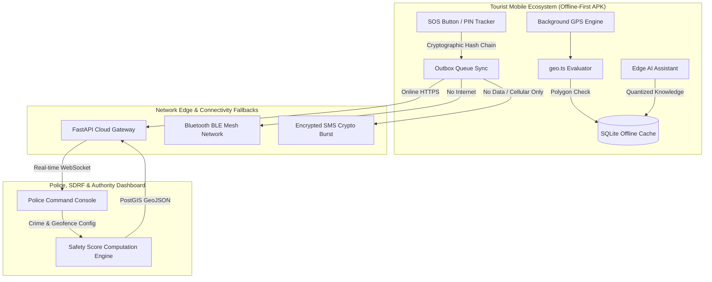
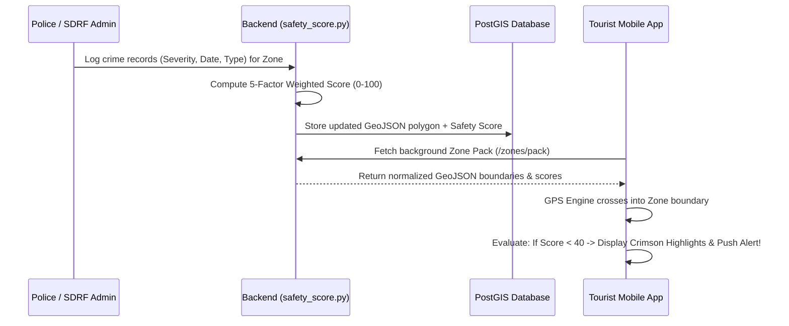

# 📘 Yatri Shield — Comprehensive System Architecture & Feature Workflows

**Yatri Shield** is a decentralized, offline-resilient smart tourist safety and emergency response network built to protect travelers across remote terrains, national corridors, and urban areas. This documentation details the end-to-end operational workflows, state machines, algorithmic scoring engines, and cryptographic integrations powering the platform.

---

## 🏗️ 1. Core System Architecture Overview

---

## 🚨 2. Emergency SOS State Machine & Workflow

The Emergency SOS architecture ensures resilient dispatching across zero-connectivity wilderness environments and prevents accidental triggers or false incident resolution.

### Step-by-Step SOS Execution Workflow:
1. **Trigger Phase**: The tourist depresses the floating emergency SOS trigger for **3.0 seconds**. An acoustic siren countdown activates on the device to allow immediate cancellation of accidental touches before broadcasting.
2. **Cryptographic Sealing**: Before transmitting coordinates, the app binds the GPS fix, device accuracy, and battery state into a secure cryptographic hash chain ([hashChain.ts](file:///C:/Nischay/PROJECTS/SIH%20INTERNAL/src/lib/hashChain.ts)). This prevents spoofing or tampering with GPS evidence during post-incident legal analysis.
3. **Multi-Channel Dispatch Try-Chain**:
   * **Tier 1 (Internet Available)**: Instant REST API upload to `/api/v1/incidents/sos` followed by opening a bidirectional realtime socket session.
   * **Tier 2 (Cellular SMS Available)**: If HTTP packets drop, the engine compiles a compressed byte-array payload via [smsCrypto.ts](file:///C:/Nischay/PROJECTS/SIH%20INTERNAL/src/services/smsCrypto.ts) and dispatches an automated shortcode SMS directly to regional police towers.
   * **Tier 3 (Complete Wilderness Off-Grid)**: Packets are propagated peer-to-peer across nearby tourist cellphones via low-power Bluetooth mesh routing ([mesh.ts](file:///C:/Nischay/PROJECTS/SIH%20INTERNAL/src/services/mesh.ts)) until reaching an internet-connected relay node.
4. **Safe PIN Cancellation Workflow**:
   * To terminate an SOS without alarming rescuers, the user taps **"Cancel SOS with Safe PIN"** on [active.tsx](file:///C:/Nischay/PROJECTS/SIH%20INTERNAL/app/sos/active.tsx).
   * Entering the **4-digit PIN** immediately acts as dual-confirmation. The client logs a `sos.cancelled_by_user` cryptographic ledger event, shuts down background high-frequency GPS tracking, clears emergency local persistence, and redirects cleanly back to `/home`.

---

## 🛡️ 3. Dynamic Crime Safety Score Engine & Geofencing Workflow

The platform bridges operational intelligence from local law enforcement directly to tourist navigation screens via a real-time risk scoring architecture.

### The 5-Factor Safety Score Calculation Engine:
Implemented inside [safety_score.py](file:///C:/Nischay/PROJECTS/SIH%20INTERNAL/backend/app/services/safety_score.py), the computational engine evaluates every geofenced sector on a standard **0 to 100 Safety Index** (100 = Perfectly Safe, 0 = Extremely Dangerous):
1. **Incident Volume Factor (30% Weight)**: Evaluates aggregate total reported infractions inside the sector bounds.
2. **Severity Distribution (25% Weight)**: Weights incidents by impact rating (`Critical: 10`, `High: 7`, `Medium: 4`, `Low: 2`, `Info: 1`).
3. **Recency Multiplier (20% Weight)**: Emphasizes active dangers by applying 30-day temporal decay functions; incidents occurring within the last month exert significantly higher penalty weights than historical records.
4. **Spatial Density per $\text{km}^2$ (15% Weight)**: Evaluates geographic concentration to differentiate sprawling national parks from highly congested urban bottlenecks.
5. **Law Enforcement Resolution Rate (10% Weight)**: Calculates the ratio of closed/arrested cases to open reports, boosting confidence in areas with proactive policing.

### Mobile Offline Map Highlighting & Alerts Workflow:
* **Background Boundary Evaluation**: Every GPS position update from [locationEngine.ts](file:///C:/Nischay/PROJECTS/SIH%20INTERNAL/src/services/locationEngine.ts) is checked against stored local polygons using array-safe ray-casting algorithms in [geo.ts](file:///C:/Nischay/PROJECTS/SIH%20INTERNAL/src/lib/geo.ts).
* **High-Risk Notification**: Upon entering any polygon where the calculated `safetyScore < 40`, the OS triggers an urgent local high-priority notification warning the tourist of documented localized hazards.
* **Offline Map Visualization**: In [MapZoneLayer.tsx](file:///C:/Nischay/PROJECTS/SIH%20INTERNAL/src/components/MapZoneLayer.tsx), any zone falling below a **50/100 threshold** automatically applies an assertive **Crimson Outline (`#dc2626`)** and overlays an interactive danger identification banner directly over offline map canvases.

---

## 🧠 4. Edge AI Emergency Guidance Assistant

To ensure travelers receive accurate medical, tactical, and survival guidance deep inside disconnected terrain, Yatri Shield embeds an autonomous offline triage engine.

### Operational Workflow:
* **Zero-Latency Edge Inference**: Supported by [emergencyChatbot.ts](file:///C:/Nischay/PROJECTS/SIH%20INTERNAL/src/services/emergencyChatbot.ts), queries are evaluated against structured survival knowledge schemas (e.g., altitude sickness triage, hyperthermia protocols, aggressive wildlife encounters) locally on the device processor.
* **Voice TTS Integration**: During physical emergencies where typing is impractical, the assistant auto-narrates first-aid instructions via native OS text-to-speech engines.
* **Persistent Memory & Privacy Check**: Chat trails persist encrypted in local storage for continuous situational context during rescue operations, and can be purged instantly via the **Clear History** action.

---

## 👁️ 5. Decentralized KYC & Multi-Tier Privacy Workflows

Yatri Shield respects tourist autonomy by utilizing verifiable credentials and tiered consent models rather than centralized intrusive surveillance.

### Consent Tiers Workflow:
1. **Tier 0 — Advisory Only (Offline Mode)**: Zero background tracking. The app acts purely as a passive geofence alerter and offline survival handbook.
2. **Tier 1 — Check-in & Corridor Verification**: GPS tracking only triggers when traversing certified hazard corridors or when automated timer heartbeats expire without verification.
3. **Tier 2 — High-Security Live Tracking**: Continuous cryptographic GPS streaming designed for high-altitude solo trekking, extreme sports, or high-threat sectors, directly viewable by emergency monitoring desks until trip completion or voluntary check-in cancellation.
